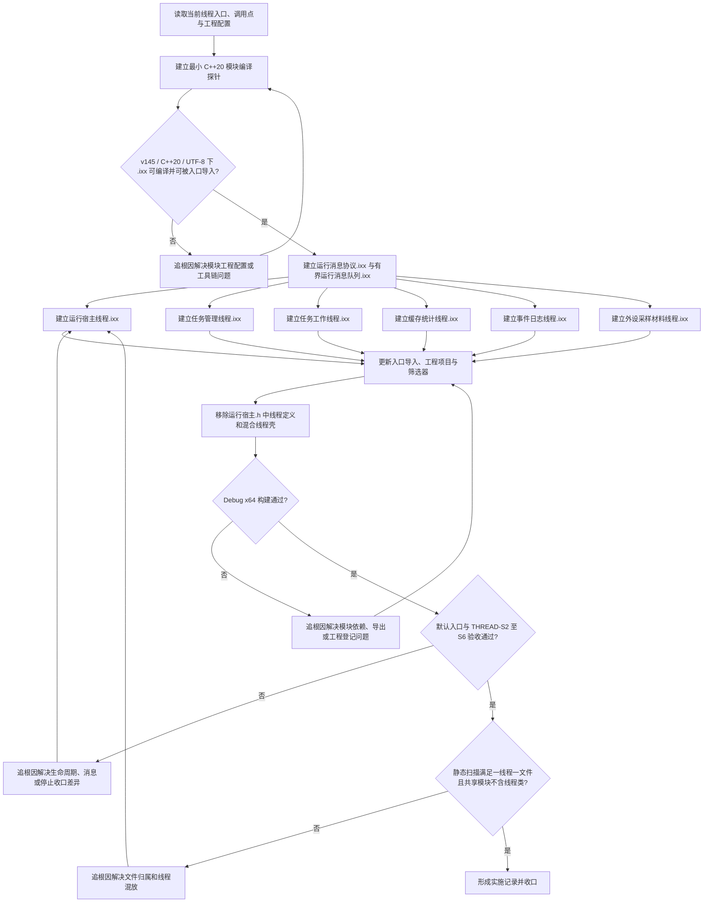

# 每线程独立 ixx 模块拆分流程图

更新时间：2026-07-10

## 依据

```text
用户要求：每个线程一个文件，不要混在一起，使用 .ixx 文件。
AGENTS.md
规范/000_项目规则总纲.md
规范/001_规则迁移清单.md
规范/多线程防锁机制规范.md
规范/详细设计/运行宿主与多线程消息队列详细设计.md
海中鱼巣/核心/运行宿主.h
海中鱼巣/核心/运行消息队列.h
海中鱼巣/入口.cpp
海中鱼巣.vcxproj
海中鱼巣.vcxproj.filters
```

## 说明

本图只描述当前 6 个线程角色从混合头文件迁移到独立 C++20 模块接口文件的施工路线。每个线程文件只允许拥有一个线程角色、一个 `std::thread` 生命周期和一个消费循环；共享消息、队列和停止协议必须放入不定义线程类的独立 `.ixx` 模块。

## 流程图



## 关键边界

```text
一个线程角色只能定义在一个独立 .ixx 文件中。
一个线程 .ixx 文件不得定义第二个线程角色或第二个 std::thread 生命周期。
共享消息、队列、状态和停止协议可以独立成 .ixx，但不得在共享模块中定义线程类。
线程不是动作来源，不得直接裸写节点仓库、主信息仓库、关系仓库或索引仓库。
任务管理线程和任务工作线程必须分文件；缓存统计线程和事件日志线程必须分文件。
不得复制 D:/鱼巢 的旧 .ixx 文件或旧线程函数体。
模块编译探针失败必须追根因，不得退回把多个线程继续塞进 .h 或同一 .ixx。
本切片不接真实 D455、体素、真实外设驱动、自我循环或自我苏醒。
```
