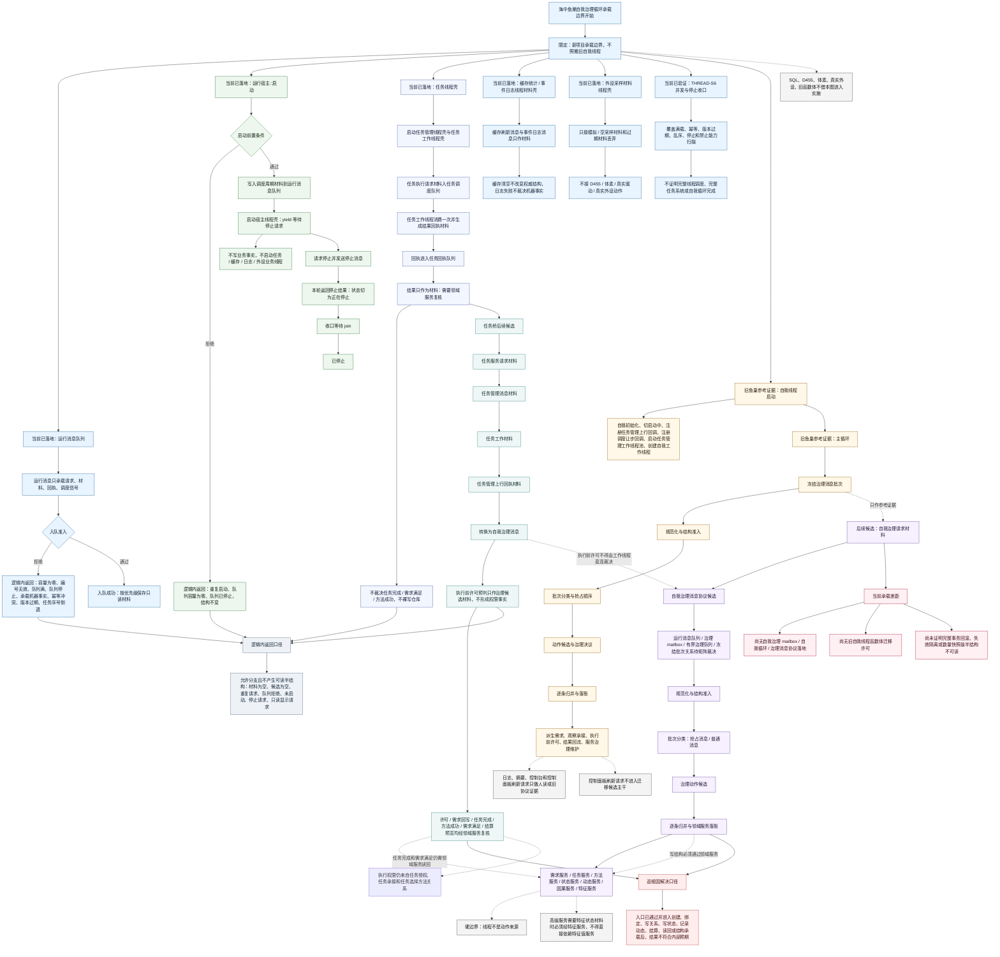

# 海中鱼巣自我治理循环承载边界流程图 v0.1

更新时间：2026-07-10

状态：已作为替代依据随 `计划/已完成计划/20260710_自我治理循环详细设计生成计划_v0.1.md` 修订确认联动确认 / #163 文档治理已完成并归档计划 / 不构成 C++ 实施许可

## 依据

```text
AGENTS.md
计划/计划索引.md
规范/0050_项目通用机器逻辑与禁止性规则总纲_20260721.md
规范/规范目录.md
规范/8100_子规范_自我线程与任务管理线程权责边界_20260720.md
规范/8200_子规范_自我内部循环实现_20260720.md
海中鱼巣/线程/有界运行消息队列.ixx
海中鱼巣/线程/运行宿主线程.ixx
海中鱼巣/入口.cpp
流程图/20260710_旧鱼巢自我线程逻辑提取流程图_v0.1.md
D:\鱼巢\自我线程模块.impl.cpp
D:\鱼巢\自我线程模块.消息协议.ixx
```

## 说明

本图面向 `海中鱼巣` 当前项目生成，不把旧 `鱼巢` 自我线程函数体当作新项目实现事实。旧代码只作为逻辑证据和后续服务逻辑包候选；当前项目已形成 THREAD-S1 至 THREAD-S6 正式实施记录，限定事实包括运行消息队列、运行宿主生命周期壳、任务线程材料壳、缓存 / 事件线程材料壳、模拟 / 空采样材料线程壳及并发停止收口验证，以及需求、任务、方法、状态、动态、因果、特征等领域服务第一轮入口。

本图已随“自我治理循环详细设计生成计划”确认联动确认，只作为 #163 详细设计生成依据；不生成 C++ 实施许可，不修改 C++。后续若进入实施，仍必须另建待确认施工计划并明确允许文件、禁止文件、入口拒绝、逻辑内返回 / 追根因解决收口、读回验证和完成声明边界。

## 流程图



## 关键边界

```text
1. 本图是海中鱼巣项目适配图，不是旧鱼巢自我线程迁移图；旧代码只作为参考证据。
2. 当前已落地事实包括 THREAD-S1 至 THREAD-S5 的限定材料壳和 THREAD-S6 并发停止收口验证，以及已有领域服务入口；不得据此宣称自我治理循环、自我苏醒、完整真实线程调度或旧能力迁移完成。
3. 运行消息队列只承载请求、材料、回执和调度信号；任何承载机器事实的消息必须被拒绝。
4. 停止请求路径必须本轮返回停止结果，再由外层或调用方收口等待，最终进入已停止；不得画回普通等待循环。
5. 后续自我治理候选必须采用“规范化与结构准入 -> 批次分类 -> 动作候选 -> 逐条归并与领域服务落账”的方向，不得把动作处理倒画成规范化来源。
6. 执行前许可必须经任务管理上行材料转换为自我治理消息后再形成许可预判；任务工作线程不得直连裁决许可。
7. 执行前许可预判只作治理候选材料；真正的执行权限仍来自任务授权、任务承接和任务选择方法关系。许可、需求回写、任务完成、方法成功、需求满足和结算预览都必须由需求 / 任务 / 方法 / 状态 / 动态 / 因果等领域服务复核，不得由线程或消息本身裁决。
8. 控制面板刷新请求只作为旧协议字段或人读显示请求证据，不进入迁移候选主干。
9. 线程不是动作来源；方法执行或领域服务写入才是动作动态和因果引用的来源候选。
10. SQL、D455、体素、真实外设、旧函数体复制、控制面板实现不借本图进入实施。
```

## 当前代码事实

```text
1. 运行消息队列.h 已定义 运行线程角色、运行消息类型、运行消息优先级、运行消息、入队结果和有界运行消息队列。
2. 有界运行消息队列在入口拒绝容量为零、消息编号无效、消息承载事实、句柄版本过期、幂等键冲突、同一任务序号倒退、队列停止和队列满等材料。
3. 运行宿主.h 的运行宿主::启动 会拒绝重复启动、容量为零和队列已停止；通过后写入调度周期材料，启动宿主线程壳，并声明不写业务事实。
4. 运行宿主::请求停止并发送停止消息 会写入停止消息、切换正在停止并请求停止；收口等待 join 后切换已停止。
5. 运行宿主.h 当前已有任务线程壳：可启动任务管理线程壳和任务工作线程壳，可发送任务执行请求，任务工作线程可消费一次并生成结果回执材料。
6. 任务线程壳消费结果显式标明不写业务事实、不裸写仓库、不裁决任务完成、不裁决需求满足、不裁决方法成功，并要求领域服务复核。
7. 入口.cpp 当前包含 THREAD-S1 至 THREAD-S4 验收片段；运行宿主已具备缓存统计线程壳、事件日志线程壳、缓存刷新消息、事件日志消息、局部失败材料和停止收口第一轮材料。
8. THREAD-S5 已形成外设采样材料线程壳正式实施记录，只证明模拟 / 空采样材料、过期材料丢弃、满载局部失败和停止收口，不证明 D455、体素、真实驱动或真实外设接入。
9. THREAD-S6 已形成并发验收正式实施记录，只证明已实现线程材料壳的停止收口、满载 / 幂等 / 过期 / 乱序拒绝、缓存非权威、日志不裁决、外部材料不入事实和禁止能力扫描通过。
10. 海中鱼巣当前尚无自我治理 mailbox、自我治理消息协议或自我循环主循环落地。
```

## 旧鱼巢参考事实

```text
1. 旧鱼巢 自我线程类::启动 会先自我初始化，再切启动中，注册任务管理上行消息通知回调和调度让步回调，启动任务管理工作线程池，并创建自我工作线程。
2. 旧鱼巢 执行主循环一轮_ 主干包含冻结治理消息批次、规范化消息并落一次特征账、抢占处理、派生需求门控、二次特征、治理帧、需求重判、主派发、后台上行、服务治理维护和自检门控。
3. 旧鱼巢消息协议中存在任务管理派生需求、结果状态、观察承接、执行前许可、自检报告和控制面板刷新请求等附加载荷。
4. 旧鱼巢 从任务管理执行前许可请求构造治理消息 会把执行前许可转为治理消息；该事实只能支持后续桥接设计，不能证明海中鱼巣已实现自我治理许可。
```

## 逻辑内返回 / 追根因解决

```text
逻辑内返回：
1. 队列容量为零、编号无效、消息承载事实、幂等冲突、版本过期、任务序号倒退、队列满、队列停止等入口拒绝，且不写业务结构。
2. 运行宿主未启动、重复启动、已停止、停止请求、任务线程壳未启动、无请求材料、非任务执行请求等允许分支，且不产生可读半结构。
3. 控制面板刷新请求、日志、摘要、显示请求和空候选只作为人读材料或请求材料，不进入机器事实。

追根因解决：
1. 前置条件已满足并进入创建、绑定、写关系、写状态、记录动态、结算、读回或结构承载后，结果不符合内部预期。
2. 后续自我治理详细设计若允许多步写入，必须补读回验证、数量快照、失败停止门禁、失效隔离或事务回滚；不能只用返回失败掩盖可读半结构。
3. 初始化入口前置条件通过并进入注册、创建、启动或结构承载后，初始化标记未完成或启动结果不符合内部预期，统一属于追根因解决；不得作为普通返回继续依赖路径。
```

## 后续产物

```text
1. 可基于本图生成“自我治理循环详细设计”。
2. 详细设计必须明确运行消息、自我治理消息、治理队列、需求服务、任务服务、方法服务、状态服务、动态服务、因果服务和特征服务边界。
3. 详细设计必须给出运行消息队列、自我治理消息、治理 mailbox、有界治理队列和冻结批次的写入方、读取方、权威性、生命周期与验证方式矩阵。
4. 详细设计必须覆盖 SG-A1 至 SG-A5：拒绝入队结构不变、冻结失败不产生可读半结构、归并失败回滚或失效隔离、上行回执不直接裁决业务事实、日志摘要显示不承载机器事实。
5. 若进入代码实施，必须另建待确认计划，并列明允许文件、禁止文件、入口拒绝、逻辑内返回 / 追根因解决收口、读回验证、数量快照、日志弹窗边界和完成声明边界。
6. 本图只作为 #163 详细设计生成依据，不自动生成施工许可，不修改 C++，不宣称自我循环完整完成。
```
