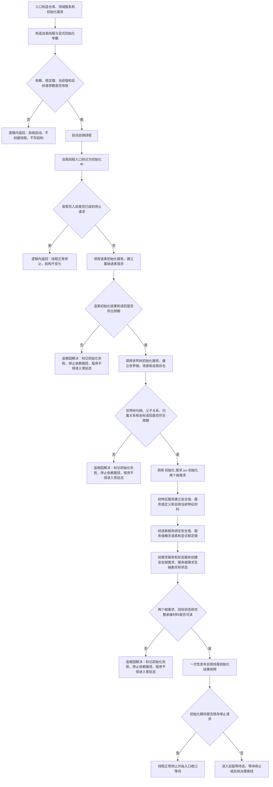

# 自我线程系统初始化流程图

更新时间：2026-07-10

## 依据

```text
用户口径：自我线程内进行系统初始化，主要初始化语素信息、世界树和两个根需求。
用户口径：需求初始化文件固定为 海中鱼巣/领域/初始化.需求.ixx。
AGENTS.md
规范/0050_项目通用机器逻辑与禁止性规则总纲_20260721.md
规范/规范目录.md
规范/8100_子规范_自我线程与任务管理线程权责边界_20260720.md
规范/8110_子规范_线程生命周期状态上报与控制面板线程信息_20260720.md
规范/8200_子规范_自我内部循环实现_20260720.md
海中鱼巣/领域/初始化.语素.ixx
海中鱼巣/领域/初始化.世界树.ixx
海中鱼巣/领域/需求服务.h
海中鱼巣/领域/特征服务.h
海中鱼巣/入口.cpp
```

## 说明

本图只定义自我线程启动阶段的第一轮系统初始化。初始化成功后，自我线程进入等待停止或后续治理接线的驻留态；本图不宣称自我治理 mailbox、真实任务调度、自我循环或自我苏醒完成。

## 流程图



## 关键边界

```text
初始化开始后的停止请求只锁存，不中断三个结构阶段，避免发布半初始化快照。
任何内部写入或读回不及预期都归为追根因解决，入口不得继续进入控制面板或常驻运行。
初始化.需求.ixx 只做领域服务编排，不直接写节点、主信息、关系或索引仓库。
两个根需求是安全根需求和服务根需求；需求目标由抽象目标状态承载，I64 只作第一轮状态值材料。
不初始化任务、当前主任务、当前主方法、本能方法、外设、SQL、缓存事实或显示事实。
```
