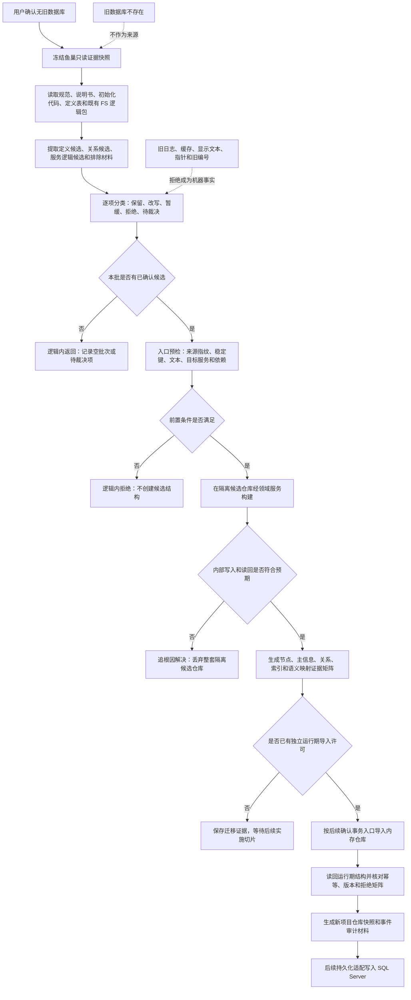

# 鱼巢信息逻辑迁移流程图

更新时间：2026-07-10

## 依据

```text
用户确认：当前没有旧数据库可用，迁移源改为 D:/鱼巢 中的信息和逻辑证据。
计划/20260705_海中鱼巣全量重构总计划_v0.1.md
实施记录/20260706_逐函数只读扫描清单.md
实施记录/20260708_应用逻辑流程图迁移顺序信息数据.md
D:/鱼巢/自我类.特征定义.cpp
D:/鱼巢/本能方法类.cpp
D:/鱼巢/自我类.初始化.cpp
D:/鱼巢/data/initial_causal_templates.tsv
```

## 说明

本流程把旧数据库导入改为信息逻辑迁移。旧 `鱼巢` 只提供候选定义、服务逻辑和证据，不提供可直接复制的运行期机器事实。第一轮只在隔离候选仓库构建最小样本，不替换当前运行期仓库，不写 SQL Server。

## 流程图



## 关键边界

```text
1. 迁移源是鱼巢的规范、代码定义、初始化顺序和服务逻辑证据，不是旧数据库。
2. 函数只作证据采集单位，服务逻辑包才是迁移确认单位。
3. 旧指针、旧节点编号、运行日志、缓存、显示文本和旧数据库字段不得直接成为新项目事实。
4. 第一轮只建隔离候选仓库；运行期导入、快照恢复和 SQL 持久化必须分别另有确认计划。
5. 前置材料不满足时逻辑内拒绝；进入候选结构构建后出现非预期结果必须追根因并丢弃整套候选仓库。
```
