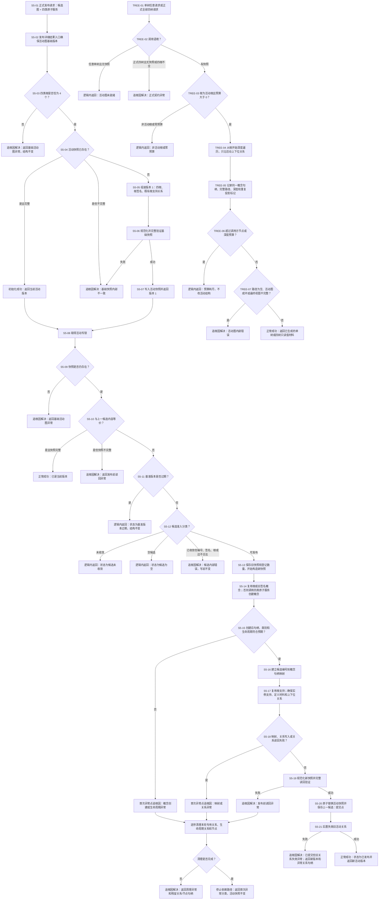

# CONCEPT-S5 活动图发布与抽象树投影现状流程图

更新时间：2026-07-11

## 元数据

```text
图类型：现状流程图
代码版本：#199 CONCEPT-S5-CORR-01 实施工作区
覆盖文件：
  海中鱼巣/领域/概念图服务.h
  海中鱼巣/入口.cpp
覆盖入口：
  初始化活动图基础版本
  发布候选图版本
  发布候选图版本并返回结果
  候选图可发布_已加锁
  构造候选活动快照_已加锁
  清理未发布候选_已加锁
  验证活动快照_已加锁
  失效旧活动关系_已加锁
  读取抽象树视图
  读取抽象树视图并返回结果
  读取全部抽象树视图
  读取全部抽象树视图并返回结果
  生成抽象树视图
逐行映射表：实施记录/20260711_CONCEPT-S5活动图发布与抽象树投影逐行代码映射表.md
输入契约表：实施记录/20260711_CONCEPT-S5活动图发布与抽象树投影输入契约与调用语境表.md
非成功审查表：实施记录/20260711_CONCEPT-S5活动图发布与抽象树投影非成功返回二分审查表.md
执行依据：计划/已完成计划/20260711_CONCEPT-S5_活动图发布与抽象树投影中途返回纠偏计划_v0.1.md
```

## 现状边界

本图依据 #199 纠偏后的 `海中鱼巣/领域/概念图服务.h` 和 `海中鱼巣/入口.cpp` 绘制。`控制面板服务.h` 保持 #187 已提交事实，本切片没有修改控制面板服务。

原 `流程图/20260711_概念图自动生长与抽象关系树形视图流程图_v0.1.md` 是总体施工流程图；本图记录 S5 纠偏后的实际分支、状态材料和提交点。

## 流程图



## 审查结论

纠偏后的代码已经把混合空返回拆成值式状态：

1. 过期、未收敛和空候选是逻辑内返回；正式收敛候选内部错误是追根因。
2. 构造、映射、关系写入、发布前读回和清理异常保留独立状态及残留句柄。
3. 活动快照替换是提交点；提交后旧边异常返回新活动版本，不再冒充“未发布”。
4. 单树详细入口承接任意请求；全部四树详细入口承接正式契约。

兼容的 `optional` 入口仍保留；正式诊断和验收使用结构化结果入口。

## 完成边界

本图只证明 S5 发布和抽象树读取的中途返回分类已按 #199 代码事实纠偏。它不证明安全物理删除、跨重启恢复、完整概念系统、自我循环或自我苏醒完成。
