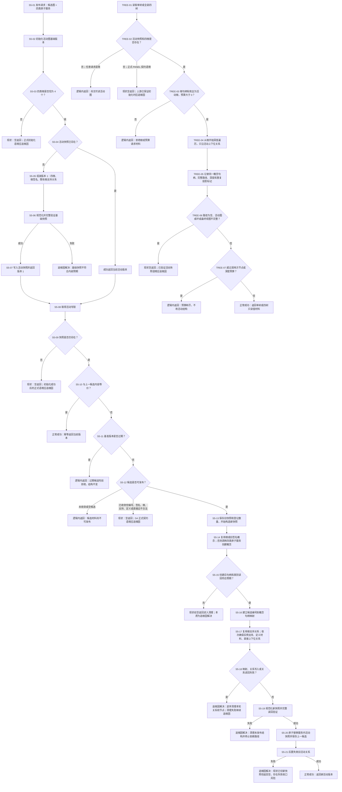

# CONCEPT-S5 活动图发布与抽象树投影现状流程图

更新时间：2026-07-11

## 元数据

```text
图类型：现状流程图
代码版本：当前 HEAD aed6db5 之后的当前工作区；目标文件 海中鱼巣/领域/概念图服务.h 无未提交改动
覆盖文件：
  海中鱼巣/领域/概念图服务.h
覆盖入口：
  初始化活动图基础版本
  活动快照公开读取组
  发布候选图版本
  候选图可发布_已加锁
  构造候选活动快照_已加锁
  清理未发布候选_已加锁
  验证活动快照_已加锁
  失效旧活动关系_已加锁
  读取抽象树视图
  读取全部抽象树视图
  生成抽象树视图
逐行映射表：实施记录/20260711_CONCEPT-S5活动图发布与抽象树投影逐行代码映射表.md
输入契约表：实施记录/20260711_CONCEPT-S5活动图发布与抽象树投影输入契约与调用语境表.md
非成功审查表：实施记录/20260711_CONCEPT-S5活动图发布与抽象树投影非成功返回二分审查表.md
不得作为施工许可：是；代码修订只允许按登记计划执行
```

## 现状边界

本图依据当前未显示为脏改动的 `海中鱼巣/领域/概念图服务.h` 绘制。`入口.cpp` 和 `控制面板服务.h` 正在发生未提交的 PANEL-TREES-S1 改动，本图只把它们作为调用语境证据，不映射其施工中代码行，也不把控制面板接线写成 CONCEPT-S5 已完成事实。

原 `流程图/20260711_概念图自动生长与抽象关系树形视图流程图_v0.1.md` 是施工流程图；本图不覆盖它，只记录 S5 当前代码怎样实际分支和返回。

## 流程图



## 审查结论

当前代码已经对基础快照验证失败、候选写后读回失败、清理失败和旧关系失效失败调用 `追根因检查`。但仍有三组“同一个空返回混合两种语境”的路径：

1. 初始化前探测与正式初始化契约混合。
2. 未收敛/过期候选与已收敛但内部结构错误的 S4 候选混合。
3. 任意树读取请求与 PANEL 正式读取契约混合。

因此，现状不能只按“结构是否改变”分类。正式上游已经保证有效时，即使尚未写结构，返回非预期结果也必须追根因。

## 完成边界

本图只证明已按当前代码建立 S5 现状流程、逐行映射、调用语境和非成功返回审查。它不证明代码已经纠偏，不证明 PANEL-TREES-S1 已完成，也不证明命名、生命周期、安全删除、跨重启恢复、自我循环或自我苏醒完成。
