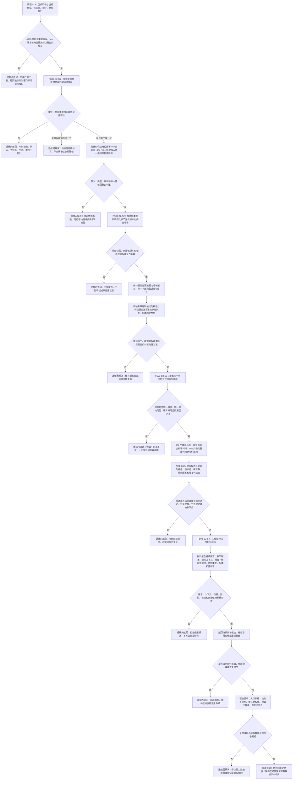

# FS03 特征值系统第二批代码实施流程图 v0.1

更新时间：2026-07-11

## 依据

```text
AGENTS.md
规范/0050_项目通用机器逻辑与禁止性规则总纲_20260721.md
规范/规范目录.md
规范/4030_子规范_基础信息服务分层与领域写授权.md
规范/4040_子规范_不透明结构事务候选确认撤销与最后发布.md
规范/4050_子规范_入口拒绝逻辑内结果与内部逻辑错误.md
规范/2100_根规范_特征值_20260720.md
规范/4130_子规范_特征值三态比较底层逻辑_20260720.md
规范/4140_子规范_枚举型实例特征值合法来源_20260720.md
规范/4060_子规范_非权威缓存统计失效与确定重建.md
计划/20260707_FS03_特征值系统第二轮专项_v0.1.md
规范/详细设计/特征值Vec原始值容器详细设计.md
规范/详细设计/特征值非权威缓存与内容哈希详细设计.md
规范/详细设计/特征值值域稳态与候选比较详细设计.md
规范/详细设计/特征值序列化恢复边界详细设计.md
实施记录/20260710_FS03_特征值系统第二轮第一批代码实施_Codex断点清单.md
海中鱼巣/领域/特征服务.h
海中鱼巣/领域/特征值服务.h
海中鱼巣/领域/统计服务.h
海中鱼巣/核心/仓库快照服务.h
```

## 说明

本图把迁移大纲复核后的下一批限定为 FS03-B2-S1 至 S4。四段均经特征服务封口；缓存和候选不裁决业务事实；序列化段只生成结构化材料与恢复候选，不写仓库。

## 流程图



## 关键边界

```text
1. 实例特征槽位第一轮只允许零个或一个归属特征值；多个归属值不是候选分支，而是当前结构歧义，必须追根因。
2. 本批不建立历史值、候选值提升或淘汰系统；特征类型节点仍可按既有入口拥有多个非槽位值材料。
3. I64、VecI64、VecU64 都必须提供统一原始值版本；同值重写是否递增按详细设计固定为“写入成功即递增”。
4. 内容哈希只缩小候选范围，碰撞和缓存缺失都由完整原始值复核收口。
5. 值域和稳态只返回候选；I64 首版支持顺序区间，Vec 首版只支持完整序列精确等价。
6. 稳态候选至少 3 个显式样本；不从日志、缓存次数或显示文本猜测样本。
7. 序列化只生成值式结构化材料和恢复候选，不写文件、不替换仓库、不执行启动恢复。
8. 需求、任务、方法、概念图、显示层和控制面板不得直接访问特征值服务。
9. 写前拒绝、候选不足、超出本批属于逻辑内返回；前置通过后写入或读回不一致必须追根因解决。
```
