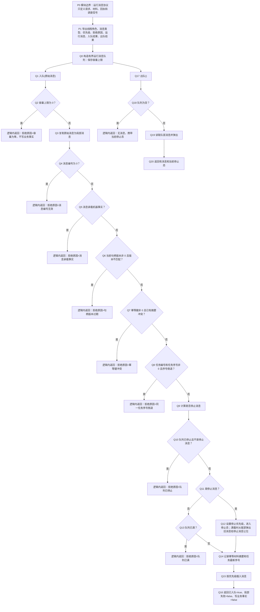

# THREAD-S1 消息类型与有界队列现状流程图

更新时间：2026-07-11

## 元数据

```text
图类型：现状流程图
代码版本：70c73a7；目标模块自 4008b7d 后未漂移；扫描开始时工作区干净
覆盖文件：
  海中鱼巣/线程/运行消息协议.ixx
  海中鱼巣/线程/有界运行消息队列.ixx
覆盖函数：
  运行消息协议模块导出枚举与轻量结构
  有界运行消息队列::有界运行消息队列
  有界运行消息队列::容量
  有界运行消息队列::数量
  有界运行消息队列::已停止
  有界运行消息队列::入队
  有界运行消息队列::出队
  有界运行消息队列::拒绝
  有界运行消息队列::记录材料索引
  有界运行消息队列::插入消息
逐行映射表：实施记录/20260711_THREAD-S1消息类型与有界队列现状流程图逐行代码映射表.md
输入契约 / 调用语境表：实施记录/20260711_THREAD-S1消息类型与有界队列输入契约与调用语境表.md
非成功返回二分审查表：实施记录/20260711_THREAD-S1消息类型与有界队列非成功返回二分审查表.md
偏差清单：实施记录/20260711_THREAD-S1消息类型与有界队列现状施工偏差清单.md
依据实施记录：
  实施记录/20260710_THREAD-S1_消息类型与有界队列基础壳代码实施_Codex断点清单.md
  实施记录/20260710_THREAD-MOD-S1_每线程独立ixx模块拆分代码实施_Codex断点清单.md
验证输出：本图为文档校正产物；未重新运行构建；引用既有 THREAD-S1 与 THREAD-MOD-S1 验证记录
不得作为施工许可：是
不得宣称：运行宿主线程完整完成、自我循环完成、自我苏醒完成、真实外设接入、旧能力迁移完成
```

## 依据

```text
AGENTS.md
规范/0050_项目通用机器逻辑与禁止性规则总纲_20260721.md
规范/规范目录.md
规范/8100_子规范_自我线程与任务管理线程权责边界_20260720.md
规范/8110_子规范_线程生命周期状态上报与控制面板线程信息_20260720.md
.codex/skills/hai-zhong-yu-chao-flowchart-code-correction/SKILL.md
计划/已完成计划/20260711_已执行计划现状流程图校正独立计划_v0.1.md
计划/已完成计划/20260710_THREAD-S1_消息类型与有界队列基础壳代码实施切片_v0.1.md
计划/已完成计划/20260710_THREAD-MOD-S1_每线程独立ixx模块拆分代码实施切片_v0.1.md
流程图/20260709_运行宿主与多线程消息队列流程图_v0.1.md
规范/详细设计/每线程独立ixx模块拆分详细设计.md
海中鱼巣/线程/运行消息协议.ixx
海中鱼巣/线程/有界运行消息队列.ixx
```

## 说明

本图是 THREAD-S1 当前代码事实的现状流程图，不覆盖 `20260709_运行宿主与多线程消息队列流程图_v0.1` 施工图。

当前 THREAD-S1 的权威代码不再是早期计划中的 `海中鱼巣/核心/运行消息队列.h`；THREAD-MOD-S1 已把消息协议迁入 `运行消息协议.ixx`，把有界队列迁入 `有界运行消息队列.ixx`，并清除旧头文件双源。

本图只映射上述两个线程共享模块文件；`入口.cpp` 存量自检由 #236 的入口分段矩阵单独登记，不与生产协议和队列主链混算。

## 流程图



## 中途非成功返回二分表

| 判断点 | 当前代码位置 | 当前分支 | 二分口径 | 理由 |
| --- | --- | --- | --- | --- |
| Q2 | `有界运行消息队列.ixx:31-33` | 容量为 0 返回拒绝 | 逻辑内返回 | 队列未写入，返回局部材料 |
| Q4 | `有界运行消息队列.ixx:36-38` | 消息编号为 0 返回拒绝 | 逻辑内返回 | 入口材料无效，结构不变化 |
| Q5 | `有界运行消息队列.ixx:39-41` | 消息承载机器事实返回拒绝 | 逻辑内返回 | 按规则阻止消息承载事实，结构不变化 |
| Q6 | `有界运行消息队列.ixx:42-44` | 句柄版本过期返回拒绝 | 逻辑内返回 | 过期材料拒绝，不写业务失败事实 |
| Q7 | `有界运行消息队列.ixx:45-50` | 幂等键摘要冲突返回拒绝 | 逻辑内返回 | 冲突材料拒绝，不合并为事实 |
| Q8 | `有界运行消息队列.ixx:51-56` | 同一任务序号倒退返回拒绝 | 逻辑内返回 | 顺序材料拒绝，不改任务状态 |
| Q10 | `有界运行消息队列.ixx:58-61` | 停止后普通消息返回拒绝 | 逻辑内返回 | 停止态局部收口，不写业务事实 |
| Q13 | `有界运行消息队列.ixx:69-71` | 普通消息满载返回拒绝 | 逻辑内返回 | 满载只返回局部失败 |
| Q18 | `有界运行消息队列.ixx:78-81` | 空队列出队返回无消息 | 逻辑内返回 | 无消息是允许结果，不代表异常 |

当前显式代码没有把“前置已满足并进入结构写入后，结果不符合内部预期”的情形画成普通失败返回；因此本图没有已实现的 `追根因解决` 分支。若后续对插入后读回、停止让位或索引记录增加内部一致性复核，复核失败必须新增 `追根因解决` 节点，并同步修正代码诊断。

## 关键边界

```text
本图是现状流程图，不是施工流程图。
消息、队列、入队结果和出队结果只承载请求、材料、回执、调度信号和局部执行结果，不承载机器事实。
所有拒绝分支当前均为逻辑内返回，不写节点、主信息、关系、索引、特征、状态、动态、因果、需求、任务或方法。
停止消息可在满载时弹出尾部旧消息给停止消息让位；这是停止收口的工程行为，不是业务事实写入。
当前映射范围不包含脏工作区中的入口自检代码，不证明默认入口当前输出稳定。
```
