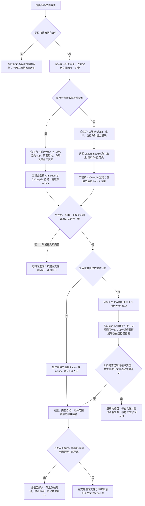

# 代码文件建立归属、模块命名与入口自检承载流程图

更新时间：2026-07-11

## 依据

```text
用户裁决：现有目录结构保持；数据结构文件保持 .h/.cpp；其它后续新文件采用模块；命名采用“功能.分类”。
规范/代码文件建立归属与模块命名规范.md
规范/000_项目规则总纲.md
计划/20260711_CONCEPT-NAMING-S1_待命名治理协议与上行桥代码实施切片_v0.1.md
```
## 说明

本图描述新建代码文件的分类、命名、工程登记和入口承载门禁。现有文件原地保留；旧文件迁移和 `入口.cpp` 全量拆分必须另走计划。

## 流程图



## 关键边界

```text
“数据结构”按文件主要职责判定，不因文件内部出现 struct 就自动使用 .h/.cpp。
新 .ixx 必须是真模块，不得按 ClInclude 登记或由 #include 使用。
生产模块与自检模块分离；自检不进入生产调用路径。
入口.cpp 只保留参数、模式、最小装配、顶层调用和退出码映射。
旧计划若要求把新自检正文继续写入入口.cpp，执行前必须退回设计窗口修订。
```
