# 任务生命周期筹办通用执行与结果结算流程图

更新时间：2026-07-11

## 施工元数据

```text
图类型：施工流程图
绑定计划：#221 TASK-LIFECYCLE-S1、#222 TASK-LIFECYCLE-S2、#223 TASK-PLANNING-S1、#224 TASK-EXECUTION-S1、#225 TASK-RESULT-S1
绑定详细设计：规范/详细设计/任务生命周期筹办通用执行与结果结算详细设计.md
正式基线：#201 / JY-238 / QR-169；#209 / JY-249 正式 S0；JY-250 / QR-172 接口修订
交叉依赖：#223 按 #209 修订无环扁平请求、双向授权材料、当前选择版本和动作桥准入，完成后解锁 #214；#224 只消费精确当前选择；#225 提供 #215 所需通用结果提交契约
结构前置：#221-#225 复用 #217 正式结构事务域；若 #217 实际接口漂移则退回修订
验证方式：各代码切片执行 Debug x64、完整自检、连续 20 轮、并发 / 乱序 / 幂等压力、规范与精确范围检查
不得宣称：当前态、状态机、通用召回选择、真实通用执行、结果结算或持久化恢复已经实现
```

## 依据

```text
AGENTS.md
规范/000_项目规则总纲.md
规范/001_规则迁移清单.md
规范/任务系统规范.md
规范/详细设计/任务状态机筹办执行桥详细设计.md
规范/详细设计/运行宿主与多线程消息队列详细设计.md
规范/详细设计/自我治理循环详细设计.md
规范/详细设计/通用方法召回登记规格索引复判排序详细设计.md
实施记录/20260711_TASK-LIFECYCLE-S0_任务生命周期与通用执行当前代码事实复核_Codex断点清单.md
实施记录/20260711_METHOD-RECALL-S7-S0_任务授权选择接线当前代码事实复核_Codex断点清单.md
海中鱼巣/领域/任务服务.h
海中鱼巣/线程/任务管理线程.ixx
海中鱼巣/线程/任务工作线程.ixx
海中鱼巣/线程/任务结果回执协议.ixx
海中鱼巣/线程/任务管理上行桥.ixx
```

## 说明

本图把 #201 的五段建议固定为连续依赖链。第一版任务生命周期使用专用 `任务生命周期` 关系：同一任务恰有一条有效关系作为当前态，旧关系失效后保留审计；关系顺序号是任务生命周期版本，发生时间戳只描述事件发生材料，不负责选“最新”。

任务授权第一版复用需求到任务的 `归属` 与任务到需求的 `引用` 配对事实；授权材料必须同时携带两条关系的完整句柄 / 版本和同一需求端点。任务方法选择请求固定由 `任务服务.h` 定义为扁平值式 DTO；方法召回侧依赖任务服务并复核完整 S6 建议后适配，方法服务依赖任务服务并消费精确当前选择材料，任务服务不得反向包含任一方法侧头文件或解释方法召回 DTO。

当前选择由唯一有效的顺序号 30 `引用(任务 -> 方法)` 关系完整句柄 / 版本、其所属当前筹办生命周期关系 / 版本和双向授权材料共同裁决。动作桥只接受这份精确当前选择材料，不再把任意任务到方法引用解释为授权。线程、运行消息、队列、方法建议和强类型回执都只承载值式材料。动作事实仍只能由方法执行或领域服务入口形成，任务结果与需求结算仍由正式领域入口写入。

## 流程图

```mermaid
flowchart TD
    A["开始：#201 已形成任务生命周期与通用执行事实矩阵"] --> B["S1：按需求创建任务并取得 #217 同域独占结构许可"]
    B --> C["创建已创建实例状态，并写任务生命周期关系，顺序号 / 生命周期版本为 1"]
    C --> D["经任务服务读取唯一有效当前关系、当前状态材料和全部有效 / 已失效审计历史"]
    D --> E{"当前投影是否唯一、版本连续、场景 / 主体 / 状态值一致"}
    E -->|"否"| R1["追根因解决：不得用最大时间戳、最大枚举或状态节点计数猜当前态"]
    E -->|"是"| F["输出当前生命周期 DTO：任务、当前关系、状态节点、阶段、版本和发生材料"]

    F --> G["S2：提交带预期当前关系 / 版本、目标阶段、时间和可选终止证据的迁移请求"]
    G --> H{"目标是否属于固定合法迁移矩阵，终态请求是否走专用入口"}
    H -->|"否"| L1["逻辑内返回：非法跳转、终态复活或通用入口请求完成 / 失败 / 取消均不写结构"]
    H -->|"精确重复"| L2["幂等逻辑内返回：读回既有当前态，不新增状态或版本"]
    H -->|"是"| I["取得同域独占许可并重读当前关系、承接壳、场景、主体和版本"]
    I --> J{"请求仍为当前且专用证据齐全"}
    J -->|"否"| L3["逻辑内返回：旧版本、并发换代或证据不足，本次不写"]
    J -->|"是"| K["创建新实例状态和新任务生命周期关系，顺序号为旧版本加一，再失效旧关系"]
    K --> M{"新关系唯一有效、旧关系审计可读且历史连续"}
    M -->|"否"| R2["追根因解决：写后结构不及预期，停止依赖路径，不扫描修补"]
    M -->|"是"| N["返回新当前态；已完成 / 失败 / 取消保持终态封口"]

    N --> P["S3：任务服务读取双向承接授权材料，两条关系完整句柄 / 版本，以及筹办中当前关系 / 版本"]
    P --> Q["调用 #206-#208 正式召回、条件复判、排序与只读建议"]
    Q --> S{"建议状态和完整来源是否可提交"}
    S -->|"无候选 / 过期 / 语义并列 / 无权威来源的策略唯一"| L4["逻辑内返回：任务保持筹办中，不按句柄、容器或线程顺序自动授权"]
    S -->|"唯一可建议"| T["方法召回侧复核完整 S6 批次及全部来源，并适配为任务服务自有扁平选择请求"]
    T --> U["任务服务不包含或解释方法召回 DTO；只按稳定句柄 / 版本重读任务、需求、授权、生命周期、方法、规格、索引和上下文来源"]
    U --> U1{"全部来源仍当前且同生命周期版本无冲突"}
    U1 -->|"正常漂移 / 前置不足"| L5["逻辑内返回：本次不写任务方法关系"]
    U1 -->|"同版本权威结构自相矛盾"| R3["追根因解决：停止选择与执行依赖路径"]
    U1 -->|"是"| V0{"是否已有当前选择"}
    V0 -->|"精确同请求"| V2["幂等读回既有当前选择，不增长关系或版本"]
    V0 -->|"同一生命周期版本的不同方法"| L6["逻辑内拒绝冲突选择，不用排序结果覆盖当前选择"]
    V0 -->|"旧生命周期选择，且 #222 已正式返回筹办中"| V1["任务服务使旧选择失效并保留审计，不复活旧关系"]
    V0 -->|"无当前选择"| V["任务服务创建唯一有效顺序号 30 引用关系；完整关系句柄 / 版本作为选择身份"]
    V0 -->|"多条当前选择 / 端点矛盾"| R4["追根因解决：不扫描挑选或修补当前选择"]
    V1 --> V
    V2 --> W
    V --> W{"选择关系、所属生命周期版本和授权材料是否唯一完整读回"}
    W -->|"否"| R5["追根因解决：不得让方法服务、排序或线程补写选择"]
    W -->|"是"| X["输出任务自有当前选择材料；动作桥只接受精确关系句柄 / 版本，#214 与 #224 前置满足"]

    X --> Y["S4：冻结双向授权、生命周期、精确当前选择、方法 / 动作 / 规格、场景和主体请求"]
    Y --> Z{"当前是否存在正式受支持执行适配器"}
    Z -->|"否"| L7["逻辑内返回：不入队、不转排队中，不注册临时函数或外部执行器"]
    Z -->|"是"| AA["任务管理线程把完整请求放入私有有界队列，运行消息只作非权威信封"]
    AA --> AB{"入队结果"}
    AB -->|"满 / 停止 / 重复 / 过期"| L8["逻辑内返回：任务当前态不变化，允许按正式版本重试"]
    AB -->|"已入队"| AC["任务服务复核请求后迁移 筹办中 -> 排队中"]
    AC --> AD["任务工作线程取出完整请求，再经任务服务复核 排队中 -> 执行中"]
    AD --> AE{"双向授权、生命周期、精确选择关系 / 版本和方法 / 动作材料是否仍为当前"}
    AE -->|"否"| L9["逻辑内丢弃过期请求；生命周期后续只经任务服务正式迁移"]
    AE -->|"是"| AF["调用受控任务执行服务；方法执行 / 领域服务写状态与动作动态，线程不是动作来源"]
    AF --> AG{"执行结果"}
    AG -->|"允许等待 / 待重筹办"| AH["任务服务按专用材料迁移到等待中或待重筹办，不伪造结果回执"]
    AG -->|"写后证据不完整"| R6["追根因解决：动作事实、状态或动态读回不一致"]
    AG -->|"完整证据"| AI["工作线程发布强类型非权威回执：任务、方法、动作、实际状态、动态、场景、主体和来源版本"]

    AI --> AJ["S5：上行桥只读复核并投递治理消息，通用任务结果治理入口再次重读权威材料"]
    AJ --> AK{"回执是否当前、完整且与精确选择关系 / 版本及动态证据一致"}
    AK -->|"过期 / 重复 / 允许拒绝"| L10["逻辑内返回：不写任务结果；精确重复读回既有结果"]
    AK -->|"当前版本不变却内部矛盾"| R7["追根因解决：不得把协议通过等同领域结果成立"]
    AK -->|"是"| AL["状态服务结构化比较任务目标状态与实际结果状态"]
    AL --> AM{"目标是否达成"}
    AM -->|"否"| AN["保留已成立状态 / 动态事实；任务服务按证据迁移等待中或待重筹办，不写最终结果 / 完成 / 结算"]
    AM -->|"是"| AO["同域独占许可内记录唯一任务实际结果并由执行中迁移到已完成，逐项读回"]
    AO --> AP{"结果关系与完成生命周期是否完整一致"}
    AP -->|"否"| R8["追根因解决：停止需求结算，不用回执、日志或统计兜底"]
    AP -->|"是"| AQ["独立调用需求服务正式结算；任务已完成事实不因结算重试而回滚"]
    AQ --> AR{"需求结算结果"}
    AR -->|"允许拒绝 / 暂不可结算"| L11["逻辑内保留待结算：任务完成与动作事实保持，可按同证据重试"]
    AR -->|"内部不一致"| R9["追根因解决：不得把任务完成直接改写成需求已满足"]
    AR -->|"已结算 / 精确幂等"| AS["完成：通用任务结果、生命周期和需求结算形成分层结构证据，#215 可复用正式接口"]
```



## 关键边界

```text
1. 新关系类型 `任务生命周期` 预留数值 14；关系 13 仍留给 #212 的 `需求目标概念`。关系准入只接受实际枚举项，不以连续区间放过保留槽位；实际枚举漂移时必须退回设计，不得重编号既有关系。
2. 同一任务恰有一条有效 `任务生命周期` 关系；旧关系转已失效并通过审计读取，顺序号严格从 1 单调加一。
3. 当前态只由有效专用关系和其目标实例状态共同裁决；时间戳、枚举大小、节点编号、状态数量和日志均不能选当前态。
4. #221-#225 复用 #217 单进程结构事务许可和令牌下传；不声明崩溃、断电或跨重启原子恢复。
5. 通用迁移入口不得直接提交已完成、失败或取消。完成由结果入口独占；失败 / 取消需要专用来源与结构化证据。
6. 已完成、失败、取消为终态，不允许复活。恢复工作必须创建新任务或由后续专门重试语义承接。
7. `归属(需求 -> 任务)` 与 `引用(任务 -> 需求)` 第一版共同构成授权 / 承接配对；公开材料必须同时给出两条关系的完整句柄 / 版本和同一需求端点。
8. 任务服务是选择 DTO 的依赖终点：`方法召回服务.h -> 任务服务.h` 负责建议适配，`方法服务.h -> 任务服务.h` 负责精确动作桥；任务服务不得反向包含任一方法侧头文件，也不得接收或解释方法召回 DTO。
9. 第一版只接受 `唯一可建议`。无候选、过期、语义并列以及缺独立权威来源的 `策略唯一` 都不写选择；不得用完整句柄、容器或线程顺序补成唯一。
10. 当前选择由唯一有效顺序号 30 `引用(任务 -> 方法)` 关系完整句柄 / 版本、所属当前筹办生命周期关系 / 版本和授权材料共同裁决；关系顺序号只标识角色槽位，不承担选择版本。
11. 精确同请求幂等读回；同一生命周期版本的不同方法写前拒绝。只有 #222 正式回到筹办中后才可失效旧选择、保留审计并创建新当前选择，不新增跨多关系回滚。
12. 动作桥只接受任务服务读出的精确当前选择材料，并复核关系句柄 / 版本、方法、动作和来源仍当前；任意任务到方法引用不再构成执行准入。
13. 运行消息只作信封。完整执行请求必须携带双向授权材料、生命周期关系 / 版本、精确当前选择关系 / 版本和规格来源版本。
14. 队列入队成功不是任务事实；排队中 / 执行中只能由任务服务复核后写入。过期队列项丢弃不修正权威结构。
15. 首版执行只接正式登记、材料完备且已有领域执行入口的适配能力；不新增任意函数指针表、外部执行器或真实外设。
16. 线程不是动作来源；状态、动态和因果材料仍由方法执行或归属领域服务写入。
17. 强类型回执仍是非权威证据。协议准入、队列发布和上行消息都不能直接记录任务结果或完成。
18. 任务实际结果第一版只记录经结构化比较证明达成目标的最终状态；未达成尝试继续由状态 / 动态证据保留。
19. 任务完成与需求结算是两个提交边界。结算暂不可完成时保留任务已完成和待结算状态，不回滚动作事实。
20. #223 是 #209 的明确后继并解锁 #214；#224 必须继续复核精确当前选择；#225 是 #215 的通用结果接口前置。
21. #216 与 #214 / #215 无业务依赖。执行窗口可跳过未满足的 #214 / #215，继续 #216-#225，再回扫已解锁项。
22. 控制面板、SQL、日志、统计、事件段和持久化快照均不裁决任务生命周期、方法选择、结果或需求满足。
```
