# 任务生命周期筹办通用执行与结果结算流程图

更新时间：2026-07-12

## 施工元数据

```text
图类型：施工流程图
绑定计划：#221 TASK-LIFECYCLE-S1 已按 JY-298 完成；#222 TASK-LIFECYCLE-S2 已按 JY-301 完成；#223 TASK-PLANNING-S1 已按 JY-302 补任务方法选择记录权威承载，#224、#225 继续依赖门控
绑定详细设计：规范/详细设计/任务生命周期筹办通用执行与结果结算详细设计.md
正式基线：#201 / JY-238 / QR-169；#209 / JY-249 正式 S0；JY-250 / QR-172 接口修订；JY-302 选择记录承载修订
交叉依赖：#223 按 #209 修订无环扁平请求、双向授权材料、当前选择版本和动作桥准入，完成后解锁 #214；#224 只消费精确当前选择；#225 提供 #215 所需通用结果提交契约
批次顺序：#213/550 -> #221/560 -> #222/570 -> #223/580 -> #214/590 -> #224/600 -> #225/610 -> #215/620；#221 不以 #213 为业务依赖，#224 不以 #214 为业务依赖
结构前置：#221-#225 复用 #217 正式结构事务域；若 #217 实际接口漂移则退回修订
验证方式：各代码切片执行 Debug x64、完整自检、连续 20 轮、并发 / 乱序 / 幂等压力、规范与精确范围检查
不得宣称：#221 之外的合法迁移、完整状态机、通用召回选择、真实通用执行、结果结算或持久化恢复已经实现
```

## 依据

```text
AGENTS.md
规范/000_项目规则总纲.md
规范/001_规则迁移清单.md
规范/任务系统规范.md
规范/详细设计/任务状态机筹办执行桥详细设计.md
规范/详细设计/运行宿主与多线程消息队列详细设计.md
规范/详细设计/自我治理循环详细设计.md
规范/详细设计/通用方法召回登记规格索引复判排序详细设计.md
实施记录/20260711_TASK-LIFECYCLE-S0_任务生命周期与通用执行当前代码事实复核_Codex断点清单.md
实施记录/20260711_METHOD-RECALL-S7-S0_任务授权选择接线当前代码事实复核_Codex断点清单.md
海中鱼巣/领域/任务服务.h
海中鱼巣/线程/任务管理线程.ixx
海中鱼巣/线程/任务工作线程.ixx
海中鱼巣/线程/任务结果回执协议.ixx
海中鱼巣/线程/任务管理上行桥.ixx
实施记录/20260712_概念命名与任务生命周期后继逻辑提取引用矩阵.md
```

## 说明

本图把 #201 的五段建议固定为连续依赖链。第一版任务生命周期使用专用 `任务生命周期` 关系：同一任务恰有一条有效关系作为当前态，旧关系失效后保留审计；关系顺序号是任务生命周期版本，发生时间戳只描述事件发生材料，不负责选“最新”。

任务授权第一版复用需求到任务的 `归属` 与任务到需求的 `引用` 配对事实；授权材料必须同时携带两条关系的完整句柄 / 版本和同一需求端点。任务方法选择请求固定由 `任务服务.h` 定义为扁平值式 DTO；方法召回侧依赖任务服务并复核完整 S6 建议后适配，方法服务依赖任务服务并消费精确当前选择材料，任务服务不得反向包含任一方法侧头文件或解释方法召回 DTO。

当前选择由唯一有效 `任务方法选择 = 16` 发布关系指向不可变 `任务方法选择记录` 节点裁决。记录节点以版本化主信息值容器保存完整任务方法选择请求、所属筹办生命周期关系 / 状态 / 版本、幂等编号、双向授权、批次与全部来源快照；顺序号 30 `引用(任务 -> 方法)` 只保留为与记录逐字段一致的当前方法投影，不能单独授权。动作桥只接受任务服务读出的记录关系、记录节点、投影关系和生命周期身份组合，不再把任意任务到方法引用解释为授权。线程、运行消息、队列、方法建议和强类型回执都只承载值式材料。动作事实仍只能由方法执行或领域服务入口形成，任务结果与需求结算仍由正式领域入口写入。

## 流程图

```mermaid
flowchart TD
    A["开始：#201 已形成任务生命周期与通用执行事实矩阵"] --> B0["调用期真模块 / 隔离自检从 #217 协调模块取得许可；任务 / 需求 / 存在 / 状态服务只消费数据桥和值式令牌"]
    B0 --> BQ["任务服务验证同域独占令牌，经需求服务同令牌重读需求有效性与完整承接材料"]
    BQ --> BQ1{"需求、主体、宿主、场景和目标状态是否仍完整当前"}
    BQ1 -->|"否"| L0["逻辑内返回：第一项任务写入前拒绝，不使用许可前快照"]
    BQ1 -->|"是"| B["S1：任务服务使用已复核值式材料创建任务节点与主信息；未接线兼容路径不证明事务隔离"]
    B --> B1["存在服务验证同一独占令牌，创建任务虚拟存在及来源引用，返回不可伪造的未发布存在候选能力"]
    B1 --> B2["状态服务验证同一令牌，创建已创建实例状态并返回不可伪造的未发布状态候选能力"]
    B2 --> C["任务服务继续用同一令牌写承接关系和任务生命周期关系，顺序号 / 生命周期版本为 1"]
    C --> D["经任务服务读取唯一有效当前关系、当前状态材料和全部有效 / 已失效审计历史"]
    D --> E{"当前投影是否唯一、版本连续、场景 / 主体 / 状态值一致"}
    E -->|"否"| RB["追根因收口：任务先撤自身关系，再请求状态服务、存在服务按能力逆序撤销，最后撤任务节点 / 主信息"]
    RB --> R1["撤销必须恢复完整前态；首撤销前缺结构或撤销失败继续追根因，不扫描修复"]
    E -->|"是"| CF["存在 / 状态服务确认候选已发布并使撤销能力失效；确认只收口调用栈能力，不新增机器结构"]
    CF --> F["输出当前生命周期 DTO：任务、当前关系、状态节点、阶段、版本和发生材料"]
    B -. "工程承载" .-> S1M["验收：领域/自检.任务生命周期初态.ixx；最终回归阶段顺序 560"]

    F --> G["S2：提交带预期当前关系 / 版本、目标阶段、时间、非零幂等编号和完整固定角色证据的迁移请求"]
    G --> H{"请求形状、目标入口和终态专用入口是否有效"}
    H -->|"否"| L1["逻辑内返回：非法跳转、终态复活或通用入口请求完成 / 失败 / 取消均不写结构"]
    H -->|"是"| I["取得同域独占许可并读取当前投影、完整审计历史、状态幂等编号和固定角色证据关系"]
    I --> IK{"同一任务历史是否已有同幂等编号"}
    IK -->|"有一项"| IS{"前驱关系 / 版本、目标、时间和全部证据是否与请求逐字段相同"}
    IS -->|"是"| L2["幂等逻辑内返回：读回原历史迁移结果及当前投影，不新增状态、关系或版本"]
    IS -->|"否"| L2C["逻辑内拒绝：同键异义，不覆盖既有历史"]
    IK -->|"多项"| R2A["追根因解决：同任务幂等编号历史不唯一，停止依赖路径"]
    IK -->|"无"| J{"预期关系 / 版本仍为当前、目标矩阵合法且专用证据齐全"}
    J -->|"否"| L3["逻辑内返回：旧版本、并发换代或证据不足，本次不写"]
    J -->|"是"| K0["状态服务写幂等双槽；任务服务用专用任务生命周期证据关系 15 的角色 40-46 写证据，再写版本 N+1 新关系"]
    K0 --> K1{"新状态、幂等材料、证据关系和新生命周期关系是否完整预读回"}
    K1 -->|"否"| RB2["追根因收口：删新生命周期 / 证据关系并撤销状态候选；旧关系保持有效"]
    K1 -->|"是"| K["唯一提交点：使版本 N 旧关系失效；版本顺序号仍只表达生命周期版本"]
    K --> M{"新关系唯一有效、旧关系审计可读、幂等编号唯一且历史连续"}
    M -->|"否"| R2["追根因解决：写后结构不及预期，停止依赖路径，不扫描修补"]
    M -->|"是"| N["状态服务确认候选，返回含幂等编号、前驱和完整证据的新当前 / 历史材料；终态保持封口"]
    G -. "工程承载" .-> S2M["验收：领域/自检.任务生命周期迁移.ixx；最终回归阶段顺序 570"]

    N --> N1["若迁移为 待重筹办 -> 筹办中：在同一许可内使旧任务方法选择关系 16 与顺序号 30 投影失效；不可变记录节点保留审计"]
    N1 --> P["S3：任务服务读取双向承接授权材料，两条关系完整句柄 / 版本，以及筹办中当前关系 / 状态 / 版本"]
    P --> Q["调用 #206-#208 正式召回、条件复判、排序与只读建议"]
    Q --> S{"建议状态和完整来源是否可提交"}
    S -->|"无候选 / 过期 / 语义并列 / 无权威来源的策略唯一"| L4["逻辑内返回：任务保持筹办中，不按句柄、容器或线程顺序自动授权"]
    S -->|"唯一可建议"| T["方法召回侧复核完整 S6 批次及全部来源，并适配为任务服务自有扁平选择请求"]
    T --> U["任务服务不包含方法召回 DTO 或协调模块；只经数据桥验证调用方令牌，并按稳定句柄 / 版本重读来源"]
    U --> U1{"全部来源仍当前且同生命周期版本无冲突"}
    U1 -->|"正常漂移 / 前置不足"| L5["逻辑内返回：本次不写任务方法关系"]
    U1 -->|"同版本权威结构自相矛盾"| R3["追根因解决：停止选择与执行依赖路径"]
    U1 -->|"是"| V0{"按任务完整选择审计查询幂等编号与当前记录"}
    V0 -->|"同键且版本化完整请求逐字段相同"| V2["幂等读回既有选择记录、发布关系与投影，不增长节点、主信息、关系或版本"]
    V0 -->|"同键异义 / 同周期已有不同选择"| L6["逻辑内拒绝：不覆盖当前记录，不用排序结果或摘要裁决相等"]
    V0 -->|"旧周期仍有有效发布关系或投影"| R4["追根因解决：正式重筹办失效合同未满足，不扫描挑选或惰性修补"]
    V0 -->|"无当前记录且幂等键未使用"| V1["创建未发布任务方法选择记录节点；按规范化值槽写完整请求、生命周期、授权、批次、索引、登记、规格、条件、上下文和动作来源"]
    V1 --> V["创建顺序号 30 任务到方法投影并把完整投影关系身份写入记录；最后创建任务方法选择关系 16 作为唯一发布点"]
    V0 -->|"多条当前记录 / 记录与投影矛盾"| R4
    V2 --> W
    V --> W{"关系 16、记录节点、顺序号 30 投影、所属生命周期和完整来源快照是否唯一完整读回"}
    W -->|"否"| R5["追根因解决：不得让方法服务、排序或线程补写选择"]
    W -->|"是"| X["输出任务自有当前选择材料；动作桥只接受记录关系 / 节点 + 投影关系 + 生命周期身份，#214 与 #224 前置满足"]
    P -. "工程承载" .-> S3M["验收：领域/自检.任务筹办选择.ixx；最终回归阶段顺序 580"]

    X --> Y["S4：冻结双向授权、生命周期、精确当前选择、方法 / 动作 / 规格、场景和主体请求"]
    Y --> Z{"当前是否存在正式受支持执行适配器"}
    Z -->|"否"| L7["逻辑内返回：不入队、不转排队中，不注册临时函数或外部执行器"]
    Z -->|"是"| AA["任务管理线程把完整请求放入私有有界队列，运行消息只作非权威信封"]
    AA --> AB{"入队结果"}
    AB -->|"满 / 停止 / 重复 / 过期"| L8["逻辑内返回：任务当前态不变化，允许按正式版本重试"]
    AB -->|"已入队"| AC["任务服务复核请求后迁移 筹办中 -> 排队中"]
    AC --> AD["任务工作线程取出完整请求，再经任务服务复核 排队中 -> 执行中"]
    AD --> AE{"双向授权、生命周期、精确选择关系 / 版本和方法 / 动作材料是否仍为当前"}
    AE -->|"否"| L9["逻辑内丢弃过期请求；生命周期后续只经任务服务正式迁移"]
    AE -->|"是"| AF["调用受控任务执行服务；方法执行 / 领域服务写状态与动作动态，线程不是动作来源"]
    AF --> AG{"执行结果"}
    AG -->|"允许等待 / 待重筹办"| AH["任务服务按专用材料迁移到等待中或待重筹办，不伪造结果回执"]
    AG -->|"写后证据不完整"| R6["追根因解决：动作事实、状态或动态读回不一致"]
    AG -->|"完整证据"| AI["工作线程发布强类型非权威回执：任务、方法、动作、实际状态、动态、场景、主体和来源版本"]
    Y -. "工程承载" .-> S4M1["生产：线程/协议.任务执行请求.ixx + 领域/服务.任务执行.ixx；既有线程真模块原地扩展"]
    S4M1 --> S4M2["验收：线程/自检.任务执行调度.ixx；最终回归阶段顺序 600"]

    AI --> AJ["S5：上行桥只读复核并投递治理消息，通用任务结果治理入口再次重读权威材料"]
    AJ --> AK{"回执是否当前、完整且与精确选择关系 / 版本及动态证据一致"}
    AK -->|"过期 / 重复 / 允许拒绝"| L10["逻辑内返回：不写任务结果；精确重复读回既有结果"]
    AK -->|"当前版本不变却内部矛盾"| R7["追根因解决：不得把协议通过等同领域结果成立"]
    AK -->|"是"| AL["状态服务结构化比较任务目标状态与实际结果状态"]
    AL --> AM{"目标是否达成"}
    AM -->|"否"| AN["保留已成立状态 / 动态事实；任务服务按证据迁移等待中或待重筹办，不写最终结果 / 完成 / 结算"]
    AM -->|"是"| AO["任务结果真模块取得同域独占许可并下传值式令牌；传统服务完成唯一结果与生命周期提交后逐项读回"]
    AO --> AP{"结果关系与完成生命周期是否完整一致"}
    AP -->|"否"| R8["追根因解决：停止需求结算，不用回执、日志或统计兜底"]
    AP -->|"是"| AQ["独立调用需求服务正式结算；任务已完成事实不因结算重试而回滚"]
    AQ --> AR{"需求结算结果"}
    AR -->|"允许拒绝 / 暂不可结算"| L11["逻辑内保留待结算：任务完成与动作事实保持，可按同证据重试"]
    AR -->|"内部不一致"| R9["追根因解决：不得把任务完成直接改写成需求已满足"]
    AR -->|"已结算 / 精确幂等"| AS["完成：通用任务结果、生命周期和需求结算形成分层结构证据，#215 可复用正式接口"]
    AJ -. "工程承载" .-> S5M1["生产：领域/服务.任务结果.ixx + 线程/路由.任务结果治理.ixx"]
    S5M1 --> S5M2["验收：线程/自检.任务结果结算.ixx；最终回归阶段顺序 610"]
```



## 关键边界

```text
1. 节点类型追加 `任务方法选择记录 = 14`；关系类型保持 13=`需求目标概念`、14=`任务生命周期`、15=`任务生命周期证据`，追加 16=`任务方法选择`，未知关系负例顺延为 17。既有枚举不得重排，普通引用不得改义。
2. 同一任务恰有一条有效 `任务生命周期` 关系；旧关系转已失效并通过审计读取，顺序号严格从 1 单调加一。
3. 当前态只由有效专用关系和其目标实例状态共同裁决；时间戳、枚举大小、节点编号、状态数量和日志均不能选当前态。
4. #221-#225 复用 #217 单进程结构事务许可和令牌下传；不声明崩溃、断电或跨重启原子恢复。
5. 通用迁移入口不得直接提交已完成、失败或取消。完成由结果入口独占；失败 / 取消需要专用来源与结构化证据。
6. 已完成、失败、取消为终态，不允许复活。恢复工作必须创建新任务或由后续专门重试语义承接。
7. `归属(需求 -> 任务)` 与 `引用(任务 -> 需求)` 第一版共同构成授权 / 承接配对；公开材料必须同时给出两条关系的完整句柄 / 版本和同一需求端点。
8. 任务服务是选择 DTO 的依赖终点：`方法召回服务.h -> 任务服务.h` 负责建议适配，`方法服务.h -> 任务服务.h` 负责精确动作桥；任务服务不得反向包含任一方法侧头文件，也不得接收或解释方法召回 DTO。
9. 第一版只接受 `唯一可建议`。无候选、过期、语义并列以及缺独立权威来源的 `策略唯一` 都不写选择；不得用完整句柄、容器或线程顺序补成唯一。
10. 当前选择由唯一有效 `任务方法选择(任务 -> 任务方法选择记录, 顺序号 30)` 关系、不可变记录节点、记录内所属当前筹办生命周期完整身份和匹配的顺序号 30 方法投影共同裁决；投影关系不得单独授权。
11. 记录值容器使用版本化规范布局，完整保存幂等编号与请求全部字段；每个 uint64 按高 / 低 32 位无损保存，变长条件 / 上下文项使用数量加定长元组，不使用摘要、时间戳、关系版本或内存表替代完整相等比较。
12. 精确同键同完整请求幂等读回；同键异义或同一生命周期已有不同选择写前拒绝。任务服务在正式 `待重筹办 -> 筹办中` 迁移的同一许可内失效旧关系 16 与方法投影，记录节点和审计关系保留，不做读路径惰性修补。
13. 动作桥只接受任务服务读出的记录关系 / 节点、精确投影关系和生命周期身份，并复核方法、动作和来源仍当前；任意任务到方法引用不再构成执行准入。
14. 运行消息只作信封。完整执行请求必须携带双向授权材料、生命周期关系 / 版本、选择记录关系 / 节点、精确方法投影和规格来源版本。
15. 队列入队成功不是任务事实；排队中 / 执行中只能由任务服务复核后写入。过期队列项丢弃不修正权威结构。
16. 首版执行只接正式登记、材料完备且已有领域执行入口的适配能力；不新增任意函数指针表、外部执行器或真实外设。
17. 线程不是动作来源；状态、动态和因果材料仍由方法执行或归属领域服务写入。
18. 强类型回执仍是非权威证据。协议准入、队列发布和上行消息都不能直接记录任务结果或完成。
19. 任务实际结果第一版只记录经结构化比较证明达成目标的最终状态；未达成尝试继续由状态 / 动态证据保留。
20. 任务完成与需求结算是两个提交边界。结算暂不可完成时保留任务已完成和待结算状态，不回滚动作事实。
21. #223 是 #209 的明确后继并解锁 #214；#224 必须继续复核精确当前选择；#225 是 #215 的通用结果接口前置。
22. #216 与 #214 / #215 无业务依赖。执行窗口可跳过未满足的 #214 / #215，继续 #216-#225，再回扫已解锁项。
23. 控制面板、SQL、日志、统计、事件段和持久化快照均不裁决任务生命周期、方法选择、结果或需求满足。
24. #221、#222、#223 自检分别由 `自检.任务生命周期初态`、`自检.任务生命周期迁移`、`自检.任务筹办选择` 真模块承载，并登记最终回归阶段 560 / 570 / 580；入口不承载验收正文。
25. #224 新生产文件固定为 `协议.任务执行请求.ixx` 与 `服务.任务执行.ixx`，#225 固定为 `服务.任务结果.ixx` 与 `路由.任务结果治理.ixx`；自检分别登记最终回归阶段 600 / 610。旧行为 `.h/.cpp` 和旧未分类协议 / 路由文件不进入工程。
26. `任务服务.h`、`需求服务.h`、`存在服务.h`、`状态服务.h`、`方法服务.h` 等传统头文件不得 `import` 或前置声明协调模块公开类；只允许 `#include 核心/结构事务接线.数据.h`，保存可空值式接线，并在令牌感知重载中验证 / 下传令牌。
27. #221-#223 的隔离自检真模块负责建立协调器、取得许可并调用传统服务令牌重载；正式运行期主装配接域归 #246 扫描后的后继计划，本批不得借兼容无接线入口宣称生产主链已纳入事务域。
28. #224 的任务执行真模块和 #225 的任务结果 / 治理真模块可 `import 海中鱼巣.核心.协调.结构事务`，由调用期编排取得许可，再把数据桥值式令牌传给传统领域服务；生产模块不得把移动许可对象存入消息、回执或长期 DTO。
29. #217 的共享状态、四函数表、令牌布局和验证规则在其正式提交前仍是假定接口。#221-#225 执行前必须对照实际头部逐项复核；接口漂移时不改代码、不扩充 ABI，退回设计窗口。
30. #221 的任务虚拟存在仍是正式承接结构，必须由存在服务创建。存在服务的令牌路径固定覆盖创建实际存在、创建虚拟存在、读取存在和存在有效性；不得由任务服务直接创建存在节点，也不得取消任务虚拟存在语义。
31. 存在 / 状态 / 任务任一令牌写链进入创建后发生内部不一致，必须在同一独占许可内按本次句柄精确逆序清理并追根因；释放许可时不得留下可读半任务、孤立存在或孤立状态。
32. #221 在第一项任务写入前必须经需求服务公开只读令牌重载重读需求有效性和承接材料；不得在许可内调用无令牌需求入口，也不得让任务服务直接读取需求仓库。
33. 需求服务令牌重载只复用既有私有令牌辅助并返回值式材料，不改需求写路径、不保存令牌；许可前承接快照不作为任务创建准入事实。
34. 存在 / 状态服务分别返回不可默认构造、不可复制、绑定原服务实例和同一独占令牌的未发布候选能力；能力只在调用栈存活，不进入 DTO、消息、仓库或日志。
35. 任务服务不获得任意存在 / 状态删除权。失败时先撤任务自有关系，再请求状态、存在原所有者按能力逆序撤销，最后撤任务节点 / 主信息；成功时由原所有者确认发布并使撤销能力失效。
36. 同一已撤销能力重复撤销幂等；首撤销前结构缺失 / 冲突、错误服务实例、错误令牌、已发布候选或部分撤销失败均追根因，不得返回幂等成功。
37. #222 的幂等编号由状态服务随版本 N+1 实例状态写入主信息固定槽位 2 / 3，分别保存低 / 高 32 位；任务服务不得直接解释或写主信息槽位，初始版本 1 两槽均不存在。
38. 迁移证据由任务服务以新状态为来源、`任务生命周期证据` 为专用类型、顺序号 40-46 承载；同源同角色唯一，同一目标可合法承担不同角色。目标类型依次限定为任务、方法、方法、状态、动态、任务或方法、状态或动态，禁止存在 / 场景；空角色不建关系，同角色多条、目标类型错误或历史目标不可读均追根因。
38A. 关系仓库只对 `任务生命周期证据` 使用“同类型 + 同源 + 同顺序号”唯一键并拒绝 40-46 外角色；普通引用和其它关系继续按现行“同类型 + 同源 + 同目标”拒绝完全重复，不得全局改成顺序号参与唯一性。
39. 当前 / 历史 DTO 必须返回可选幂等编号、前驱生命周期关系和完整证据材料。精确重复先按同任务完整历史查幂等编号，再逐字段比较前驱、目标、时间和证据；摘要、时间戳或关系版本都不能单独裁决同义。
39. 同任务同幂等编号只能出现一次。唯一历史命中且完整语义相同返回原迁移结果；唯一命中但任一字段不同按同键异义写前拒绝；多项命中属于内部结构矛盾。
40. 旧关系失效是 #222 唯一提交点。提交前任何失败必须删除任务服务新建的生命周期 / 证据关系并由状态服务撤销候选，保持旧关系有效；提交后读回不一致进入追根因，不做版本倒退回滚。
```
