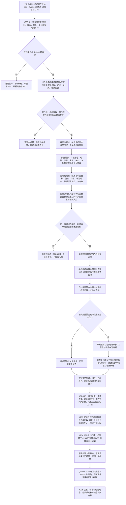

# 动态证据窗口聚类与因果概率候选流程图

更新时间：2026-07-16

## 施工元数据

```text
图类型：施工流程图
当前计划：#233 / DQ-125 / DYNAMIC-PATTERN-S2 / JY-364 / 预留阶段 640
正式前置：#231、#232 已完成；#232 正式提交 6e5f5fb，阶段 630 已登记
当前代码事实：规范动态窗口由步骤组和稳定哈希组成；规范动态步携带完整结构键、回合、片段序号和来源证据
第一版裁决：一个规范动态步只形成一个单步片段实例；不把多个步骤或多个窗口拼接成多步模式
验证方式：Debug / Release x64、完整自检、Release 隔离、碰撞 / 去重 / 输入排列确定性和最终 Debug 连续 20 轮
不得宣称：多步运动序列、因果概率、用途学习、候选持久化或运行期生产接线已实现
```

## 依据

```text
AGENTS.md
规范/000_项目规则总纲.md
规范/仓库与服务分层事务边界规范.md
规范/代码文件建立归属与模块命名规范.md
规范/迁移路线权力分层规范.md
实施记录/20260711_DYNAMIC-PATTERN-S1_规范动态证据签名与有序窗口代码实施_Codex断点清单.md
海中鱼巣/领域/材料.动态模式.ixx
海中鱼巣/领域/算法.动态模式.ixx
海中鱼巣/领域/服务.动态模式.ixx
海中鱼巣/领域/组合.动态观察.ixx
```

## 说明

#232 已形成非权威值式 `规范动态窗口`。窗口稳定哈希混入回合、片段序号、时间和来源动态，只能证明同一窗口材料的稳定封装，不能作为跨回合模式相等键。#233 只消费这些不可变值，不重新读取仓库，不取得许可，也不把许可释放后的窗口解释为当前事实。

版本 1 以 `规范动态步` 为最小片段实例。每个实例按 `动态模式结构键` 完整比较；场景、主体、任务、方法、时间、回合、片段序号和来源动态只保留为来源证据，不进入跨实例结构键。多个步骤不在本轮拼接成多步片段，不引入时间间隔阈值、任意子序列、模糊距离或容差。

## 流程图



## 关键边界

```text
1. #232 的窗口稳定哈希包含来源证据，不能代替 #233 的完整结构键比较，也不能直接作为聚类身份。
2. 第一版片段实例等于一个完整规范动态步；多个步骤 / 窗口不拼接，多步序列、连续性和时间间隔合同后置。
3. 结构相等键不含场景、主体、任务、方法、时间、回合、片段序号或来源动态；这些字段完整保留为来源证据。
4. 哈希只召回候选桶，完整结构键逐字段比较裁决相等；碰撞不同键必须分开。
5. 支持数按完整回合身份去重；同一窗口重复、同一动态重复、同一回合同键重复都不得虚增支持。
6. 同一来源动态映射到不同结构键，或同一回合锚点映射到不同完整回合材料，属于内部不一致并追根因。
7. #232 版本 1 的完整结构键已要求有效来源动作和空二次角色；重复聚类满足后运动基元候选条件自动成立，不保留不可达的“无动作重复聚类”正常分支。
8. 片段序号和发生时间戳只用于来源证据与稳定排序。本轮不推断缺失序号，不设置跨步时间阈值，不枚举任意子序列。
9. #233 纯值计算不得读取仓库、取得许可、调用数据操作层、写缓存、持久化或接唯一运行期业务装配。
10. 聚类和运动基元都只是非权威、可丢弃、可重建候选，不得升格为抽象动态、方法、因果、概念或任务结果事实。
11. #234 继续等待 #233 正式 DTO 和实施结果后重做；不得在 #233 执行轮连续消费 650。
12. #214 继续用户暂停；#258 / #261 救援 stash 不属于本流程，禁止读取、恢复、修改或删除。
```
