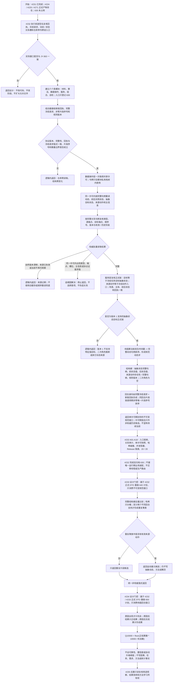

# 动态证据窗口聚类与因果概率候选流程图

更新时间：2026-07-16

## 施工元数据

```text
图类型：施工流程图
绑定计划：#232 DYNAMIC-PATTERN-S1；#233 / #234 只保留后继概念路径，旧 640 / 650 不直接实施
绑定详细设计：规范/详细设计/动态证据窗口聚类与因果概率候选详细设计.md
正式前置：#231 / DQ-123 / JY-362 已完成；#224、#225、#271 正式产物已存在
当前代码事实基线：3c2c324；630 / 640 / 650 未占用
版本 1 目标：只支持正式任务执行链中“抽象状态目标 + 实例前后状态 + 实例动态 + 来源动作”的规范窗口
验证方式：#232 执行 Debug / Release x64、完整自检、并发单许可快照、Release 隔离和最终 Debug 连续 20 轮
不得宣称：特征值反向语义已补齐、运行期新版任务结果链已接线、重复模式 / 因果概率 / 用途学习已实现
```

## 依据

```text
AGENTS.md
规范/000_项目规则总纲.md
规范/仓库与服务分层事务边界规范.md
规范/多线程防锁机制规范.md
规范/代码文件建立归属与模块命名规范.md
实施记录/20260711_DYNAMIC-CAUSAL-S0_动态模式因果用途与学习接线当前代码事实复核_Codex断点清单.md
计划/已完成计划/20260711_TASK-EXECUTION-S1_通用执行调度与强类型回执代码实施切片_v0.1.md
计划/已完成计划/20260711_TASK-RESULT-S1_任务结果完成与需求独立结算代码实施切片_v0.1.md
```

## 说明

本图只处理非权威值式候选。调用方提交新版任务结果回执、其内嵌完整冻结请求、非零片段序号和规则版本；完整冻结请求与回执共同形成非权威观察回合身份，不新增权威任务尝试节点，也不持久化回合或片段。

`数据操作.动态模式` 是唯一结构读取许可所有者。它在一次共享许可内按完整句柄、版本、关系句柄、关系阶段和端点，批量重读动态、前后实例状态、抽象目标状态与来源动作；公开业务服务和组合器只接收值式请求 / 结果，不暴露、保存、传递或比较原始事务令牌。

版本 1 不从特征值反查语义，也不从二次特征顺序号推断角色。规范动态步以抽象状态完整句柄表示变化语义，二次特征角色固定为空。#233 / #234 继续只消费不可变值式材料，但必须在 #232 实际完成后重做各自实施合同。

## 流程图



## 关键边界

```text
1. #231 已完成，旧 #217“服务取得许可并下传原始令牌”不再是 #232 前置或实现合同。
2. 完整冻结请求 + 新版回执共同形成非权威回合身份；调用期只新增非零、同回合唯一的片段序号，不新增权威任务尝试节点。
3. 公开组合器、业务服务、材料和算法模块不得暴露、持有、传递或比较原始结构事务令牌、许可、仓库或锁。
4. `数据操作.动态模式` 内部一次取得共享许可，直接按仓库权威记录形成批量值式材料；不得调用会再次取得许可的既有公开服务或数据操作入口。
5. 一次共享许可只证明本批读取处于同一许可期，不建立全局快照编号，也不证明许可释放后材料仍然当前。
6. 版本 1 只支持正式任务执行链的抽象状态目标；`被改变目标` 必须等于冻结任务目标状态并读回为完整抽象状态。
7. 前后实例状态、动态、场景、主体、来源动作和新版回执必须逐字段一致；关系按完整句柄、版本、端点、顺序号和有效 / 历史阶段复核。
8. 特征值反向语义解析不在 #232 内补齐；特征值目标和其它未登记目标类型逻辑返回，不改既有特征服务。
9. 二次特征顺序号只表示结构位置；版本 1 角色字段固定为空，不读取、不猜测、不混用。
10. 片段内部按发生时间戳和完整动态句柄排序；回合内按显式片段序号排序，容器、线程和哈希桶顺序不得影响结果。
11. 结构键使用抽象状态完整句柄、前后状态值、来源动作存在性 / 完整句柄和规则版本；实例身份、场景、时间、动态句柄只作证据。
12. 哈希只用于分桶，完整结构键全量比较才裁决相等；哈希碰撞必须保持分离。
13. 请求无效、来源自然漂移或版本 1 不支持属于逻辑内返回；同一许可内完整协议与权威结构矛盾属于追根因解决。
14. #232 不写任何仓库、特征值侧表、缓存、索引或 HYSNAP01 段，不持久化回合、片段、窗口或候选。
15. #232 新建 `材料.动态模式`、`算法.动态模式`、`数据操作.动态模式`、`服务.动态模式`、`组合.动态观察`、`自检.动态模式` 六个真模块。
16. 入口只 import 自检模块并登记 Debug 阶段 630；Release 不登记、不输出且二进制不含专项自检标识。
17. #232 不修改唯一运行期业务装配、任务执行 / 结果治理组合器、线程协议或生产路由；隔离生产模块与自检接域不等于生产链接通。
18. #233 / #234 旧计划不得在 #232 完成后自动消费；必须基于实际 DTO 分别重做计划后才可实施 640 / 650。
19. #235 继续后置纯只读，不把概率、效用、用途缓存和方法学习合并成一个事实或分数。
20. 本批不新增状态 / 动态生命周期写入、抽象节点、后台线程、SQL、控制面板、D455、体素、外设或旧能力迁移完成声明。
```
