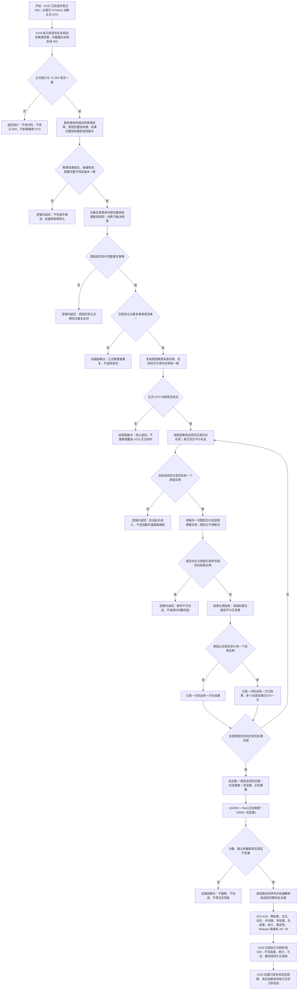

# 动态证据窗口聚类与因果概率候选流程图

更新时间：2026-07-16

## 施工元数据

```text
图类型：施工流程图
当前计划：#234 / DQ-126 / CAUSAL-PATTERN-S1 / JY-365 / 预留阶段 650
正式前置：#231-#233 已完成；#233 正式提交 b73ad16，阶段 630 / 640 已登记
当前代码事实：动态聚类结果公开单步实例、重复聚类和运动基元；实例保留完整回合、片段序号、结构键和来源证据
第一版裁决：原因必须是正式重复聚类；每个原因支持回合只计一次机会；原因后一个或多个结果只计一次正结果
验证方式：Debug / Release x64 完整 Rebuild、完整自检、Release 隔离、顺序 / 计数 / 公式确定性和最终 Debug 连续 20 轮
不得宣称：稳定因果、可靠性、结果效用、用途观察、方法学习、候选持久化或运行期生产接线已实现
```

## 依据

```text
AGENTS.md
规范/000_项目规则总纲.md
规范/代码文件建立归属与模块命名规范.md
规范/迁移路线权力分层规范.md
实施记录/20260711_DYNAMIC-PATTERN-S2_重复片段聚类与运动基元候选代码实施_Codex断点清单.md
海中鱼巣/领域/材料.动态模式.ixx
海中鱼巣/领域/算法.动态模式.ixx
海中鱼巣/领域/服务.动态模式.ixx
```

## 说明

#233 已形成纯值 `动态聚类结果`。`单步实例组` 是本轮出现位置的完整来源，`重复聚类组` 证明某一完整结构键至少获得两个不同完整回合支持。#234 不重新读取仓库，不取得许可，也不把该值式快照解释为当前世界事实。

版本 1 的原因键必须精确命中一个正式重复聚类；结果键只需完整、与原因键不同且规则版本一致，可以在全部单步实例中零次出现。结果只在同一原因支持回合内、片段序号严格大于唯一原因实例时形成正结果；原因前结果保留为来源证据但不贡献正结果。同一回合原因多次无法确定机会起点，或原因 / 结果片段序号相同无法确定先后，均逻辑拒绝，不猜测配对。

## 流程图



## 关键边界

```text
1. #234 的输入是完整动态聚类结果，不是窗口哈希、结构哈希、单个运动基元或调用方自报计数。
2. 原因键必须精确命中正式重复聚类，确保至少两个不同完整回合提供机会；结果键允许零次出现，以合法表达 Q10000 = 0。
3. 原因 / 结果相等使用 动态模式结构键相同 逐字段裁决；哈希只可用于定位，不能裁决出现或因果身份。
4. 每个原因支持回合只贡献一次机会。原因零次的其它回合不计机会，也不进入负结果集合。
5. 同一支持回合存在多个原因实例时机会起点歧义，逻辑拒绝整个请求；不得选择最早、最晚或首次遍历项。
6. 结果只与同一完整回合配对。结果片段序号严格大于原因才是后续结果；相同序号拒绝，时间戳不用于补顺序。
7. 结果只在原因之前出现时，该机会是负结果；前置结果保留证据但不拒绝请求。
8. 原因之后出现一个或多个结果实例都只贡献一次正结果；完整后续结果实例组保留为证据，不能虚增概率。
9. 机会数固定等于原因重复聚类的支持回合数；概率使用整数下取整，不设置可靠性、置信度、最低概率或自动升格阈值。
10. #233 已将合法实例总数限制在公开容量内，版本 1 的乘法上界可静态证明安全；有效输入不伪造不可达的溢出分支。
11. 新增 材料.因果模式、算法.因果模式、服务.因果模式、自检.因果模式 四个真模块；DTO 只有材料模块一个声明所有者。
12. 全链纯值同步计算，不读仓库、不取许可、不调用数据操作、不启动生产线程、不持久化、不接唯一运行期业务装配。
13. 概率候选不是稳定因果、用途有效、方法学习授权或自动行动依据；这些问题只由 #235 后继事实复核承接。
14. #214 继续用户暂停；#258 / #261 救援 stash 不属于本流程，禁止读取、恢复、修改或删除。
```
