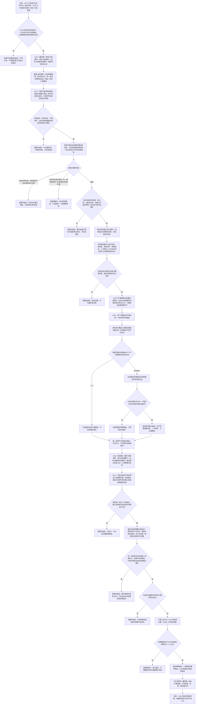

# 动态证据窗口聚类与因果概率候选流程图

更新时间：2026-07-12

## 施工元数据

```text
图类型：施工流程图
绑定计划：#232 DYNAMIC-PATTERN-S1、#233 DYNAMIC-PATTERN-S2、#234 CAUSAL-PATTERN-S1
绑定详细设计：规范/详细设计/动态证据窗口聚类与因果概率候选详细设计.md
正式前置：#217、#225 实际完成 -> #231 更新后 S0 事实复核
当前代码事实基线：18f7bca；现有单动态候选不能冒充重复模式或概率候选
验证方式：各代码切片执行 Debug x64、完整自检、连续 20 轮，并按各自验收矩阵验证确定性和失败不变式
不得宣称：当前已形成动态模式、运动基元、稳定因果、用途学习、方法学习或自动概念生成
```

## 依据

```text
AGENTS.md
规范/000_项目规则总纲.md
规范/001_规则迁移清单.md
规范/详细设计/服务操作函数矩阵第三批.md
规范/详细设计/动态聚合与运动基元候选详细设计.md
规范/详细设计/因果模板与查询候选详细设计.md
实施记录/20260707_FS02_动态聚合因果模板删除实例状态后续S0当前代码事实扫描_Codex断点清单.md
计划/20260711_TASK-RESULT-S1_任务结果完成与需求独立结算代码实施切片_v0.1.md
```

## 说明

本图只处理非权威候选。调用方显式提交观察回合身份、回合内片段序号和动态句柄组；服务逐条重读动态与特征语义，形成稳定排序的规范动态窗口。一个完整片段只能形成实例片段候选，至少两个不同回合各有完全相同的完整片段键才能形成重复聚类；重复聚类中存在有效来源动作时，才可返回运动基元候选。

因果候选以显式原因模式、结果模式和观察回合组为输入，只统计原因出现后的机会与结果并返回 Q10000 概率。概率表示当前证据下的可能性，不要求“可靠世界事实”，也不自动升格、行动或写方法；是否好用及方法学习接线由 #235 更新后事实复核裁决。

## 流程图



## 关键边界

```text
1. #232 执行前必须先完成 #225 和 #231；实际回执、状态、动态、特征和用途接口与假定契约不一致时退回设计。
2. 第一版只接收调用方显式提交的观察回合身份、片段序号和动态组，不扫描整个场景并用隐藏时间阈值自动切段。
3. 每个片段的动态必须同场景、同主体且不重复；同回合片段序号唯一、动态不跨片段重复，不合法请求整体逻辑内返回。
4. 片段内部按发生时间戳、完整动态句柄排序；回合内片段按显式序号排序，线程完成顺序、容器遍历顺序和指针地址不得影响结果。
5. 动态目标必须经特征服务解析唯一语义特征定义；动态模式服务不得直接调用特征值服务。
6. 目标非特征值、原始类型不支持或来源过期是逻辑拒绝；当前有效特征值归属零 / 多、实例槽位模板定义零 / 多是内部结构矛盾并追根因。
7. 规范动态步的相等键至少包含语义特征定义、前值、后值、来源动作存在性 / 句柄和规则版本。
8. 场景、主体、时间戳和来源动态句柄保留为证据，但不进入跨实例语义相等键。
9. 二次特征上下文只有在 #231 证明角色序号是稳定语义后才能进入键；不得把容器位置猜成角色。
10. 哈希只用于分桶，完整结构键全量比较才裁决候选相等；哈希碰撞必须分开。
11. 一个显式片段只形成单实例片段；至少两个不同回合各有完全相同片段才形成重复聚类候选。
12. 同一回合即使有多个同键片段也不得重复贡献支持数；来源回合组使用稳定身份确定性排序。
13. 运动基元候选还要求重复片段中存在有效来源动作；无动作的重复片段仍只是重复动态候选。
14. 第一版比较完整显式片段；因果只在显式片段窗口序列中匹配，不进入动态步内部做任意子序列挖掘、模糊距离、隐式容差或评分阈值。
15. 聚类和运动基元均为非权威值式材料，不创建抽象动态、二次特征、方法、概念或因果节点。
16. 因果统计只把“原因出现”算作机会；原因缺席的回合不进入分母。
17. 原因 / 结果键第一版必须不同，结果窗口的片段序号必须在原因之后；多次出现或重复片段身份造成歧义时拒绝整个请求，由调用方重新分段。
18. 概率使用 Q10000 下取整，机会数非零即可返回；不设可靠性、置信度或自动升格门槛。
19. 概率候选只表达当前证据下的可能性，不等于稳定世界事实；是否好用由 #235 基于真实结果 / 结算材料另行复核。
20. 本批不新增状态 / 动态删除、持久化段、后台线程、SQL、显示、控制面板、外设或自然语言裁决。
21. #232 的生产动态模式服务是本批唯一许可所有者：一次公开调用只取得一份共享许可，并向动态、特征、状态和二次特征读取下传同一值式令牌；嵌套取得许可、锁内跨仓库读取或绕过令牌均为接口漂移。
22. #233 和 #234 只消费已封存的不可变值式材料，不保存结构事务接线、许可或令牌，也不重新读取仓库。
23. #232-#234 的行为文件必须是真模块；自检分别由 `自检.动态模式`、`自检.动态聚类`、`自检.因果模式` 承载并登记最终回归阶段 630 / 640 / 650，入口只 import 和登记无捕获回调。
24. 本批不接入运行期主装配；未来生产接线归 #246 裁决出的唯一正式运行期上下文后继计划，隔离自检接域不能冒充主装配完成。
```
