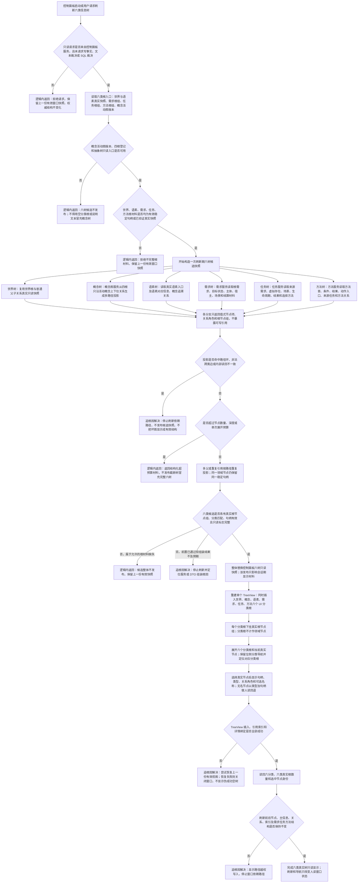

# 控制面板六类真实树只读显示流程图 v0.1

更新时间：2026-07-11

## 依据

```text
AGENTS.md
规范/0050_项目通用机器逻辑与禁止性规则总纲_20260721.md
规范/规范目录.md
规范/1140_根规范_存在节点_20260720.md
规范/2210_根规范_语素入口_20260720.md
规范/3100_根规范_需求_20260720.md
规范/3200_根规范_任务_20260720.md
规范/3300_根规范_方法_20260720.md
规范/4010_子规范_统一仓库稳定句柄与通用关系索引边界.md
规范/7100_子规范_存在概念与实例创建最小闭环_20260720.md
规范/8110_子规范_线程生命周期状态上报与控制面板线程信息_20260720.md
流程图/20260711_概念图自动生长与抽象关系树形视图流程图_v0.1.md
规范/详细设计/概念图自动生长与抽象关系树形视图详细设计.md
实施记录/20260711_CONCEPT-S0_概念图自动生长当前代码事实扫描_Codex断点清单.md
流程图/20260709_控制面板功能流程图_v0.1.md
流程图/20260710_控制面板原生窗口运行流程图_v0.1.md
规范/详细设计/控制面板功能详细设计.md
规范/详细设计/控制面板原生窗口运行详细设计.md
当前控制面板窗口、控制面板服务、需求服务、任务服务、方法服务和语素服务代码事实
```

## 说明

本图把“所有树都显示出来”固定为世界、概念、语素、需求、任务、方法六类真实只读结构同时进入同一个 TreeView。六个分类标题只是 UI 导航容器；每类必须挂接由稳定句柄和正式关系证明的真实根节点组，分类标题本身不冒充领域节点。

概念树必须读取概念图服务的活动图版本和抽象关系树形投影。当前 CONCEPT-S0 已证明该入口尚未实现，因此最终控制面板切片依赖 CONCEPT-S5；依赖未满足时不得显示空概念根、文本说明或 SQL 行冒充概念树。

## 流程图



## 关键边界

```text
1. 六类固定为世界、概念、语素、需求、任务、方法；状态和动态只作为节点详情材料。
2. TreeView 同时挂六个 UI 分类根并允许全部展开，分类导航继续保留并只定位分类根。
3. UI 分类根是会话期导航容器，不是节点，不计入真实树节点数，也不能在无真实子根时冒充一棵树。
4. 世界树和语素树复用当前真实结构 DTO；需求、任务、方法必须优先调用各自领域服务公开只读入口。
5. 概念树只接受 CONCEPT-S5 活动图版本和抽象关系树形投影；不得读取设计文档、空标题、SQL、日志或静态文本冒充。
6. 概念多父节点按每条有效路径重复投影，不复制领域节点，不向概念图反写树关系。
7. 名称可以为空；显示回退标签由节点类型和稳定句柄生成，只做人读，不参与身份、匹配或裁决。
8. 一次刷新必须先构造完整六树候选，再整体替换会话快照；不得逐类覆盖后留下五棵新树和一棵旧树。
9. 控制面板服务、显示层和窗口都不得写节点、主信息、关系、索引、需求、任务、方法、状态、动态或因果结构。
10. SQL Server 审计页可以继续独立存在，但 SQL 记录不得成为六类树的数据源或运行期事实。
11. 逻辑内返回只发生在写前拒绝、依赖未就绪、允许的根材料缺失或预算耗尽，且不发布部分候选。
12. 有效前置通过后的图环、非法边、DTO 组装不一致、控件插入失败或结构数量变化都必须追根因解决。
```
