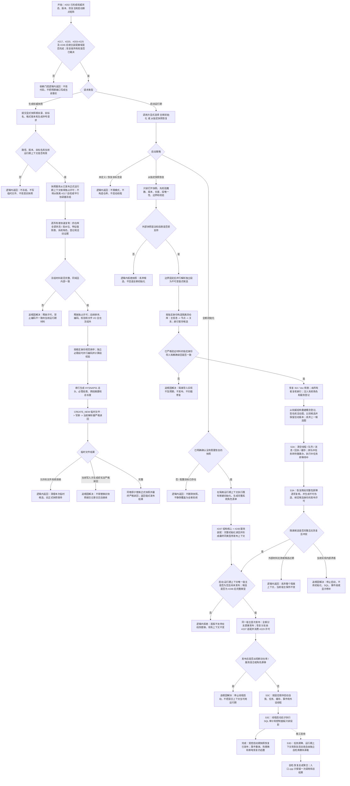

# 权威状态快照隔离恢复与运行期上下文一次发布流程图

更新时间：2026-07-11

## 施工元数据

```text
图类型：施工流程图
绑定计划：#226 PERSIST-S1、#227 RECOVERY-S1、#228 RECOVERY-S2、#229 RECOVERY-S3A、#237 RECOVERY-S3B、#238 RECOVERY-S3C、#239 RECOVERY-S3D、#230 RECOVERY-S4
绑定详细设计：规范/详细设计/权威状态快照隔离恢复与运行期上下文一次发布详细设计.md
正式基线：#202 / JY-240 / QR-170
接口冻结前置：#217、#220、#203-#225 必须形成实际接口；#246 及其登记的主装配接域 / 端到端计划必须完成并裁决恢复链复用关系；#191、#200 已完成事实继续作为输入
验证方式：各代码切片执行 Debug x64、完整自检、连续 20 轮；最终切片增加 50 轮并发冻结与隔离恢复循环
不得宣称：当前已实现权威快照、事件重放、在线热替换、崩溃 / 断电恢复、任务跨重启续跑或旧持久化能力迁移
```

## 依据

```text
AGENTS.md
规范/000_项目规则总纲.md
规范/001_规则迁移清单.md
规范/详细设计/仓库快照格式与恢复拒绝矩阵详细设计.md
规范/详细设计/事件日志持久化恢复详细设计.md
规范/详细设计/特征值序列化恢复边界详细设计.md
规范/详细设计/结构化事件段持久化与只读校验详细设计.md
实施记录/20260711_PERSIST-RECOVERY-S0_权威状态持久化恢复当前代码事实复核_Codex断点清单.md
```

## 说明

本图把持久化和恢复分成两个方向。持久化在统一结构事务独占许可内只做快速值式复制，随后释放冻结，再并行规范编码和原子发布文件。恢复不接触当前运行期，而是在隔离上下文中严格解析、按指定身份构造四仓库、恢复领域侧表与系统角色、重建活动图、完成跨段屏障，最后由空宿主一次发布。

索引段只保存带明确所有者的候选，恢复时必须由所有者逐键复核；HYEVSEG1、缓存、线程、消息、回执、控制面板和 SQL 不参与恢复裁决。首版只支持启动期发布，不支持已有运行期上下文的在线替换。

## 流程图



## 关键边界

```text
1. PERSIST-S1 执行前必须复核 #217、#220、#203-#225 的实际接口；任何服务新增侧表权威状态都必须有显式段，禁止塞入不透明字节。
2. 快照格式第一版固定魔数 HYSNAP01、显式小端、总头版本 1、段类型版本和必需段唯一性；未知必需段或版本拒绝。
3. 快照必须保存四仓库全部记录状态、当前版本、仓库编号、高水位和节点创建序号，不只保存有效记录。
4. 冻结采用 #217 同域独占许可。所有权威写入口必须先参与该事务域；否则不能生成完整快照。
5. 冻结内只做有界的值式复制和内部一致性读回，不排序、不编码、不校验大字节、不做文件 I/O。
6. 各所有者锁一次只持有一把；概念图双锁继续采用活动图锁到图写锁的正式顺序。
7. 冻结外可并行编码 / 解析独立段，但完成顺序不决定记录顺序、快照身份、活动版本或发布顺序。
8. 索引不裁决事实。每个索引候选必须有唯一明确所有者和格式版本，恢复时由所有者重读权威结构后绑定。
9. 当前有效关系的端点必须是精确当前有效句柄；已失效 / 已删除历史关系可以指向同身份的墓碑端点，但不得指向不存在身份或未来版本。
10. I64 值与版本、VecI64 / VecU64 完整值与版本必须一起恢复；#191 候选不能替代空上下文导入。
11. 系统角色清单使用版本化枚举和完整句柄，不用名称字符串、日志或 SQL 发现世界根、自我、两个根需求或概念四根。
12. 活动图集合和签名是候选证据；恢复时从仓库和登记重建后比较。活动版本精确保留，上一候选图始终丢弃。
13. HYEVSEG1 只作审计旁路，不参与快照补齐、事件重放或当前事实裁决。
14. 统计缓存、窗口树、线程对象、队列、消息、回执、幂等表和会话序号不进入权威快照。
15. 全新与恢复是显式互斥启动策略。无效既有快照绝不静默回退全新初始化。
16. 首版运行期上下文只允许空宿主首次发布；已有上下文时拒绝恢复，不实现在线热替换。
17. 恢复候选在隔离上下文中完成。外部坏快照属于逻辑内拒绝；当前写入方自读失败或已验证候选导入失败属于追根因。
18. 恢复后排队中任务只转待重筹办，执行中任务只转等待中；不从遗留队列继续执行，也不自动重试未知外部副作用。
19. 发布后才启动线程，线程后才做 SQL 审计和控制面板投影；后二者不能修复发布候选。
20. 首版只证明受控启动期恢复，不证明崩溃 / 断电耐久性、跨版本迁移、在线热替换、事件重放或任务恰好一次执行。
21. RECOVERY-S3 固定拆为 #229 恢复屏障、#237 恢复候选发布适配、#238 启动接线、#239 独立自检；只有恢复分支需要 #229 不可伪造许可，全新分支使用 #247 结构核心与 #248 服务装配形成的完整初始化读回。
22. 恢复领域场景、并发和逐项输出必须位于 `自检.恢复任务屏障`、`自检.恢复上下文发布`、`自检.恢复启动` 和 `自检.恢复总成` 真模块；#237 复用 #247/#248 最终 `自检.运行期上下文` 合同，入口只作最小调用。
23. #217 只证明隔离仓库组可接域，不证明入口主装配、快照服务或运行期宿主已接域；#226 不得直接以 #217 完成为运行期冻结充分条件。
24. #246 必须先扫描当前主装配和恢复链，生成并完成正式主装配接线 / 失败清理 / 端到端计划，再裁决 #237 是复用、修订还是被替代；裁决前 #226、#229、#237-#239、#230 不得执行代码。
25. 生产运行期上下文、宿主、租约和协调状态只能有一个所有者。离线恢复候选可以独立构造，但发布时必须移动进入同一正式宿主合同，不得保留第二套生产上下文类型。
26. #247 缺领域服务的结构核心禁止生产发布；#248 回改 `启动.运行期上下文` 后最终上下文拥有服务装配，恢复链只消费该完整类型。
26. #227 / #228 的严格解析和隔离重建设计可保留，但其代码执行仍经 #226 依赖链门控；离线候选通过不等于运行期恢复或发布完成。
```
