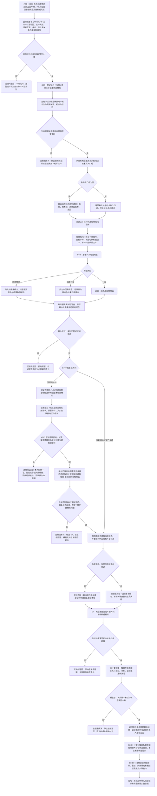

# 概念命名用途与生命周期治理流程图

更新时间：2026-07-11

## 施工元数据

```text
图类型：施工流程图
绑定计划：#194 CONCEPT-S6A、#195 CONCEPT-S6B、#196 CONCEPT-S6C-S0、#197 CONCEPT-S7、#198 CONCEPT-S8-S0；#210 CONCEPT-S6D 是 #197 的正式业务前置
绑定详细设计：规范/详细设计/概念命名用途与生命周期治理详细设计.md
允许文件：分别以五份绑定计划的“允许文件”为准；本图不授予超出单切片范围的合并修改许可
禁止文件：分别以五份绑定计划的“禁止文件”为准；尤其禁止提前修改节点 / 主信息 / 索引删除、写入事务、命名需求和 UI 写事实
预期结构变化：S6A 新增概念生命周期关系与名称 / 指代只读材料；S6B 新增非权威用途缓存；S7 只重挂生命周期关系；两份 S0 不改机器结构
执行前复核：每个切片读取前置正式记录并逐项比对实际接口；漂移时不改代码，退回设计计划窗口修订对应计划
验证方式：代码切片执行 Debug x64、完整自检、规范检查和排除项扫描；S0 只执行文档与 C++ 零差异检查
不得宣称：本施工目标是当前代码事实；命名需求、自动命名、安全物理删除、跨重启恢复或旧概念能力已实现
```

## 依据

```text
AGENTS.md
规范/0050_项目通用机器逻辑与禁止性规则总纲_20260721.md
规范/规范目录.md
规范/4000_子规范_基础抽象命名规则_20260720.md
规范/7100_子规范_存在概念与实例创建最小闭环_20260720.md
规范/7110_子规范_存在根概念元特征_20260720.md
规范/7200_子规范_基础信息语素信息关系整合_20260720.md
流程图/20260711_概念图自动生长与抽象关系树形视图流程图_v0.1.md
流程图/20260711_概念活动实例支持权威失效与投影推进流程图_v0.1.md
规范/详细设计/概念图自动生长与抽象关系树形视图详细设计.md
规范/详细设计/概念活动实例支持权威失效与投影推进详细设计.md
实施记录/20260711_CONCEPT-S0_概念图自动生长当前代码事实扫描_Codex断点清单.md
实施记录/20260711_CONCEPT-S5_活动图发布与抽象树只读投影代码实施_Codex断点清单.md
实施记录/20260711_CONCEPT-S6D_活动实例支持权威失效与投影推进代码实施_Codex断点清单.md
海中鱼巣/领域/概念图服务.h
海中鱼巣/领域/语素服务.h
海中鱼巣/领域/状态服务.h
海中鱼巣/领域/统计服务.h
```

## 说明

本图承接已完成的 CONCEPT-S5 与 CONCEPT-S6D，覆盖待命名请求、上下文临时指代、一般 / 因果预测 / 因果行动用途观察、生命周期初态、冷却、退役和重新激活。S7 的活跃到冷却路径必须显式经过 #210 正式支持失效、真实普通概念零支持、旧候选过期和当前版本候选重算，不得回退四根或复用旧候选。

物理删除不在本图直接实施。S7 完成后必须先执行 CONCEPT-S8-S0，重新核对事务、补偿、活动图隔离、关系失效、主信息 / 索引清理和删除后固定点，再生成安全删除三件套。

## 流程图



## 关键边界

```text
1. 类型不能为空由四根类别和直接上位概念承担；名称可以为空，名称不参与概念身份裁决。
2. 名称仍由语素关系承载；不得新增概念名称字段或把代词持久化为名称。
3. 概念生命周期使用专用“概念生命周期”关系指向活跃、冷却、退役抽象状态材料；同一概念必须恰有一个当前目标。
4. 一般、因果预测、因果行动三类用途分别观察；预测 / 行动用途只接受因果概念。
5. 统计缓存可清空、可重建，不得直接改变生命周期或裁决概念是否有用。
6. 冷却、退役和重新激活只能由概念图服务在重读权威支持与外部引用后执行。
7. 根概念不得冷却或退役；退役节点仍可读、可命名、可重新激活，但不进入主动召回。
8. 命名请求不等于完整需求。现有需求目标必须是目标状态，S6C 先扫描正式映射后再生成代码计划。
9. S8-S0 只读复核后才能生成物理删除实施计划；不得把节点仓库单点删除冒充安全删除。
10. 写前拒绝和候选不足属于逻辑内返回；前置通过后写入、重挂或读回不及预期属于追根因解决。
11. S7 活跃到冷却必须使用 #210 正式入口使真实普通概念当前支持归零；四根支持写前拒绝，不能作为样本。
12. #210 推进活动版本后，失效前 #195 候选必须过期；只有按当前活动版本重算且零支持、观察材料完整的新候选可以进入生命周期转换。
13. #210 写前逻辑拒绝或仍未达到零当前有效支持属于逻辑内返回：本次拒绝请求不写，已完成合法失效与活动版本推进保持，生命周期关系不变；只有已真实达到零支持并推进版本后，旧候选仍可接受或新候选材料不一致才进入追根因解决。
14. 每条 #210 支持失效请求独立原子；S7 不新增跨多关系事务，也不因后续拒绝或并发新增支持回滚已经完成的合法失效。
```
