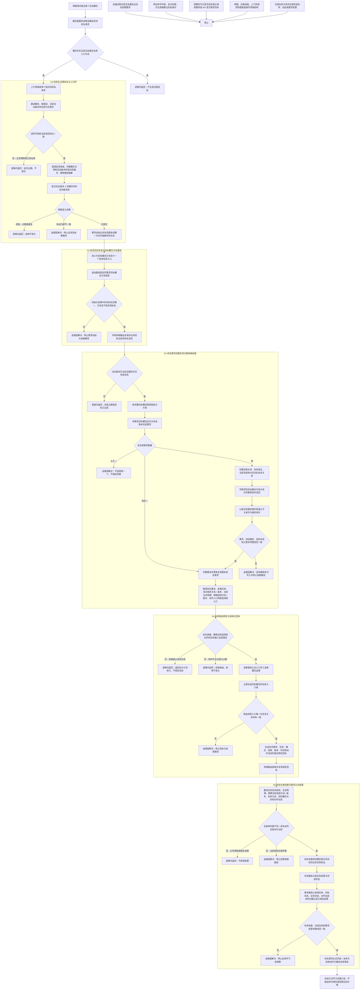

# 概念命名需求协议目标创建绑定结算流程图

更新时间：2026-07-11

## 依据

```text
AGENTS.md
规范/000_项目规则总纲.md
规范/001_规则迁移清单.md
规范/详细设计/概念图自动生长与抽象关系树形视图详细设计.md
规范/详细设计/需求创建与目标状态详细设计.md
规范/详细设计/自我治理循环详细设计.md
规范/节点类型与关系类型枚举规范.md
实施记录/20260711_CONCEPT-S6C_命名需求治理接线当前代码事实扫描_Codex断点清单.md
海中鱼巣/领域/概念图服务.h
海中鱼巣/领域/语素服务.h
海中鱼巣/领域/需求服务.h
海中鱼巣/领域/初始化.需求.ixx
海中鱼巣/线程/自我治理消息协议.ixx
海中鱼巣/线程/有界自我治理队列.ixx
海中鱼巣/线程/自我线程.ixx
```

## 说明

本图以 `9cfc125` 后 #196 正式事实为起点。当前已经能够从活动概念读取值式待命名请求，也能沿 `语素概念追溯` 反查名称；治理邮箱和自我线程可以承载纯值消息，但当前协议没有目标概念和活动版本，需求服务没有信息目标构造、同概念唯一未完成需求或命名结算接线。

施工按 S1 至 S5 分为协议承载、信息目标基线、原子创建复用、名称绑定回执和正式结算。S1-S3 可依据现有事实连续实施；S4-S5 必须在双向任务授权关系 / 版本、当前生命周期、精确当前选择关系 / 版本、动作桥和结果回执实际接口形成后逐项复核，接口不齐时退回修订，不复用固定安全根样例或任意任务到方法引用伪造命名闭环。

## 流程图



## 关键边界

```text
待命名请求、治理消息、绑定回执都是值式材料；概念名称事实只由语素概念追溯关系承载。
需求目标仍是共享抽象状态；I64 仅可作为状态值材料，目标概念由专用关系单独承载。
同概念唯一未完成需求由需求服务的完整句柄分片锁和正式关系读回裁决，邮箱顺序和摘要不裁决。
服务根普通父子关系是命名需求进入需求树的最终发布边界；发布前候选不得由正式读取返回。
名称绑定只能经语素服务；上行桥、自我线程、显示、日志和 SQL 均不得写名称关系。
名称关系读回只是目标证据，不等于需求结算；正式结算仍需要来源任务、实际状态和动作动态。
S4-S5 若双向任务授权、生命周期、精确当前选择关系 / 版本、动作桥或结果接口与假定不一致，必须退回设计计划修订，禁止沿固定安全根样例或任意任务到方法引用硬接。
```
