# 概念命名需求协议目标创建绑定结算流程图

更新时间：2026-07-12

## 依据

```text
AGENTS.md
规范/000_项目规则总纲.md
规范/001_规则迁移清单.md
规范/详细设计/概念图自动生长与抽象关系树形视图详细设计.md
规范/详细设计/需求创建与目标状态详细设计.md
规范/详细设计/自我治理循环详细设计.md
规范/节点类型与关系类型枚举规范.md
规范/代码文件建立归属与模块命名规范.md
流程图/20260712_中央自检运行器与第一批领域自检迁移流程图_v0.1.md
规范/详细设计/中央自检运行器与第一批领域自检迁移详细设计.md
实施记录/20260712_概念命名目标与安全删除后继逻辑提取引用矩阵.md
实施记录/20260712_SELFTEST-MIGRATION-B1A_执行时序漂移与阶段化修订_Codex断点清单.md
实施记录/20260711_CONCEPT-S6C_命名需求治理接线当前代码事实扫描_Codex断点清单.md
海中鱼巣/领域/概念图服务.h
海中鱼巣/领域/语素服务.h
海中鱼巣/领域/需求服务.h
海中鱼巣/领域/初始化.需求.ixx
海中鱼巣/线程/自我治理消息协议.ixx
海中鱼巣/线程/有界自我治理队列.ixx
海中鱼巣/线程/自我线程.ixx
计划/20260711_CONCEPT-NAMING-S1_待命名治理协议与上行桥代码实施切片_v0.1.md
```

## 说明

本图以 `9cfc125` 后 #196 正式事实为起点，并按 #211 执行前接口复核修订。当前待命名单项读取的唯一正式入口是 `读取待命名请求(概念, const 语素服务&)`；概念图服务不持有语素服务。命名上行桥因此必须只读持有概念图服务、语素服务和治理邮箱，不能假定无语素参数的读取，也不能为了隐藏依赖修改领域服务。

施工按 S1 至 S5 分为协议承载、信息目标基线、原子创建复用、名称绑定回执和正式结算。S2 的自检承载还依赖 #244、#242、#245、#243 形成正式阶段化总成，并以 #217 最终回归阶段顺序 500 为登记基线；这不把结构事务写成 S2 业务依赖。S4-S5 必须在双向任务授权关系 / 版本、当前生命周期、精确当前选择关系 / 版本、动作桥和结果回执实际接口形成后逐项复核，接口不齐时退回修订，不复用固定安全根样例或任意任务到方法引用伪造命名闭环。

## 流程图

```mermaid
flowchart TD
    A["明确请求表达某个活动概念"] --> A1["调用现有双参入口读取待命名请求：概念 + 语素服务"]
    A1 --> A2{"概念仍在当前活动图且名称入口为空"}
    A2 -- "否" --> AR1["逻辑内返回：不生成治理消息"]
    A2 -- "是" --> S1A

    subgraph S1["S1 待命名治理协议与上行桥"]
        S1A["上行桥.概念命名治理真模块接收单个值式请求；只读持有概念图服务、语素服务和治理邮箱"] --> S1B["调用读取待命名请求(请求概念, 语素服务)"]
        S1B --> S1C{"当前双参待命名请求是否存在"}
        S1C -- "否" --> S1C1["语素服务只读反查目标概念的名称入口组"]
        S1C1 --> S1C2{"当前名称入口组是否非空"}
        S1C2 -- "是" --> S1R1["逻辑内返回：目标已有名称，不提交"]
        S1C2 -- "否" --> S1R2["逻辑内返回：当前请求不存在，不提交"]
        S1C -- "是" --> S1D{"概念、根类别和活动版本与交付请求完全一致"}
        S1D -- "否" --> S1R3["逻辑内返回：当前材料正常漂移，不提交"]
        S1D -- "是" --> S1E["按固定用途域、完整概念句柄和活动版本构造消息编号、幂等键和摘要"]
        S1E --> S1F["提交协议版本 2 的概念待命名纯值消息"]
        S1F --> S1G{"邮箱准入结果"}
        S1G -- "拒绝、过期或重复" --> S1R4["逻辑内返回：结构不变化"]
        S1G -- "协议内部不一致" --> S1X1["追根因解决：停止该消息依赖路径"]
        S1G -- "已提交" --> S2A
    end

    S1A -. "工程承载" .-> S1M1["生产：上行桥.概念命名治理.ixx，ClCompile + export module + import"]
    S1M1 --> S1M2["验收：自检.概念命名治理.ixx 承载 A01-A12 与并发正文"]
    S1M2 --> S1M3["最终回归阶段顺序 400 登记；入口只做总运行器最小装配与一次执行"]

    subgraph S2["S2 信息目标状态与目标概念关系基线"]
        S2A["需求初始化经状态服务创建一次共享抽象目标状态"] --> S2B["语义为目标概念已有至少一个有效名称入口"]
        S2B --> S2C["追加数值锁定的需求目标概念关系类型"]
        S2C --> S2D{"初始化结果中的目标状态唯一、可读且不是实例状态"}
        S2D -- "否" --> S2X1["追根因解决：停止需求初始化依赖路径"]
        S2D -- "是" --> S2E["生命周期活性计数排除需求目标概念；安全删除候选仍把该关系作为阻断证据"]
        S2E --> S3A
    end

    S2A -. "工程承载" .-> S2M1["验收：领域/自检.概念命名目标.ixx 承载 A01-A10"]
    S2M1 --> S2M2["预期以最终回归阶段顺序 510 登记；执行前复核 #244-#243 阶段接口及 #217/500 实际注册表"]
    S2M2 --> S2M3["入口只增加 import 与 CONCEPT-NAMING-S2 / 最终回归阶段 510 无捕获回调登记，不承载验收正文"]

    subgraph S3["S3 命名需求创建复用与服务根挂载"]
        S3A["专用领域路由复核协议消息和当前待命名请求"] --> S3B{"活动版本仍当前且概念仍无有效名称"}
        S3B -- "否" --> S3R1["逻辑内返回：消息过期或目标已出现"]
        S3B -- "是" --> S3C["取得 #217 生产结构事务域独占许可"]
        S3C --> S3C1["按完整目标概念取得固定分片锁；内部调用显式复用同域令牌"]
        S3C1 --> S3D["经需求目标概念反向关系读取未完成需求"]
        S3D --> S3E{"未完成需求数量"}
        S3E -- "大于一" --> S3X1["追根因解决：许可内不写，释放后停止；不选择第一个"]
        S3E -- "恰好一" --> S3F["完整重读并幂等复用既有命名需求"]
        S3E -- "零" --> S3G["创建自我主体、目标宿主、当前场景和共享目标状态关系"]
        S3G --> S3H["写需求到目标概念专用关系并完整预发布读回"]
        S3H --> S3I["以提交到服务根的普通父子关系作为最终发布"]
        S3I --> S3J{"需求、目标概念、目标状态和父需求完整读回一致"}
        S3J -- "否" --> S3X2["追根因解决：独占许可内逆序撤销不可见候选，释放后停止"]
        S3J -- "是" --> S3F
        S3F --> S3K["完整复用或完整后态形成后释放独占许可；公开读取只见完整前态或后态"]
        S3K --> S4A
    end

    S3A -. "工程承载" .-> S3M1["生产：路由.概念命名治理.ixx"]
    S3M1 --> S3M2["验收：自检.概念命名需求.ixx 承载 A01-A14 与公开读者交错"]
    S3M2 --> S3M3["向中央运行器登记；入口只作最小上下文和登记，不承载 A01-A14 正文"]

    subgraph S4["S4 名称候选绑定与结构化回执"]
        S4A["取得命名需求、来源任务、双向授权关系 / 版本、当前生命周期、精确选择关系 / 版本、动作入口和候选语素入口"] --> S4B{"双向承接、精确当前选择和动作桥实际接口全部满足"}
        S4B -- "否：前置接口尚未形成" --> S4R1["逻辑内返回：退回设计计划修订，不绑定名称"]
        S4B -- "否：材料不合法或已过期" --> S4R2["逻辑内返回：拒绝候选，结构不变化"]
        S4B -- "是" --> S4C["语素服务正式入口写入语素概念追溯"]
        S4C --> S4D["立即反查目标概念的名称入口组"]
        S4D --> S4E{"候选语素入口唯一包含且关系材料一致"}
        S4E -- "否" --> S4X1["追根因解决：停止回执与结算路径"]
        S4E -- "是" --> S4F["生成包含需求、任务、概念、语素、版本、时间和动作动态的值式绑定回执"]
        S4F --> S5A
    end

    subgraph S5["S5 命名任务结果与需求正式结算"]
        S5A["领域路由接收并复核绑定回执"] --> S5B["重读任务双向授权、生命周期、精确当前选择关系 / 版本、名称关系、目标概念关系和动作动态"]
        S5B --> S5C{"全部材料属于同一命名动作且版本仍当前"}
        S5C -- "否：正常漂移或重复结算" --> S5R1["逻辑内返回：不新增结算"]
        S5C -- "否：当前结构互相矛盾" --> S5X1["追根因解决：停止结算依赖路径"]
        S5C -- "是" --> S5D["经状态服务创建匹配共享目标的实际实例状态"]
        S5D --> S5E["任务服务记录实际结果与完成状态"]
        S5E --> S5F["需求服务以来源任务、目标状态、实际状态、动作动态和时间戳记录已满足结算"]
        S5F --> S5G{"任务结果、完成状态和需求结算完整读回一致"}
        S5G -- "否" --> S5X2["追根因解决：停止后续学习和观察"]
        S5G -- "是" --> O1["命名需求正式完成；名称关系继续作为概念名称事实"]
    end

    O1 --> O2["后续方法学习另建计划，不能由单次绑定或结算自动升格"]

    X1["批量读取全部无名概念后自动创建需求"] --> X9["禁止"]
    X2["把名称字符串、显示标题、日志或摘要当名称身份"] --> X9
    X3["把概念节点冒充目标宿主或把服务值 I64 冒充需求目标"] --> X9
    X4["邮箱、自我线程、上行桥或控制面板直接写领域结构"] --> X9
    X5["仅因名称关系存在就伪造任务、动态或需求结算"] --> X9
```



## 关键边界

```text
待命名请求、治理消息、绑定回执都是值式材料；概念名称事实只由语素概念追溯关系承载。
命名上行桥只读持有 `const 概念图服务& + const 语素服务& + 有界自我治理邮箱&`；现有双参读取负责重读名称为空条件，读不到时再由语素服务反查区分“目标已有名称”和“当前请求不存在”。
允许新桥模块 include 语素服务，但不得修改概念图服务、语素服务或其它领域文件，也不得新增无语素参数的概念图读取入口。
S1 生产桥和自检分别使用 `上行桥.概念命名治理`、`自检.概念命名治理` 真模块；旧 `概念命名治理上行桥.ixx` 不进入工程，A01-A12 正文不再留在入口。
需求目标仍是共享抽象状态；I64 仅可作为状态值材料，目标概念由专用关系单独承载。
S2 的共享命名目标状态在两个根需求完整后作为初始化最后一个业务写入形成；无效前置写前拒绝，内部写后不一致追根因停止，不虚构通用回滚接口。
关系 13 在生命周期活性计数中显式排除，在安全删除候选的外部关系计数中继续保留为阻断证据；禁止用一个全局过滤同时改变两条语义。
S2 验收由 `海中鱼巣/领域/自检.概念命名目标.ixx` 真模块承载，导出无参运行入口并返回正式 `自检单元结果`；入口预期登记 `CONCEPT-NAMING-S2 / 最终回归阶段 510`。执行前复核 #244、#242、#245、#243 的正式阶段接口与 #217/500 登记基线，实际阶段或注册表漂移则退回设计。
同概念唯一未完成需求由需求服务的完整句柄分片锁和正式关系读回裁决，邮箱顺序和摘要不裁决。
#213 直接依赖 #217；创建前重读、分步写、服务根发布和失败撤销全程持同域独占许可，所有参与域公开读取只见完整前态或完整后态。服务根父子是领域完整性边界，不单独冒充并发可见性屏障。
逆序撤销只处理独占许可内对外不可见的本次候选，不作为普通并发隔离、跨事务回滚或崩溃恢复基础。
S3 生产路由和自检分别使用 `路由.概念命名治理`、`自检.概念命名需求` 真模块；入口不承载 A01-A14 正文。
名称绑定只能经语素服务；上行桥、自我线程、显示、日志和 SQL 均不得写名称关系。
名称关系读回只是目标证据，不等于需求结算；正式结算仍需要来源任务、实际状态和动作动态。
S4-S5 若双向任务授权、生命周期、精确当前选择关系 / 版本、动作桥或结果接口与假定不一致，必须退回设计计划修订，禁止沿固定安全根样例或任意任务到方法引用硬接。
```
