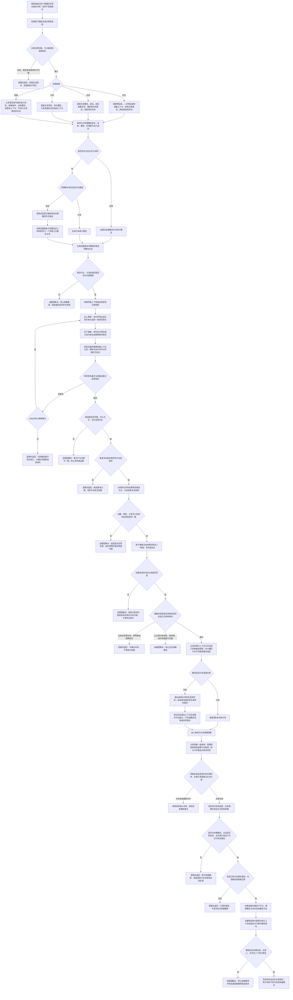

# 概念图自动生长与抽象关系树形视图流程图 v0.1

更新时间：2026-07-11

## 依据

```text
用户本轮已确认口径：四根、实例后确保种子概念、多父无环图、确定性首版匹配、预置名称不预造普通概念、分阶段淘汰与安全删除。
D:/鱼巢/规范/存在概念与实例创建最小闭环规范20260509.md
D:/鱼巢/规范/抽象特征规范20260518.md
D:/鱼巢/规范/二次特征规范20260520.md
D:/鱼巢/规范/因果信息用途与用法规范20260516.md
D:/鱼巢/详细设计/待完成/20260412_抽象状态生成详细设计.md
D:/鱼巢/详细设计/待完成/20260412_抽象动态生成详细设计.md
规范/000_项目规则总纲.md
规范/001_规则迁移清单.md
规范/仓库逻辑空间与领域树结构规范.md
规范/节点类型与关系类型枚举规范.md
规范/详细设计/抽象状态动态治理详细设计.md
规范/详细设计/动态聚合与运动基元候选详细设计.md
规范/详细设计/因果模板与查询候选详细设计.md
当前存在、状态、动态、二次特征、因果、语素、世界服务与核心仓库只读事实
```

## 说明

底层权威结构是概念图；“抽象树”只表示从选定根节点沿抽象上下位关系展开的只读树形视图。四个完整顶层分类固定为存在、动态、关系（二次特征）和因果。场景是上下文，特征和抽象状态是定义材料，实例状态是临时证据，不另立概念根。

普通概念不以名称为创建前提，也不以命中次数、稳定度或因果可靠性为存在门槛。类型不能为空：概念必须属于四类之一，并且除四个根概念外至少具有一个同类上位概念。名称可以为空，由语素关系另行绑定。

## 流程图



## 关键边界

```text
1. 四个根概念是初始化种子例外，允许预置名称，必须以非名称的幂等身份登记稳定句柄，永久保留且不得进入淘汰。
2. 普通概念必须在实例信息团完成后确保生成或复用；人工预置只能提供名称候选和匹配边界，不能无实例预造世界概念。
3. 虚构、计划和假设内容必须先在明确的虚拟场景形成实例，再进入同一生成流程。
4. 概念身份由节点类型、同类上位关系和结构化定义材料共同形成；名称、日志文本、显示标题和内容哈希均不是权威身份。
5. 第一版离散值精确匹配，数值按区间包含或相交，关系按角色和签名匹配；模糊相似度只排序候选。
6. 概念上下位是多父无环关系，不使用只能单父的普通父子关系；树形视图不得反写概念图。
7. 概念创建没有命中次数或稳定度门槛。候选、稳定、冷却和退役只描述召回与生命周期，不决定概念能否存在。
8. 因果概念表达概率和可能用途，不表达绝对世界事实。预测用途和行动用途必须分别统计和复核。
9. 线程只可提交重算请求材料，不能成为概念、动态或因果的生成来源；正式写入必须回领域服务。
10. 当前事务壳不具备真实回滚；物理删除实现必须等待独立计划证明事务、补偿或失效隔离边界。
11. 活动快照替换是 S5 发布提交点；提交后旧边失效异常必须返回已生效的新活动版本和异常关系句柄。
12. 任意单树请求可逻辑拒绝无效根、零预算和预算耗尽；正式四树契约缺快照、缺四根或内部不一致必须追根因。
13. 正式发布和树读取使用值式状态材料；兼容 `optional` 入口不得作为失败原因裁决材料。
```

## 中途非成功返回二分口径

```text
逻辑内返回：实例或材料在写入前不满足准入、候选未收敛或为空、基准版本过期、计算或树投影预算耗尽、任意单树根无效、退役概念尚有引用或缺少安全删除边界。除“已提交但旧关系失效异常”外，以上路径不得改变当前有效概念图。
追根因解决：正式收敛候选内部不合法，或前置通过后创建、写关系、读回、清理、正式四树读取、提交后旧边收口或删除结果不符合内部预期。必须停止依赖路径；提交前异常证明半结构已清理或报告残留句柄，提交后异常必须忠实返回已生效版本。
```
