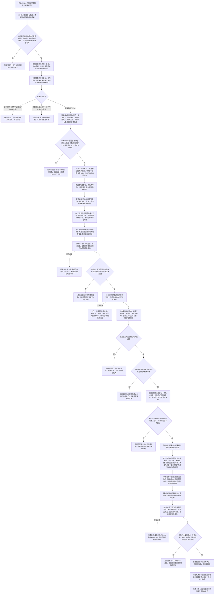

# 概念安全删除候选事务清理与后验固定点流程图

更新时间：2026-07-12

## 施工元数据

```text
图类型：施工流程图
绑定计划：#216 CONCEPT-S8-S1、#217 STRUCT-TXN-S1、#218 CONCEPT-S8-S2、#219 CONCEPT-S8-S3、#220 CONCEPT-S8-S4；#217-#220 已按 JY-272 数据桥 ABI 与入口矩阵补修
绑定详细设计：规范/详细设计/概念安全删除候选事务清理与后验固定点详细设计.md
业务前置：#198、#199、#216、#243 已完成；#217 执行前复核 `e21affd` 正式阶段总成与 500 空位
允许文件：分别以五份绑定计划的允许文件为准，本图不授予跨切片合并实施许可
禁止文件：需求 / 任务 / 方法语义扩展、命名自动解绑、持久化恢复提交、SQL、控制面板写入、D455、体素和外设
验证方式：代码切片执行 Debug x64、完整自检、连续 20 轮、并发端点交错、规范检查与精确范围扫描
不得宣称：流程目标已经实现、现有事务壳已经具备回滚 / 隔离、安全物理删除已完成或崩溃恢复已完成
```

## 依据

```text
AGENTS.md
规范/000_项目规则总纲.md
规范/001_规则迁移清单.md
规范/多线程防锁机制规范.md
规范/详细设计/写入事务详细设计.md
规范/详细设计/概念图自动生长与抽象关系树形视图详细设计.md
规范/详细设计/概念命名用途与生命周期治理详细设计.md
流程图/20260712_中央自检运行器与第一批领域自检迁移流程图_v0.1.md
规范/详细设计/中央自检运行器与第一批领域自检迁移详细设计.md
实施记录/20260712_中央自检运行器与第一批领域自检逻辑提取引用矩阵.md
实施记录/20260712_概念命名目标与安全删除后继逻辑提取引用矩阵.md
实施记录/20260712_SELFTEST-MIGRATION-B1A_执行时序漂移与阶段化修订_Codex断点清单.md
实施记录/20260711_CONCEPT-S8-S0_安全物理删除当前代码事实复核_Codex断点清单.md
实施记录/20260711_ENTRY-MOD-S0_入口与自检承载当前代码事实复核_Codex断点清单.md
实施记录/20260711_CONCEPT-S7_冷却退役与重新激活代码实施_Codex断点清单.md
海中鱼巣/核心/节点仓库.h
海中鱼巣/核心/主信息仓库.h
海中鱼巣/核心/关系仓库.h
海中鱼巣/核心/索引仓库.h
海中鱼巣/核心/写入事务.h
海中鱼巣/领域/概念图算法.h
海中鱼巣/领域/概念图服务.h
```

## 说明

本图只处理当前活动图中普通概念的第一版安全删除。四根永久拒绝；目标必须已退役、零当前有效实例支持、零全部外部有效关系。删除候选和事务写集都是值式材料，不新增第四生命周期阶段，也不由日志、显示、统计或 SQL 授权。

第一版采用统一读取隔离，不做版本倒退式回滚：普通读取 / 新增 / 关系索引变化持共享许可，节点 / 主信息身份删除与事务提交持独占许可。所有分配、完整输入重建、版本复核和清理包构造都在提交前完成；进入提交段后不再提供普通失败返回，且不声明进程崩溃恢复。

## 流程图



## 关键边界

`结构事务接线.数据.h` 是传统头可见的纯数据结构桥；`协调.结构事务`、`服务.概念安全删除` 与全部新增自检文件必须以 `ClCompile + export module + import` 形成真模块。生产模块不得依赖自检模块，任何 Axx 正文不得写回 `入口.cpp`。

```text
1. 四根永久拒绝物理删除；活跃或冷却普通概念也拒绝。
2. 第一版只接受零当前有效支持、零全部外部有效关系的退役普通概念，不自动解绑名称、需求、任务、方法或其它领域引用。
3. 删除候选是调用期值式 DTO，只达到“领域影响已形成”；结构写集由 S8-S2 在事务域内补全后才可能提交。
4. 完整当前输入必须来自同一活动版本的全量活动快照、签名和关系，不从局部受影响分量猜测全图。
5. 删除后直接边必须复用固定点共享的签名比较和传递约简算法；禁止另写局部父子移动算法。
6. 第一版结构事务域采用粗粒度共享 / 独占许可。它先保证正确性，不宣称高并发吞吐或分布式事务。
7. 普通关系创建、关系重挂、索引绑定及全部关系 / 索引读取统计从端点复核前持共享许可；节点 / 主信息身份删除持独占许可，端点在共享许可期不可消失。
8. 同一同步调用链只取得一次结构许可；下层通过值式域 / 纪元 / 序号 / 类型令牌进入令牌感知入口，不得递归申请或跨线程携带。
9. 删除提交持独占许可；所有参与公开读取持共享许可，保证外部只能看到完整旧版本或完整新版本。
10. 锁序固定为：结构事务许可 -> 活动图锁_ -> 图写锁_ -> 单个仓库锁；不得同时持有多个仓库锁，也不得持锁调用上层服务、日志、I/O 或回调。
11. 版本倒退会破坏稳定句柄语义，第一版不做逆向回滚；采用提交前完整准备、提交段无普通失败和统一读取隔离。
12. 候选过期、新增支持 / 引用或事务域未接入属于写前逻辑内返回；完整当前输入内部矛盾、写集缺项和提交后结构不一致属于追根因解决。
13. 一旦进入提交段，各包必须已经完成分配和复核，提交函数不得再返回普通失败或创建新材料。
14. 进程崩溃、断电和跨重启恢复不在第一版证明范围；后续必须由持久化恢复专项承接。
15. 普通读取因端点失效返回空不等于关系或索引已清理；必须通过审计读取和反向索引证明真实清零。
16. 删除回执只汇总仓库与服务结构证据，不成为独立权威事实；重复删除由底层审计状态和版本裁决。
17. 统计缓存、显示、日志、SQL 和控制面板均不得阻止、授权或修复删除。
18. 等价概念重建必须走现有实例、签名、固定点和发布路径，获得新节点句柄；历史材料不得复活旧句柄。
19. #218、#219、#220 自检分别由 `自检.概念清理适配`、`自检.概念安全删除`、`自检.概念删除后验` 真模块承载，均导出无参运行入口并返回正式 `自检单元结果`；入口只登记 `CONCEPT-S8-S2 / 最终回归阶段 520`、`CONCEPT-S8-S3 / 最终回归阶段 530`、`CONCEPT-S8-S4 / 最终回归阶段 540` 无捕获回调。
20. 最终回归阶段顺序 520-540 依赖 #244-#243 形成正式阶段总成、#217 同阶段登记 500、#212 同阶段登记 510 且无占用；执行前必须读取实际阶段接口和注册表，漂移时退回设计，不在执行窗口自行改阶段或改号。
21. `概念安全删除服务.h/.cpp` 旧预案撤销；#219 生产编排固定落入 `海中鱼巣/领域/服务.概念安全删除.ixx`，#220 继续消费该模块。
22. #217 只证明可选接域能力和隔离已接域仓库组；当前入口主装配、既有直接删除与失败清理不在本批接域，不得扩大声明为运行期全局隔离完成。
```
