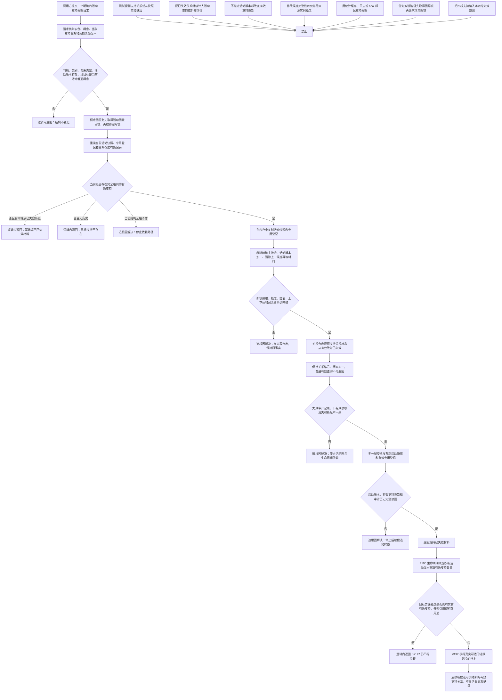

# 概念活动实例支持权威失效与投影推进流程图

更新时间：2026-07-11

## 依据

```text
AGENTS.md
规范/000_项目规则总纲.md
规范/001_规则迁移清单.md
规范/节点类型与关系类型枚举规范.md
规范/仓库逻辑空间与领域树结构规范.md
规范/详细设计/概念图自动生长与抽象关系树形视图详细设计.md
规范/详细设计/概念命名用途与生命周期治理详细设计.md
实施记录/20260711_CONCEPT-S6B_三类用途观察与生命周期候选代码实施_Codex断点清单.md
实施记录/20260711_CONCEPT-S6C_命名需求治理接线当前代码事实扫描_Codex断点清单.md
海中鱼巣/核心/关系仓库.h
海中鱼巣/核心/关系仓库.cpp
海中鱼巣/领域/概念图服务.h
海中鱼巣/领域/概念图算法.h
```

## 说明

当前普通概念由非空来源实例候选生成，发布时每个来源实例都形成有效 `实例支持概念` 关系并进入活动快照。现有代码没有支持失效或解绑入口，因此“有效实例支持阻止冷却 / 退役”使 #197 活跃到冷却前置在当前样本中不可达。

本图采用不删除原关系的权威失效模型：关系记录从 `有效` 原地转换为 `已失效`，关系编号保持、版本推进；概念图服务同时从新活动快照移除该支持边并推进活动版本。旧候选、用途候选和生命周期候选按活动版本过期，历史关系通过审计入口保留。

## 流程图



## 关键边界

```text
候选概念仍必须有非空来源实例；本设计不放宽概念形成规则。
支持失效只改变现有支持关系的记录状态和活动投影，不删除关系、节点、主信息或概念。
普通关系读取只返回有效关系；审计读取可返回已失效记录，二者不得混用。
旧支持关系不原地重新激活；后续真实支持重新出现时创建新的有效关系，旧记录继续审计可读。
支持失效必须推进活动版本，使固定点候选、用途候选、生命周期候选和待命名请求按既有版本规则过期。
四根及其当前根支持均不属于本切片失效范围；目标为任一四根时写前逻辑内拒绝，关系状态、关系版本和活动版本均不变化。
四根生命周期继续保持活跃。根支持何时随实例生命周期失效，必须由后续实例退役 / 删除事务专项整体裁决，不能由本入口单边改变。
显式领域入口只证明手动权威失效能力，不声明自动识别实例失效、场景消亡或跨重启恢复已经实现。
需要同时持有两把概念图内部锁时，固定按 `活动图锁_ -> 图写锁_` 获取；禁止持有 `图写锁_` 后再请求 `活动图锁_`，以免与候选发布形成 ABBA 死锁。
```
