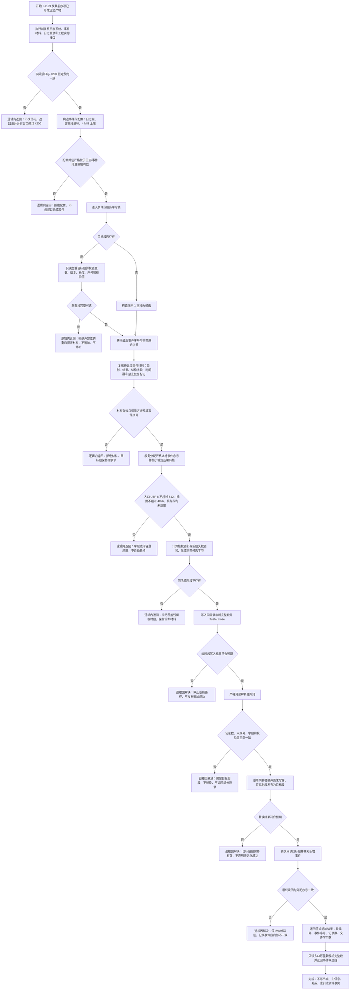

# 结构化事件段持久化与只读校验流程图 v0.1

日期：2026-07-11

状态：施工流程图 / 绑定 #200 EVENT-SEGMENT-S1 / 未改 C++ / 未构建 / 未运行程序

## 图元数据

```text
图类型：施工流程图
绑定计划：#200 EVENT-SEGMENT-S1 结构化事件段持久化与只读校验基础代码实施切片
绑定详细设计：规范/详细设计/结构化事件段持久化与只读校验详细设计.md
允许文件：以 #200 计划“允许文件”为准；本图不授权修改领域服务、仓库、事件日志线程或恢复入口
禁止文件：节点 / 主信息 / 关系 / 索引仓库，需求 / 任务 / 方法 / 概念图服务，事件日志线程，SQL、控制面板和外设文件
预期结构变化：新增事件日志段服务和值式追加 / 读取材料；只写 D:\海中鱼巣\日志\事件段 下的持久化候选文件，不写机器事实
执行前复核：读取 #153、#159 正式记录与日志系统实际接口；接口漂移时不改代码，退回修订 #200
验证方式：Debug x64、EVENT-SEGMENT-A01 至 A10、自检目录边界、损坏段拒绝、原子替换失败收口、规范与排除项扫描
不得宣称：事件线程已接线、事件日志可裁决当前事实、仓库快照或恢复已实现、跨重启完整恢复已完成
```

## 定位

当前 `日志系统.h` 已有结构化 `事件材料`，但 `记录结构事件日志` 最终仍写入人读文本文件；事件日志线程也只消费通用运行消息，没有结构化事件段。第一轮新增独立事件段服务，建立可严格校验的持久化候选材料，不改变现有文本日志和任何领域写入路径。

事件段采用固定小端格式、版本 1、FNV-1a 64 位完整性校验和受限 UTF-8 字段。每次追加先生成同目录临时完整段，严格读回后再执行替换；目标段只在完整候选通过后更新。

## 流程图



## 关键边界

```text
1. 事件段只能位于 D:\海中鱼巣\日志\事件段；调用方不能提供任意外部路径。
2. 格式使用显式小端编码，不直接写入 C++ struct 内存，不依赖编译器对齐。
3. 段魔数固定为 HYEVSEG1，格式版本固定为 1；未知版本只读拒绝。
4. 事件序号由事件段服务在单写锁内分配，调用方必须传 0；事件时间戳仍由调用方提供且必须非零。
5. FNV-1a 64 只用于损坏检测，不是身份哈希、业务签名或安全认证。
6. 第一轮单段上限 4 MiB，不自动轮换、不压缩、不加密、不多进程并发写。
7. 入口名称 UTF-8 上限 512 字节，摘要 UTF-8 上限 4096 字节，单帧上限 8192 字节。
8. 既有损坏段、未知版本和残留临时段属于外部持久材料拒绝，逻辑内返回且不修补。
9. 前置通过后的写入、临时段读回、原子替换或最终读回不及预期必须追根因。
10. 读取事件段只返回候选材料，不恢复仓库、不重放领域动作、不裁决当前事实。
```

## 后续

#202 PERSIST-RECOVERY-S0 将在 #191、#197、#198 和 #200 形成正式产物后，统一盘点事件段、四仓库、特征值侧表、概念活动图和生命周期的持久化 / 重建边界。本图不提前定义恢复提交。
