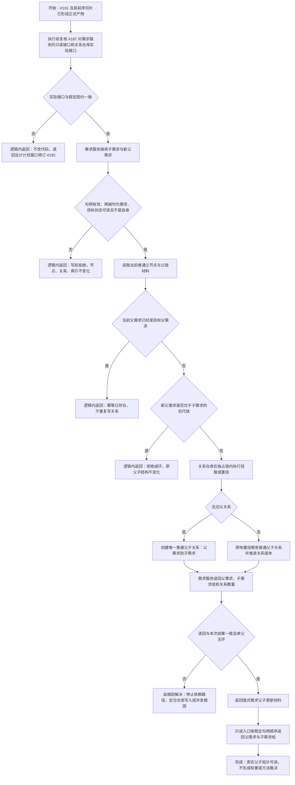

# 需求父子原子挂载与重挂流程图

更新时间：2026-07-11

## 依据

```text
AGENTS.md
规范/0050_项目通用机器逻辑与禁止性规则总纲_20260721.md
规范/4010_子规范_统一仓库稳定句柄与通用关系索引边界.md
规范/3100_根规范_需求_20260720.md
规范/5110_子规范_需求树生长机制_20260720.md
规范/4030_子规范_基础信息服务分层与领域写授权.md
规范/4040_子规范_不透明结构事务候选确认撤销与最后发布.md
规范/详细设计/需求父子原子挂载与重挂详细设计.md
实施记录/20260708_FLOW-06_需求树后续结构代码实施_Codex断点清单.md
海中鱼巣/核心/关系仓库.h
海中鱼巣/核心/关系仓库.cpp
海中鱼巣/领域/需求服务.h
```

## 说明

本图只把需求树从“父需求请求材料”推进到真实需求父子关系的原子挂载与重挂。父子拓扑复用 `普通父子`，通用防环和单父约束归关系仓库，需求类型与目标状态准入归需求服务。

本图不实现脱离父节点、需求删除、阻塞权重事实、AND / OR 逻辑组织、方向签名、枚举目标、方法召回、排序或执行。

## 流程图



## 关键边界

```text
1. 普通父子方向固定为“父需求 -> 子需求”，一个子需求第一轮最多一个普通父节点。
2. 新增通用挂载 / 重挂算法只能落在关系仓库；需求服务不得复制父链扫描或裸改关系记录。
3. 需求服务在调用通用入口前拒绝非需求端点、无目标状态、自环和当前已挂载；关系仓库仍须在锁内重复防环。
4. 幂等已存在、无效输入和成环属于逻辑内返回；写入后读回不一致属于追根因解决。
5. 现有 `重挂节点` 行为保持兼容，不借本切片改变世界树或其它领域调用语义。
6. 不新增需求父子专用关系类型，不把父需求、权重或方向写进主信息字段。
7. 阻塞权重继续只是旧第一轮请求材料，本切片不读取它作为权限或完成裁决。
8. 不实现脱离、删除、逻辑组织、方向签名、枚举目标、方法召回、SQL、控制面板、D455、体素或外设。
```
