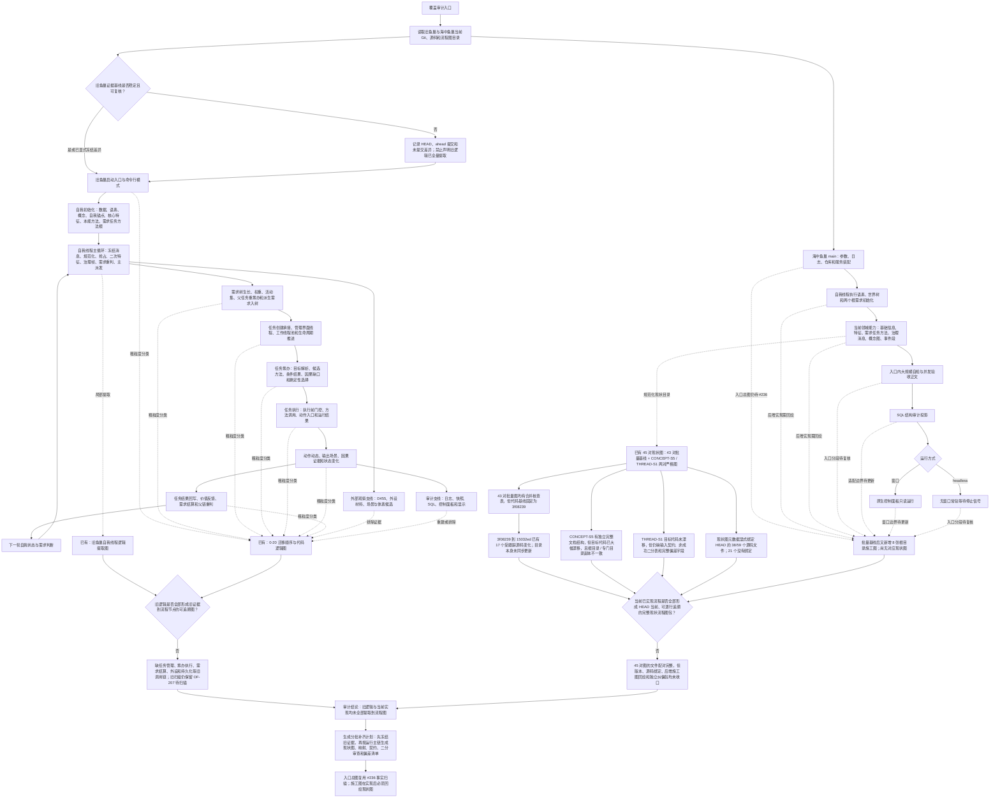

# 鱼巢逻辑与当前实现流程覆盖审计现状流程图 v0.1

更新时间：2026-07-12

图类型：现状流程图

旧代码快照：`D:\鱼巢`，HEAD `ef2cbbf`，相对 `birthplace/main` ahead 4，另有 2 个未提交 C++ 文件

当前代码快照：`D:\海中鱼巢`，HEAD `15032ed`；本次只统计 HEAD，工作树中的 #211 / JY-254 并行变化明确排除

逐行映射表：`实施记录/20260711_鱼巢逻辑与当前实现流程覆盖逐行代码映射表.md`

覆盖矩阵：`实施记录/20260711_鱼巢逻辑与当前实现流程图覆盖审计矩阵.md`

## 1. 审计对象

本图回答两个问题：

```text
旧鱼巢当前运行逻辑由哪些主链组成？
这些旧逻辑和海中鱼巢当前已实现流程，是否都已经形成可回到代码行的现状流程图？
```

本图只记录审计时的代码与文档事实，不把施工流程图当成当前代码事实，不把旧函数扫描当成逻辑迁移完成，也不构成 C++ 实施许可。

## 2. 流程图



## 3. 数量事实

| 项目 | 当前数量 | 审计结论 |
| --- | ---: | --- |
| 旧鱼巢受跟踪源码 | 121 个，202635 行 | 含 3 个第三方 WebView2 头文件；既有扫描不是全量函数或全量调用链证明 |
| 旧鱼巢顶层源码 | 117 个，136962 行 | 只有 9 个完整文件名被 HEAD 的流程图 Markdown 显式提到，通配描述不计证据绑定 |
| 旧函数证据编号 | `OF-001` 至 `OF-206` | 清单保留 `OF-207` 为下一待扫描槽位 |
| 海中鱼巢 HEAD 源码 | 59 个，42907 行 | 不含工作树中 #211 新增的两个未跟踪模块，也不混入并行修改 |
| 海中鱼巢受跟踪流程图 Markdown | 102 份 | 根目录 56 份，专门目录 45 份现状图加 1 份索引；文件数量不等于覆盖完成 |
| 专门目录现状图 | 45 对 MD / HTML | 43 对由 `FLOW-STATE-BATCH-001` 在 `3f08239` 基线生成，2 对为严格图兼容副本 |
| 批量基线后的图变化 | 新增 8 份根目录图，修改 3 份根目录图 | `流程图/现状流程图/` 自 `63cec55` 后没有同步变化 |
| 现状图显式源码绑定 | 38/59 个 | 仍有 21 个 HEAD 源码文件未进入现状图 `覆盖文件` 元数据；显式绑定也不代表全行覆盖 |
| 完整独立纠偏文档结构 | 1 份 | `CONCEPT-S5` 结构检查可通过，但目标代码与图基线已漂移，不能计为 HEAD 当前完整包 |
| 不完整严格现状包 | 1 份 | `THREAD-S1` 代码目标未漂移，但缺输入契约、非成功审查，偏差表字段不完整 |

## 4. 完成判定

只有同时满足以下条件，单个流程才可标为“已提取”：

```text
旧能力有冻结证据编号或明确说明无等价旧能力。
当前代码有入口、调用方、结构写入方和读回路径。
流程图明确标为现状流程图，并绑定实际代码行。
逐行映射、输入契约、非成功返回二分审查和偏差清单完整。
施工图与实现后的现状图已做差异复核。
流程图、详细设计、计划和当前代码没有把预期接口写成已实现事实。
```

本次审计不满足全量完成条件，因此当前结论固定为“未全部提取”。

## 5. 边界

```text
本图不修改 D:\鱼巢 或海中鱼巢 C++。
旧鱼巢的控制面板、SQL、D455、体素和外设逻辑仍按保留、删除、重建或暂缓分别裁决。
施工流程图可以继续作为计划依据，但不能代替实现后的现状流程图。
显式引用文件名只证明可追溯入口，不证明函数、分支或有效代码行全部覆盖。
本图不证明旧能力迁移、自我循环、自我苏醒、恢复或真实外设接入完成。
```
