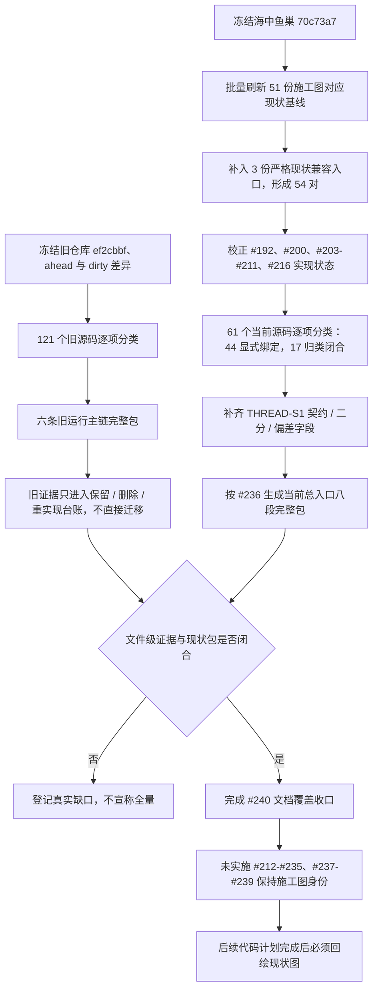

# FLOW-COVERAGE-S1 鱼巢逻辑与当前实现流程覆盖收口现状流程图

更新时间：2026-07-12

图类型：现状流程图

逐行映射表：`实施记录/20260712_FLOW-COVERAGE-S1_鱼巢逻辑与当前实现流程覆盖收口逐行代码映射表.md`

## 依据

```text
旧鱼巢：ef2cbbf，121 个受跟踪源码，ahead 4，2 个 dirty C++ 与 1 个 dirty 计划
海中鱼巢：70c73a7，61 个源码，#211 与 #236 已完成
流程图/现状流程图：54 对 MD / HTML
实施记录/现状流程图核查：51 份生成核查表
六条旧运行主链完整包
THREAD-S1 完整包
当前总入口完整包
```

## 流程图



## 完成边界

```text
已完成文件级证据分类、已实现切片现状回绘基线和缺口登记。
未声明旧函数已全部迁移、代码已纠偏、入口已拆分、恢复或外设已完成。
```
