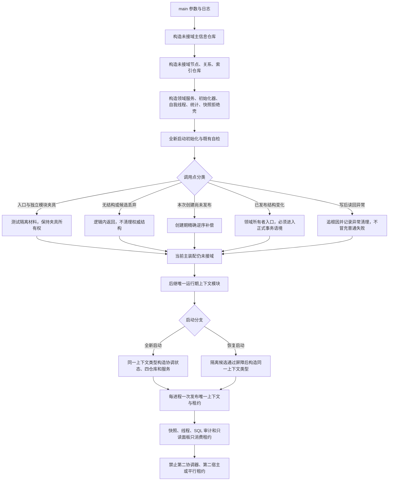

# RUNTIME-TXN-S0 主装配接域与失败清理现状流程图

更新时间：2026-07-12

图类型：现状流程图

逐行映射表：`实施记录/20260712_RUNTIME-TXN-S0_主装配接域逐行代码映射表.md`

## 依据

```text
海中鱼巣/入口.cpp
海中鱼巣/核心/结构事务接线.数据.h
海中鱼巣/核心/协调.结构事务.ixx
海中鱼巣/核心/节点仓库.*、主信息仓库.*、关系仓库.*、索引仓库.*
海中鱼巣/领域/初始化.世界树.ixx、初始化.语素.ixx、语素服务.h、概念图服务.h
海中鱼巣/核心/仓库快照服务.h
#217 / JY-273 正式实施记录
```

## 说明

本图只表达当前代码事实和后继接域边界。生产主装配仍未接域；唯一真实协调器只存在于 #217 隔离自检。快照与恢复当前只有拒绝矩阵，没有运行期发布实现。

## 流程图



## 关键边界

```text
#217 隔离接域不等于生产主装配接域。
创建期补偿、已发布删除和内部不一致清理必须分别治理。
全新启动与恢复启动是互斥分支，共用一个上下文类型和一次发布合同。
快照、SQL、控制面板、日志不裁决机器事实。
本切片不修改 C++，不声明恢复、安全删除或主装配接域完成。
```
