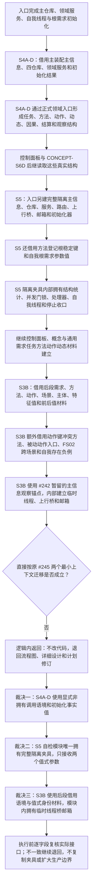

# SELFTEST-MIGRATION-B1A2 自我治理共享夹具现状流程图 v0.1

更新时间：2026-07-12
代码基线：`10e24cb`
性质：当前代码事实与 #245 接口漂移复核，不表示迁移完成。

图类型：现状流程图
逐行映射表：`实施记录/20260712_SELFTEST-MIGRATION-B1A2_共享夹具逐行代码映射表.md`

## 当前结论

1. S4A-D、S5、S3B 是三种不同所有权和生命周期，不能压成一个共享总夹具。
2. “最小 DTO”只适用于稳定键、初始化参数、句柄和读数等值式材料；仓库与领域服务必须以调用期非拥有语境显式传递。
3. S5 的隔离仓库、服务、初始化器、路由、上行桥、邮箱、统计函数和并发控制整体迁入其自检模块并由该模块唯一拥有。
4. S3B 不复制后段跨域夹具；入口只组装现有服务引用、现成句柄和值式观察锚点。
5. 所有进入正式领域写入后的内部不一致继续归为追根因解决；缺少调用期材料或接口漂移属于执行前逻辑内返回。
