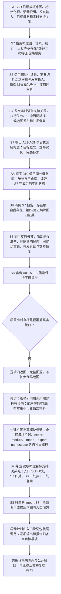

# SELFTEST-MIGRATION-B1B 概念生命周期删除候选调用语境现状流程图 v0.1

更新时间：2026-07-12
代码基线：`cdc96aa`（#243 首次迁移草案已完整回退）
图类型：现状流程图
逐行映射表：`实施记录/20260712_SELFTEST-MIGRATION-B1B_概念生命周期删除候选逐行代码映射表.md`

## 当前结论

1. S7 是对当前测试概念图的正式领域写入与实时读回，不是纯值报告计算。
2. S8 既消费 S7 的稳定身份交接，又必须在顺序 310 读取同一概念图的后 S7 实时状态；不得把活动图快照当权威替代。
3. S7 模块唯一导出只读测试辅助 `读取概念目标支持关系组`，内部基于 `概念图.读取活动关系组()` 过滤 `实例支持概念` 与目标概念，并按关系仓库编号、关系编号、版本号稳定排序。
4. 入口 S6D 的六个早期调用、S7 的四个调用和 S8 的一个调用必须先统一改接该辅助，共十一处；全部改接后才可删除入口闭包。S8 单向导入 S7，S7 不得导入 S8。
5. 两个模块必须先以固定真模块骨架和公开上下文 / 报告接口通过编译，再迁移大段正文；禁止把 `module;`、`export module`、`import` 或 `export namespace` 压缩到同一行。
6. 启动计时和阶段注册属于入口人读装配；S7/S8 模块负责自身逐项输出、报告和临时并发对象。
7. 删除候选仍不可提交；S8 的准备性生命周期和支持变化只复现既有自检行为，不新增生产能力。
