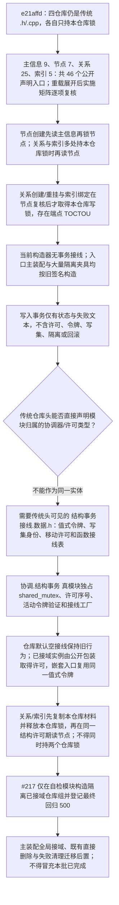

# STRUCT-TXN-S1 模块边界与仓库许可调用现状流程图 v0.1

更新时间：2026-07-12
图类型：现状流程图
代码版本：`e21affd`
覆盖文件：四仓库 `.h/.cpp`、`写入事务.h/.cpp`、`入口.cpp`、工程文件
覆盖函数：四仓库构造及 58 个公开入口、当前跨仓库节点有效性读取、主装配构造
逐行映射表：`实施记录/20260712_STRUCT-TXN-S1_模块边界与仓库许可调用逐行代码映射表.md`
输入契约 / 调用语境表：`实施记录/20260712_STRUCT-TXN-S1_模块边界与仓库许可调用输入契约与调用语境表.md`
非成功返回二分审查表：`实施记录/20260712_STRUCT-TXN-S1_模块边界与仓库许可调用非成功返回二分审查表.md`
偏差清单：`实施记录/20260712_STRUCT-TXN-S1_模块边界与仓库许可调用现状施工偏差清单.md`
不得作为施工许可：本图只证明当前边界与缺口，代码只能按修订 #217 实施。

## 当前结论

1. 模块行为与传统头公开数据必须分层，不能让四仓库直接持有模块归属类。
2. 当前关系 / 索引读取存在本仓库锁内再读节点的嵌套路径；#217 必须先复制、释放再验证。
3. 默认空接线必须保持所有既有隔离夹具；本批只证明可接域能力和隔离自检，不把入口主装配说成已统一接域。
4. `写入事务` 状态壳不参与 #217 实现，不得被扩写成许可或回滚。
