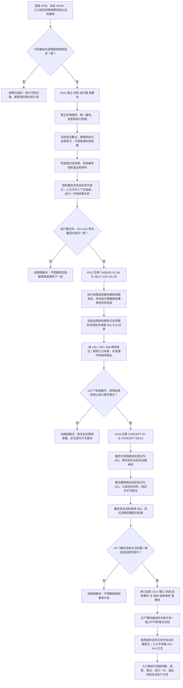

# 中央自检运行器与第一批领域自检迁移流程图

更新时间：2026-07-12

## 依据

```text
规范/代码文件建立归属与模块命名规范.md
实施记录/20260711_ENTRY-MOD-S0_入口与自检承载当前代码事实复核_Codex断点清单.md
实施记录/20260712_中央自检运行器与第一批领域自检逻辑提取引用矩阵.md
流程图/现状流程图/20260712_海中鱼巣当前总入口生产装配自检SQL与运行分支现状流程图_v0.1.md
海中鱼巣/入口.cpp
海中鱼巣/线程/自检.概念命名治理.ixx
```

## 说明

本图描述 NEW-05 中央自检运行器和第一批存量自检迁移。源代码提供当前行为事实，现状图只作范围索引。迁移只改变自检承载和调用编排，不改变生产逻辑或业务结构。

## 流程图



## 关键边界

```text
运行器、自检编号、报告和退出码只做人读验证，不承载机器事实。
迁移前后必须保留原验收编号、输入语境、结构读回和禁止能力边界。
任何已进入正式领域写入后的内部不一致继续按追根因解决，不得因迁入自检模块而改成普通失败。
本批不迁移需求、任务、方法召回、基础信息、SQL、控制面板或初始化自检。
本图不证明入口全量瘦身、结构事务实现、旧能力迁移或自我循环完成。
```
