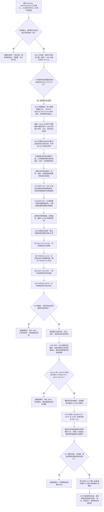

# 中央自检运行器与第一批领域自检迁移流程图

更新时间：2026-07-12

## 依据

```text
规范/代码文件建立归属与模块命名规范.md
实施记录/20260711_ENTRY-MOD-S0_入口与自检承载当前代码事实复核_Codex断点清单.md
实施记录/20260712_中央自检运行器与第一批领域自检逻辑提取引用矩阵.md
实施记录/20260712_SELFTEST-MIGRATION-B1A_执行时序漂移与阶段化修订_Codex断点清单.md
流程图/现状流程图/20260712_海中鱼巣当前总入口生产装配自检SQL与运行分支现状流程图_v0.1.md
流程图/20260712_SELFTEST-MIGRATION-B1A2_自我治理共享夹具现状流程图_v0.1.md
实施记录/20260712_SELFTEST-MIGRATION-B1A2_共享夹具逐行代码映射表.md
海中鱼巣/入口.cpp @ 10e24cb
海中鱼巣/自检.运行器.ixx @ 10e24cb
```

## 说明

本图描述 NEW-05 中央自检运行器和第一批存量自检的阶段化迁移。#241 已实现单批次运行器；#242 首次草案证明单个最终阶段回调不能同时保持 SELF-GOV-S4/S5 的早期结构前置与 SELF-GOV-S3B 的后期材料依赖，草案已全部撤销。本次只修订自检承载、夹具所有权和执行锚点，不改变生产业务逻辑。

## 流程图



## 关键边界

```text
阶段顺序和阶段内顺序是两个不同维度；不得再用单个 100 / 200 / 300 / 400 全局序号表达跨锚点时序。
#241 的自检运行器公开合同保持兼容；#244 只追加阶段化总成。
S4A-D 使用主装配的显式非拥有调用语境；S5 使用模块内部唯一拥有的完整隔离夹具，二者不得混成共享总夹具。
S3B 必须消费后续真实任务、方法、动作、状态、动态、负例句柄和主信息观察锚点；不得复制夹具或降格为早期空壳。
DTO 只承载稳定键、初始化参数、句柄和读数等值式材料；仓库与服务只允许调用期借用。
跨阶段只传强类型、单写封存、后继只读的测试报告；不得使用可写全局变量或让报告裁决业务事实。
运行器、自检编号、报告和退出码只做人读验证，不承载机器事实。
任何正式领域写入后的内部不一致继续按追根因解决，不得被阶段汇总掩盖。
本图不证明入口全量瘦身、结构事务、自我循环、旧能力迁移或恢复完成。
```
