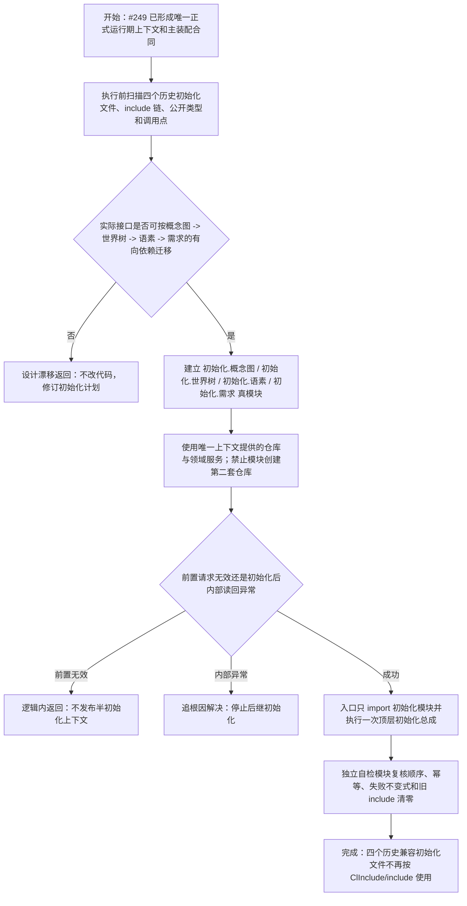

# 历史初始化真模块迁移与唯一上下文装配流程图

更新时间：2026-07-12

替代状态：本图已由 `JY-337` 和 `流程图/20260714_系统角色初始化与历史兼容初始化调用迁移代码逻辑流程图_v0.1.md` 替代，只保留为历史设计证据，不再作为 `#250 / DQ-142` 执行依据。

## 依据

```text
规范/代码文件建立归属与模块命名规范.md
实施记录/20260711_ENTRY-MOD-S0_入口与自检承载当前代码事实复核_Codex断点清单.md
流程图/20260712_运行期主装配结构事务接域与恢复链单一所有权流程图_v0.1.md
```

## 说明

本图只迁移四个历史兼容初始化 `.ixx` 的编译身份和调用边界，不改变初始化业务顺序、根身份或领域语义。

## 流程图



## 关键边界

```text
1. 只改变工程承载和调用方向，不改初始化领域事实。
2. 新行为文件全部是真模块；生产与自检分离。
3. 入口不展开初始化正文或验收场景。
4. 不删除既有文件前先完成调用迁移、工程登记替换和回归；接口漂移时退回设计。
```
