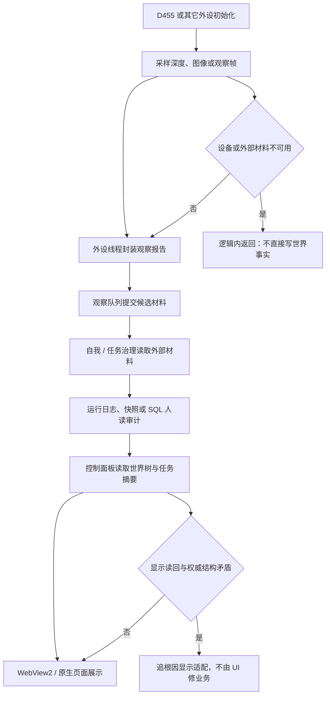

# 旧鱼巢外设持久化与显示现状流程图

更新时间：2026-07-12

图类型：现状流程图

逐行映射表：\`实施记录/20260712_旧鱼巢外设持久化与显示逐行代码映射表.md\`

## 依据

```text
旧仓库：D:/鱼巢
旧 HEAD：ef2cbbf；相对 birthplace/main ahead 4
工作区：2 个 dirty C++ 与 1 个 dirty 计划文件，按 HEAD / dirty 分栏冻结
D:/鱼巢/D455相机类.cpp
D:/鱼巢/外设线程_D455深度相机.ixx
D:/鱼巢/外设观察报告队列.ixx
D:/鱼巢/日志模块.ixx
D:/鱼巢/控制面板类.cpp
```

## 说明

本图记录旧鱼巢当前证据，不是海中鱼巢施工许可。旧外设、SQL、WebView2 和控制面板仅作为证据；海中鱼巢当前明确暂缓真实外设和旧 UI / DB 迁移。

## 流程图



## 关键边界

```text
线程不是新项目动作来源。
日志、控制台、SQL 和显示不承载机器事实。
旧外设与旧控制面板证据不计入海中鱼巢迁移完成度。
```
