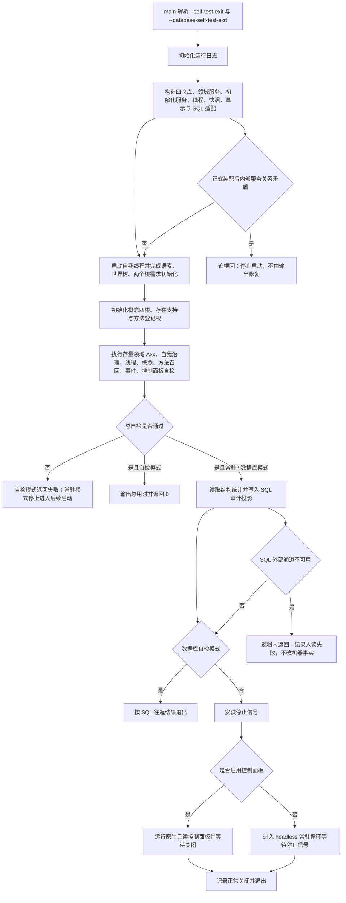

# 海中鱼巣当前总入口生产装配自检 SQL 与运行分支现状流程图

更新时间：2026-07-12

图类型：现状流程图

逐行映射表：`实施记录/20260712_海中鱼巣当前总入口生产装配自检SQL与运行分支逐行代码映射表.md`

## 依据

```text
代码版本：70c73a7
海中鱼巣/入口.cpp
实施记录/20260711_ENTRY-MOD-S0_入口与自检承载当前代码事实复核_Codex断点清单.md
```

## 说明

本图按 #236 的正式八段矩阵记录当前入口，不把自检输出、SQL 审计或控制面板投影解释为机器事实。

## 流程图



## 关键边界

```text
入口当前仍有 15903 行，#211 只证明新切片不恶化，不证明存量自检已迁出。
SQL Server 只做审计投影；控制面板只读，不裁决业务或恢复。
当前没有统一自检运行器、权威数据库恢复或真实外设接线。
```
