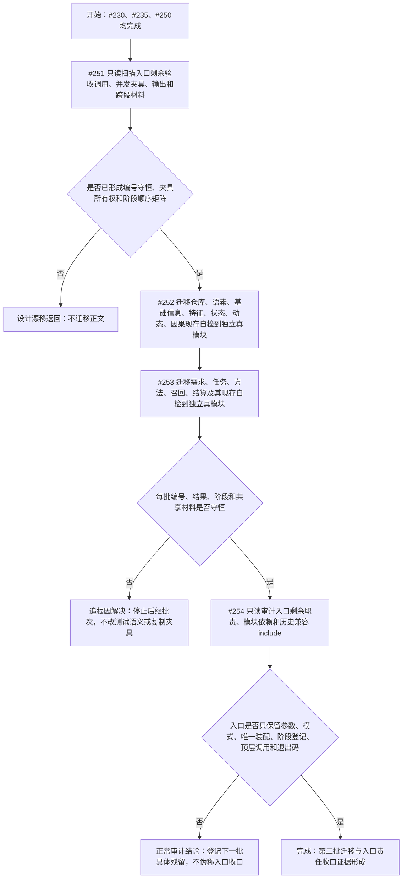

# 第二批领域自检迁移与入口剩余责任收口流程图

更新时间：2026-07-12

## 依据

```text
规范/代码文件建立归属与模块命名规范.md
实施记录/20260711_ENTRY-MOD-S0_入口与自检承载当前代码事实复核_Codex断点清单.md
规范/详细设计/中央自检运行器与第一批领域自检迁移详细设计.md
```

## 说明

第二批等待 #212-#235、恢复链和初始化模块形成实际产物后再扫描剩余入口正文；先按验收编号和共享夹具归属冻结矩阵，再分基础信息与高级服务两批迁移，最后只读审计入口责任。

## 流程图



## 关键边界

```text
1. #251 是事实门禁；未形成完整矩阵前 #252/#253 不执行。
2. 不按文本连续区间迁移，必须按验收编号、依赖和夹具所有权迁移。
3. 生产模块不得依赖自检模块；入口只登记无捕获回调。
4. 不改测试、不伪造样本、不复制跨阶段夹具、不把普通失败短路后续回调。
5. #254 是只读收口审计，不自行迁移发现的新残留。
```
