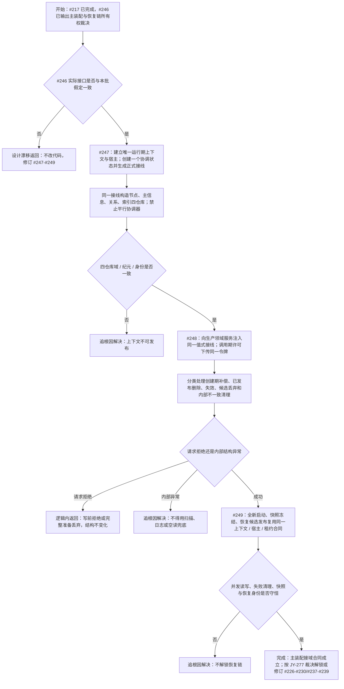

# 运行期主装配结构事务接域与恢复链单一所有权流程图

更新时间：2026-07-12

## 依据

```text
AGENTS.md
计划/20260712_RUNTIME-TXN-S0_主装配接域与直接删除失败清理当前事实复核计划_v0.1.md
规范/详细设计/概念安全删除候选事务清理与后验固定点详细设计.md
规范/详细设计/权威状态快照隔离恢复与运行期上下文一次发布详细设计.md
实施记录/20260712_RECOVERY-GATE-S0_主装配接域与恢复链所有权主动预审矩阵.md
```

## 说明

本图描述 #246 完成后唯一生产运行期上下文、四仓库接域、领域服务接线、失败清理和恢复链复用。#217 的隔离仓库组只证明合同，不是主装配。

## 流程图



## 关键边界

```text
1. 生产运行期只允许一个上下文、宿主、租约和协调状态所有者。
2. #247-#249 均直接依赖 #246 正式扫描结果；假定接口漂移时退回设计。
3. 领域服务保存值式接线，不保存移动 RAII 许可；许可只存在于调用期。
4. 入口只保留参数、模式、唯一上下文装配、顶层调用与退出码。
5. 恢复、快照、SQL、控制面板和线程只能消费正式租约，不得另建仓库或协调器。
6. 不宣称 ACID、跨进程事务、断电恢复或旧数据库能力迁移。
```
