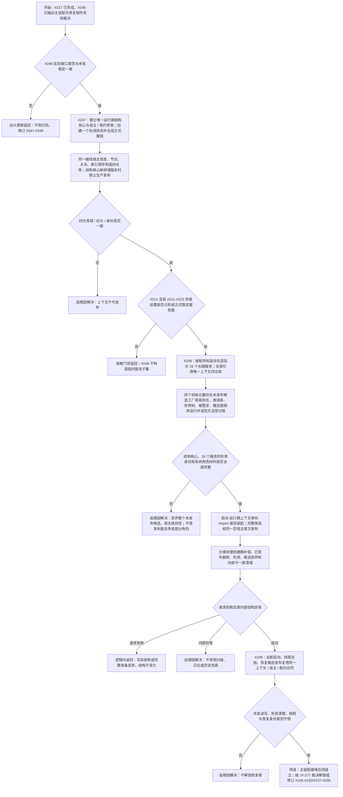

# 运行期主装配结构事务接域与恢复链单一所有权流程图

更新时间：2026-07-12

状态：历史设计证据 / 已由 JY-338 和 `流程图/20260714_运行期上下文首次发布租约与恢复链单一所有权代码逻辑流程图_v0.1.md` 替代 / 不得作为 #249 当前实施入口

## 依据

```text
AGENTS.md
计划/已完成计划/20260712_RUNTIME-TXN-S0_主装配接域与直接删除失败清理当前事实复核计划_v0.1.md
规范/详细设计/概念安全删除候选事务清理与后验固定点详细设计.md
规范/详细设计/权威状态快照隔离恢复与运行期上下文一次发布详细设计.md
实施记录/20260712_RECOVERY-GATE-S0_主装配接域与恢复链所有权主动预审矩阵.md
```

## 说明

本图描述 #246 完成后唯一生产运行期上下文、四仓库接域、领域服务接线、失败清理和恢复链复用。#217 的隔离仓库组只证明合同，不是主装配。#248 已按 JY-295 固定 16 个长期成员、四个工厂局部初始化器和发布后消费者排除矩阵。

## 流程图



## 关键边界

```text
1. 生产运行期只允许一个上下文、宿主、租约和协调状态所有者。
2. #247 只形成结构核心和宿主 / 租约骨架；缺少领域服务装配时不得成功生产发布，也不对恢复链承诺最终上下文 ABI。
3. #248 允许回改 `启动.运行期上下文.ixx`；最终上下文长期拥有矩阵内 16 个服务，四个初始化器只属全新候选工厂局部，`装配.领域服务` 不拥有仓库、宿主或租约。
4. #247-#249 均直接依赖 #246 正式扫描结果；假定接口漂移时退回设计。
5. 所有长期服务引用同一四仓库；只有正式事务路径服务保存值式接线，纯只读 / 无状态服务不得为了“完整”虚构接线成员。移动 RAII 许可只存在于调用期。
6. 入口只保留参数、模式、唯一上下文装配、顶层调用与退出码。
7. 恢复、快照、SQL、控制面板和线程只能消费 #248 后完整上下文的正式租约，不得另建仓库或协调器。
8. 不宣称 ACID、跨进程事务、断电恢复或旧数据库能力迁移。
9. 仓库快照、控制面板、SQL、线程和算法 / 路由模块是发布后消费者，不计入 #248 `完整()`，不得反向拥有上下文。
10. #248 硬前置为 #214，传递包含 #221-#223；执行前成员 / 构造 / 初始化接口漂移必须再次退回设计。
```
