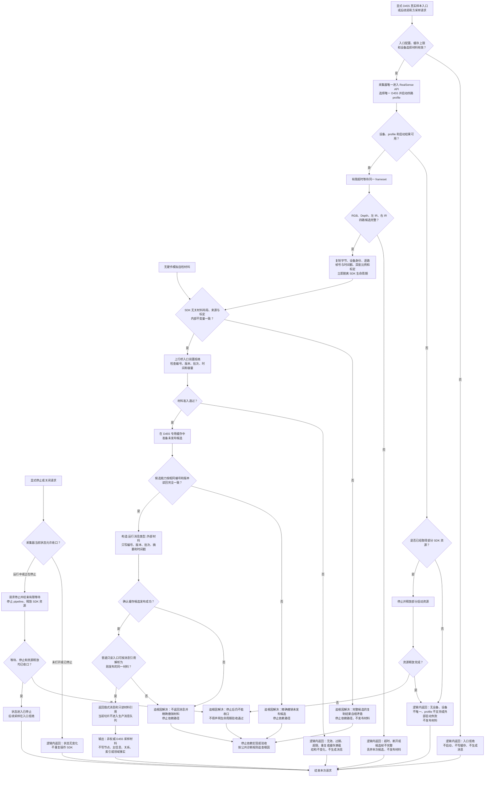

# D455 相机采样材料入口流程图

更新时间：2026-07-13

## 依据

```text
AGENTS.md
规范/0050_项目通用机器逻辑与禁止性规则总纲_20260721.md
规范/规范目录.md
规范/6320_子规范_外设观察特征与自我场景认知分层_20260720.md
规范/6340_子规范_外设独立控制线程与消息承接边界_20260720.md
规范/6350_子规范_双目相机外设独占观察线程_20260720.md
规范/代码文件建立归属与模块命名规范.md
实施记录/20260706_FSX_控制面板SQLD455体素外设排除项汇总记录.md
实施记录/20260713_D455相机采样材料入口S0当前代码事实扫描_Codex断点清单.md
海中鱼巣/线程/运行消息协议.ixx
海中鱼巣/线程/外设采样材料线程.ixx
```

## 说明

本图只描述 D455 第一轮材料入口：RealSense 采集结果先复制成 SDK 无关强类型材料，再进入专用有界缓存，最后生成只含材料引用的外部材料消息。当前切片不建立生产采样线程，不修改现有模拟外设线程，不把材料写为世界事实。

## 流程图



## 关键边界

```text
1. 四路完整帧只进入 D455 专用缓存；运行消息不承载帧字节或 SDK 对象。
2. 当前外设采样材料线程保持模拟 / 空材料壳，不在本切片中改造成真实采样线程。
3. 无设备、超时、候选不完整和容量拒绝属于逻辑内返回，均不得留下可读半材料。
4. 缓存先准备未发布候选，候选读回一致后才构造消息；确认发布后必须再用普通入口复核消息引用。
5. 完整候选复制后出现布局矛盾、缓存读回不一致、确认发布异常或消息悬空引用必须追根因解决。
6. 启动失败若已取得部分 SDK 资源必须先释放；显式停止 / 关闭必须以有限等待、pipeline 停止和资源释放全部收口。
7. 线程、相机帧、缓存和消息都不是动作来源，不写世界事实。
8. 体素、分割、点云、视觉融合、外设本能动作、任务结算、方法学习、控制面板和 SQL 均不在本图范围。
9. 真实样本只有显式入口才运行；模拟自检通过不能替代真实 D455 样本通过。
```
