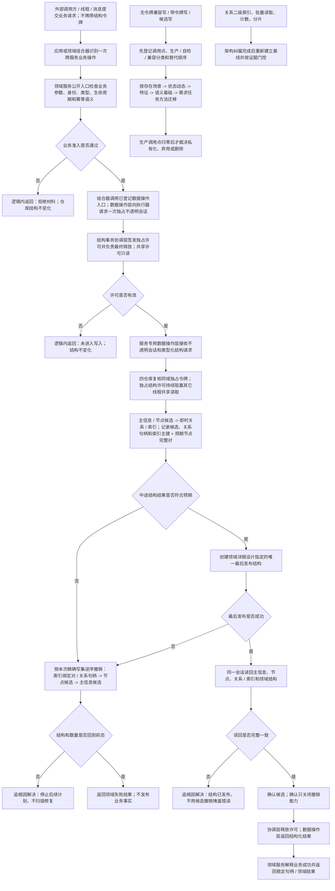

# 仓库底层与服务数据操作分层纠偏流程图

更新时间：2026-07-13

## 依据

```text
规范/仓库与服务分层事务边界规范.md
规范/仓库逻辑空间与领域树结构规范.md
规范/多线程防锁机制规范.md
规范/领域服务授权写入规范.md
实施记录/20260713_仓库与服务分层纠偏S0当前代码事实扫描_Codex断点清单.md
当前四仓库、结构事务、领域服务和线程路由代码
```

## 说明

本图表达一次业务写入从外部请求到仓库提交的正式权力链。原始结构事务令牌只允许存在于协调层、写入会话和仓库内部，不进入领域服务公开入口、线程消息或外部调用方。

## 流程图



## 非成功返回二分

```text
逻辑内返回：业务入口拒绝、许可未取得、兼容路径尚未迁移；结构不变化。
追根因解决：入口通过后仓库结果异常、撤销无法回到前态、最后发布后读回不一致、同一会话内候选与权威结构不一致。
```

## 关键边界

```text
协调层签发 / 释放许可，不解释业务。
仓库验证令牌和锁，不解释需求 / 任务 / 方法语义。
领域服务负责业务准入，不暴露或比较原始令牌。
数据操作层隐藏仓库和令牌，负责精确提交与撤销，但不裁决业务。
跨服务组合器定义一次业务事务边界，外部调用方不携带令牌。
```
