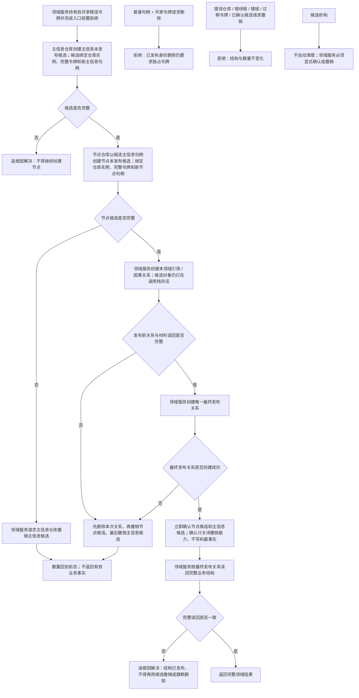

# 共享写入未发布身份候选与撤销流程图

更新时间：2026-07-13

## 依据

```text
AGENTS.md
规范/000_项目规则总纲.md
规范/多线程防锁机制规范.md
海中鱼巣/核心/主信息仓库.h/.cpp
海中鱼巣/核心/节点仓库.h/.cpp
海中鱼巣/核心/关系仓库.h/.cpp
海中鱼巣/核心/结构事务接线.数据.h
实施记录/20260713_CONCEPT-NAMING-S4_共享写入失败清理ABI再次漂移_Codex断点清单.md
```

## 说明

本图只表达共享路径写入中“未发布身份”的创建、确认和撤销能力。它不放宽已发布主信息 / 节点的删除权限，不修改结构事务接线 ABI，也不替代领域服务的发布关系、失败清理顺序和完整读回。

## 流程图



## 关键边界

```text
候选是调用栈能力，不是机器事实，不进入主信息、节点、关系、日志、消息或 DTO。
共享撤销只接受由同一仓库本次创建返回的候选，不接受裸句柄。
现有 删除主信息(句柄, 令牌) 与 删除节点(句柄, 令牌) 继续只验证独占令牌。
关系仍由领域服务先按精确句柄删除；节点候选撤销成功后才能撤销主信息候选。
最终发布关系创建成功后必须先确认候选，再做公开完整读回；读回不一致属于追根因，不回退已发布事实。
候选析构不得隐藏写入或自动回滚。
本能力不修改结构事务接线、协调器、许可类型、线程身份或核心删除提交会话。
```
