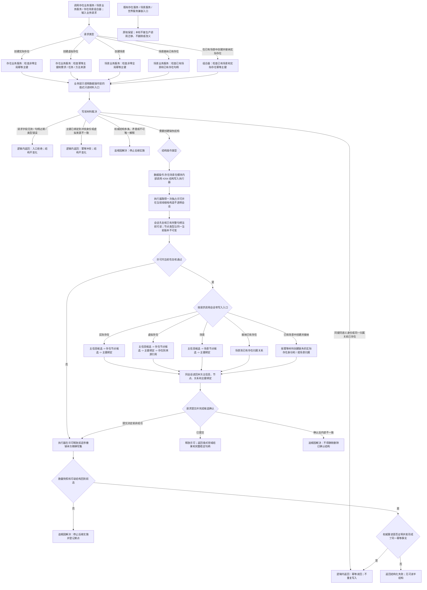

# 存在场景首组垂直样例代码逻辑流程图

更新时间：2026-07-13

## 依据

```text
规范/仓库与服务分层事务边界规范.md
规范/详细设计/仓库底层与服务数据操作分层纠偏详细设计.md
计划/已完成计划/20260713_SERVICE-DATA-S1_不透明结构写入会话与执行器代码实施切片_v0.1.md
实施记录/20260713_SERVICE-DATA-S1_不透明结构写入会话与执行器代码实施_Codex断点清单.md
海中鱼巣/核心/会话.结构写入.ixx
海中鱼巣/核心/执行器.结构写入.ixx
海中鱼巣/领域/存在服务.h
海中鱼巣/领域/场景服务.h
海中鱼巣/领域/世界服务.h
```

## 说明

本图按 JY-319 固定第一组五条路径：创建实际存在、创建虚拟存在、创建场景、场景接纳已有存在、在已有场景中创建并接纳实际存在。业务服务和组合器不直接导入结构写入执行器；只有 `数据操作.存在场景` 在模块内部调用执行器并提交同步会话回调。

旧无令牌、带令牌和手写候选入口继续作为兼容路径保留。本轮只在隔离自检验证新分层，不迁移既有生产调用，不创建“场景候选 + 存在候选”的双新身份组合。

## 流程图



## 五条固定路径

```text
1. 创建实际存在：幂等主键 -> 主信息候选 -> 存在节点候选 -> 主键绑定 -> 完整读回 -> 提交。
2. 创建虚拟存在：幂等主键 + 来源需求 / 任务 / 方法 -> 存在身份 -> 主键绑定 -> 来源引用最后形成 -> 完整读回 -> 提交。
3. 创建场景：幂等主键 -> 主信息候选 -> 场景节点候选 -> 主键绑定 -> 完整读回 -> 提交。
4. 场景接纳已有存在：已有场景 + 已有存在 -> 场景到存在归属；同一关系已存在时幂等读回。
5. 在已有场景中创建并接纳实际存在：已有场景 + 存在幂等主键 -> 创建缺失的实际存在身份和 / 或归属 -> 完整读回 -> 提交。
```

## 关键边界

```text
业务服务、组合器、线程和消息不得直接导入结构写入执行器，不接触原始令牌、许可、锁或仓库引用。
数据操作层可以私有持有只读仓库引用用于返回值式身份、主键和关系材料，但不得向上层暴露仓库或会话。
会话只复核完整句柄当前可读，不返回节点类型；业务层使用写前值式类型材料，数据操作层在独占会话中以同一完整版本句柄复核当前性。
关系仓库不提供重复关系幂等创建。重复接纳只有在权威读回确认同一当前归属关系后，才可映射为业务幂等成功。
第一轮不同时新建场景和存在，不实现虚拟存在创建并接纳，不收纳状态 / 动态，不迁移既有生产调用。
```
