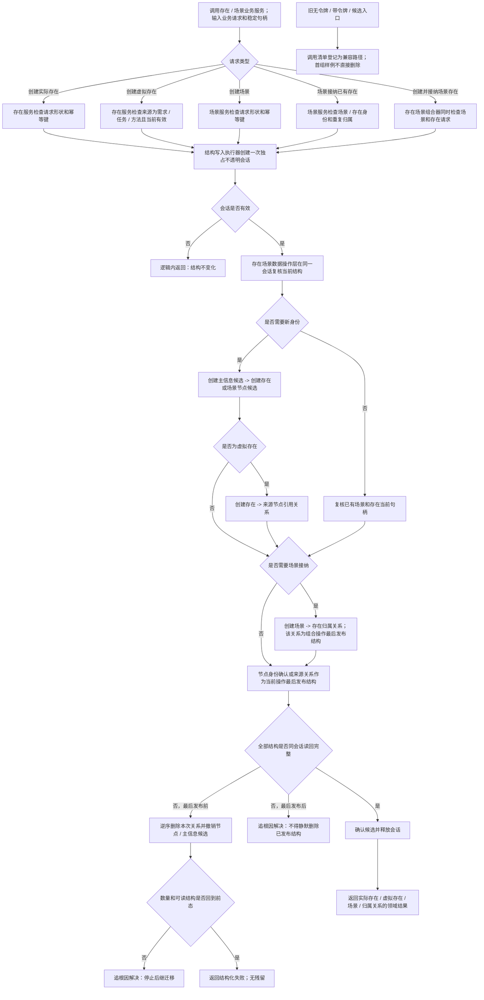

# 存在场景首组垂直样例代码逻辑流程图

更新时间：2026-07-13

## 依据

```text
规范/仓库与服务分层事务边界规范.md
海中鱼巣/领域/存在服务.h
海中鱼巣/领域/场景服务.h
海中鱼巣/领域/世界服务.h
实施记录/20260713_仓库与服务分层纠偏S0当前代码事实扫描_Codex断点清单.md
```

## 说明

本图固定第一组垂直样例：实际存在、虚拟存在、场景、场景接纳存在以及创建并接纳。旧无令牌和带令牌入口暂时保留为兼容路径，新公开业务入口不接收原始令牌。

## 流程图



## 验收边界

```text
无效来源、错误节点类型、重复接纳、跨域句柄和错误幂等键在第一笔写入前拒绝。
虚拟存在来源关系失败不得留下存在节点。
创建并接纳失败不得留下新存在、场景或归属关系。
公开业务服务、世界聚合入口、线程和自检调用方不接触原始结构事务令牌。
```
