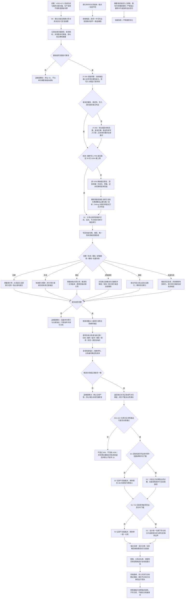

# 数据仓库关系查询二级索引与性能治理流程图

更新时间：2026-07-13

状态：JY-356 / #257、790 已完成 / JY-355 首版草案性能门禁失败 / 原 #258 提交算法修订后重新待执行 / 800 未实施

## 依据

```text
AGENTS.md
规范/000_项目规则总纲.md
规范/仓库逻辑空间与领域树结构规范.md
规范/多线程防锁机制规范.md
规范/详细设计/关系仓库详细设计.md
规范/详细设计/索引仓库详细设计.md
海中鱼巣/核心/关系仓库.h/.cpp
海中鱼巣/核心/索引仓库.h/.cpp
海中鱼巣/核心/协调.结构事务.ixx
海中鱼巣/领域/控制面板服务.h
实施记录/20260713_WAREHOUSE-OPT-S0_关系查询与并发性能基线代码实施_Codex断点清单.md
实施记录/20260715_WAREHOUSE-OPT-S1_正式性能门禁复测失败_Codex断点清单.md
```

## 说明

本图表达统一物理仓库上的关系查询优化顺序。当前六项是显示分类，不是六棵物理树；概念结构允许多根、多父共享节点和图关系。关系表继续承载权威关系，关系仓库内部二级索引只召回候选，候选必须按关系句柄、版本、状态和有效端点复核。

## 流程图



## 非成功返回二分

```text
逻辑内返回：无候选、请求键不合法、证据未达到 S2 / S3 门槛、显示请求越权或超限；均不改变结构。
追根因解决：写入后主表与索引不一致、同一许可内候选无法复核、失效 / 重挂 / 逻辑删除 / 撤销 / 批量失效留下旧索引项、结果与全表参考模型不一致。
```

## 关键边界

```text
关系仓库是树和图的权威结构承载；二级索引只是关系仓库内部派生候选结构。
通用索引仓库继续只负责领域入口候选，不接管关系事实。
世界、概念、需求、任务、方法不得建立互不相通的身份体系。
普通父子当前单父约束不外推到概念上下位等允许多父的关系类型。
六类控制面板视图是显示分类，不是六棵物理树。
#257 正式基线只证明指定机器与夹具的全表候选增长，不自动证明生产运行饱和、锁竞争瓶颈或分片必要性。
当前删除只推进关系表记录为已删除，不物理移除权威记录；二级索引不得改写这一生命周期事实。
旧带令牌删除保持共享兼容，严格结构化删除继续要求独占；S1 不改变许可强度或事务 ABI。
JY-355 的查询收益与专项正确性是草案证据，不是已发布实现；失效 / 删除写入回归不得由吞吐收益抵消。
JY-356 只拆分验收证据归属，不放宽 150% 写入上限、15% 三轮稳定门槛或 800 登记条件。
```
