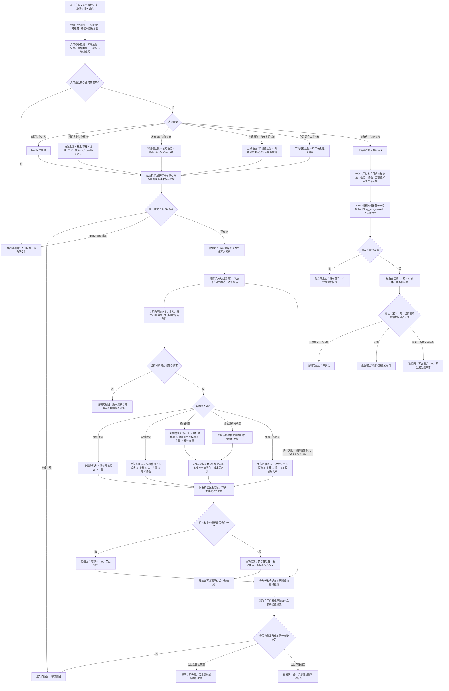

# 特征体系服务分层迁移代码逻辑流程图 v0.1

更新时间：2026-07-14

## 依据

```text
AGENTS.md
规范/仓库与服务分层事务边界规范.md
规范/详细设计/特征服务封口增强详细设计.md
规范/详细设计/FS03特征值系统第二轮第一批代码实施详细设计.md
规范/详细设计/FS03特征值系统第二批代码实施详细设计.md
规范/详细设计/二次特征服务详细设计.md
流程图/20260708_特征与状态材料代码逻辑流程图_v0.1.md
流程图/20260713_特征值原始材料事务适配代码逻辑流程图_v0.1.md
实施记录/20260713_SERVICE-DATA-S2_状态动态服务分层迁移代码实施_Codex断点清单.md
实施记录/20260714_FEATURE-VALUE-TXN-S1_特征值原始材料事务适配代码实施_Codex断点清单.md
海中鱼巣/领域/特征服务.h
海中鱼巣/领域/特征值服务.h
海中鱼巣/领域/二次特征服务.h
```

## 说明

本图表达 `#267 / SERVICE-DATA-S3` 的隔离新分层路径。`#274 / DQ-166 / 735` 已完成，JY-329 已按正式接口复核本图；本批不修改或迁移既有 `特征服务.h`、`特征值服务.h`、`二次特征服务.h` 生产调用，不删除兼容入口。

## 流程图



## 第一轮写入路径

```text
1. 创建特征定义。
2. 为已有宿主和特征定义创建唯一实例特征槽位。
3. 为已有且无当前值的槽位发布一个初始 I64、VecI64 或 VecU64 特征值。
4. 在一次会话内创建槽位并发布一个初始特征值。
5. 创建由有序长期组成项构成的组合二次特征。
```

## 非成功返回二分

```text
逻辑内返回：
- 主键为 0、句柄无效、类型不允许、原始值字段冲突、空或超长序列、组成项为空或重复。
- 同主键不同事实、已有槽位、槽位已有当前值、状态或动态组成项不能证明为长期材料。
- 写前版本漂移、原始值锁竞争、无槽位或无当前值。

追根因解决：
- 入口已通过并进入写入后，主信息、节点、关系、索引、原始值版本或 Vec 记录不符合内部预期。
- 同一宿主和定义出现多个槽位，同一槽位出现多个模板或多个当前值。
- 失败收口后存在可读节点、关系、索引、I64 版本或 Vec 记录残留。
```

## 关键边界

```text
1. 只有 数据操作.特征体系 可以导入结构写入执行器和 #274 特征值参与者；业务服务和组合器不接触仓库、令牌、许可、会话、候选或参与者。
2. 特征值材料只通过特征业务服务对外；需求、任务、方法等高级服务不得直接访问特征值服务或参与者。
3. 关系仓库继续权威承载宿主归属、定义模板、当前值归属和二次特征组成关系；索引只召回候选。
4. 第一轮原始值只允许在新建特征值节点上初始化，版本为 1；不更新已发布值，不形成历史值切换。
5. 二次特征组成项第一轮只接纳基础信息、存在、场景、特征、二次特征、因果引用；状态和动态拒绝。
6. 不实现值域、稳态、哈希、缓存、序列化、恢复、生产调用迁移、兼容入口删除、控制面板、SQL、D455、体素或外设。
7. #274 / DQ-166 / 735 已完成；#267 只按 JY-329 复核通过的正式签名实施，实际接口再次漂移时仍须原编号退回设计。
```
