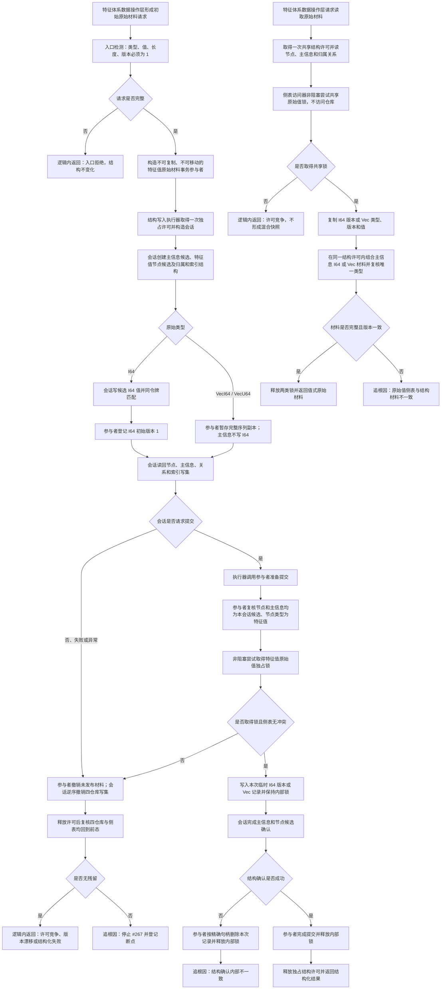

# 特征值原始材料事务适配代码逻辑流程图 v0.1

更新时间：2026-07-13

## 依据

```text
AGENTS.md
规范/仓库与服务分层事务边界规范.md
规范/详细设计/FS03特征值系统第二轮第一批代码实施详细设计.md
规范/详细设计/特征值Vec原始值容器详细设计.md
实施记录/20260713_CORE-SESSION-S2_不透明结构写入会话材料能力扩展代码实施_Codex断点清单.md
海中鱼巣/核心/会话.结构写入.ixx
海中鱼巣/核心/执行器.结构写入.ixx
海中鱼巣/领域/特征值服务.h
```

## 说明

本图表达 `#274 / FEATURE-VALUE-TXN-S1`。它只把新建特征值的初始 I64 版本或 Vec 原始材料加入现有独占结构写入会话，不修改已发布特征值，不把特征值侧表升级为核心仓库，也不实施 `#267` 的特征业务入口。

## 流程图



## 非成功返回二分

```text
逻辑内返回：
- 类型未知、I64 / Vec 字段冲突、空序列、超过上限、版本不是 1。
- 服务内部锁竞争、写前句柄版本漂移，且第一笔发布前或完整撤销后结构不变化。

追根因解决：
- 会话已经接受完整请求后，候选身份、主信息、原始值记录或读回不符合内部预期。
- 参与者准备发布后，结构确认失败且本次侧表记录无法精确撤销。
- 撤销后四仓库数量、可读结构或特征值侧表任一未回到前态。
```

## 关键边界

```text
1. 执行器只认识通用事务参与者生命周期，不依赖特征值类型。
2. 参与者不接收原始令牌，不签发许可，不调用四仓库，不解释特征业务。
3. 初始材料只绑定本会话新建的主信息和特征值节点候选；不更新已发布特征值。
4. I64 值仍由主信息候选承载；参与者只承载 I64 原始版本。Vec 值和容器版本仍由特征值服务内部侧表承载。
5. 写入和读取均使用非阻塞侧表锁尝试，避免既有兼容路径与结构许可锁序反转。
6. #274 不实施特征定义、实例槽位、当前值业务入口、二次特征、缓存、哈希、值域、稳态或恢复。
```
