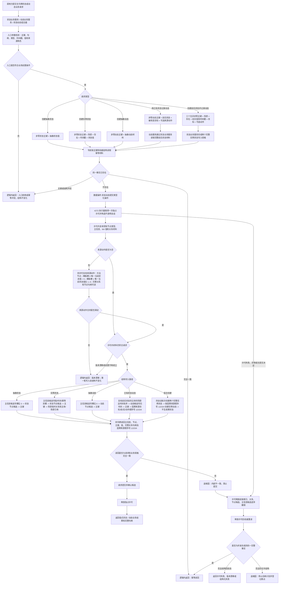

# 状态动态服务分层迁移代码逻辑流程图 v0.1

更新时间：2026-07-13

## 依据

```text
AGENTS.md
规范/仓库与服务分层事务边界规范.md
规范/详细设计/仓库底层与服务数据操作分层纠偏详细设计.md
规范/详细设计/实例状态动态生命周期治理详细设计.md
规范/详细设计/抽象状态动态治理详细设计.md
流程图/20260708_特征与状态材料代码逻辑流程图_v0.1.md
流程图/20260708_动态记录输出结果场景代码逻辑流程图_v0.1.md
实施记录/20260713_ARCH-LAYER-S0_仓库服务双路径与调用点事实复核_Codex断点清单.md
实施记录/20260713_EXIST-SCENE-S1_存在场景首组垂直样例代码实施_Codex断点清单.md
实施记录/20260713_CORE-SESSION-S2_不透明结构写入会话材料能力扩展代码实施_Codex断点清单.md
实施记录/20260713_SERVICE-DATA-S2_实例动态关系顺序号合同漂移_Codex断点清单.md
海中鱼巣/领域/动态服务.h
```

## 说明

本图表达 `#266 / SERVICE-DATA-S2` 的五条隔离分层路径。它不改接既有 `状态服务.h`、`动态服务.h` 生产调用，不删除兼容入口，也不把动态服务当前直接创建裸值材料状态的路径带入新分层。

## 流程图



## 五条路径

```text
1. 创建抽象状态：长期基础信息；有 I64 状态材料，无发生时间戳和运行期临时关系。
2. 创建完整实例状态：场景内临时节点；必须有主体、场景、值、时间戳和幂等编号。
3. 创建抽象动态：长期基础信息；有抽象动态材料，无发生时间戳和运行期临时关系。
4. 使用两个已有完整实例状态记录动态：前后状态必须主体一致、场景一致，前时间戳不得晚于后时间戳。
5. 创建前后状态并记录动态：前后状态规格必须由状态业务服务形成，三者在同一会话内完成；动态服务不得创建裸值材料状态。
```

## 非成功返回二分

```text
逻辑内返回：
- 无效句柄、错误节点类型、主键为 0、时间戳非法、来源动作角色错误、三个主键重复。
- 幂等主键已绑定不同事实，或许可内复核发现写前句柄已经版本漂移。
- 竞争失败后权威读回到同一完整事实时返回幂等读回。

追根因解决：
- 业务前置已经满足并进入写入后，任一主信息值、节点、关系、索引或读回不符合内部预期。
- 前后状态、动态关系组或幂等双槽出现缺失、重复或矛盾。
- 失败收口后仍存在可读孤儿节点、半关系、残留索引或数量增长。
```

## 关键边界

```text
1. 只有 数据操作.状态动态 可以在本批生产路径导入结构写入执行器；业务服务和组合器不接触仓库、令牌、许可、会话或候选。
2. 状态业务服务拥有实例状态规格；动态业务服务不得绕过它创建状态。
3. 关系仓库继续承载场景归属、主体、目标、前后状态和来源动作的权威关系；索引只召回候选。
4. 实例动态因果来源顺序号固定为：被改变目标 1、前状态 2、后状态 3、来源动作 4；不在 #266 内迁移为 0/1/2/4，也不增加兼容读取或历史结构迁移。
5. 来源动作允许为空；非空时必须在同一许可内证明：节点类型为方法，模板槽 0 唯一当前状态值为 5，模板槽 1 唯一当前状态值在 1..6，相关关系与节点完整句柄均可读。线程、消息、日志和控制面板不能成为动作来源。
6. 抽象状态、抽象动态不携带发生时间戳；实例状态、实例动态必须携带合法时间戳。
7. 本批不实现提升、失效、删除、聚合、运动基元、稳定因果、生产调用迁移、兼容入口删除、动态关系顺序迁移或历史结构迁移。
8. #272 / DQ-164 / 725 已完成且不得重复执行；#266 仍须执行窗口按实际接口重新复核后才可实施。
```
