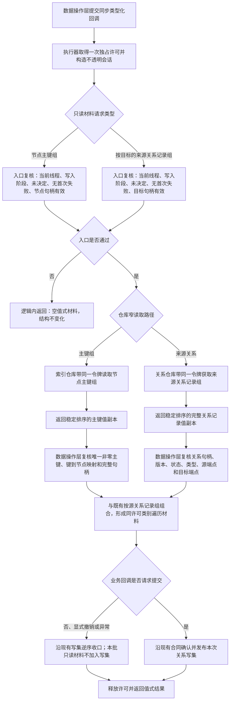

# 不透明结构写入会话概念图只读材料扩展代码逻辑流程图 v0.1

更新时间：2026-07-14

## 依据

```text
AGENTS.md
规范/仓库与服务分层事务边界规范.md
规范/详细设计/不透明结构写入会话材料能力扩展详细设计.md
规范/详细设计/语义基础服务分层迁移详细设计.md
海中鱼巣/核心/会话.结构写入.ixx
海中鱼巣/核心/关系仓库.h
海中鱼巣/核心/索引仓库.h
计划/20260714_CONCEPT-DATA-S1_概念图创建型结构服务分层迁移代码实施切片_v0.1.md
实施记录/20260714_SERVICE-DATA-S4_语义基础服务分层迁移代码实施_Codex断点清单.md
```

## 说明

本图只表达 `#276 / CORE-SESSION-S3` 对现有不透明结构写入会话的窄只读材料扩展。当前会话已经能按源节点读取关系记录组并复核指定主键绑定，但不能在同一独占许可内按目标节点读取来源关系记录组，也不能非破坏性读取节点的完整主键组，因而不能闭合 `#275` 的根无上位复核、反向查询和稳定键唯一性复核。

## 流程图



## 非成功返回二分

```text
逻辑内返回：
- 无效句柄、跨线程、会话不在写入阶段、已经请求提交 / 撤销或已有首次失败。
- 当前确实没有主键或没有指定类型的来源关系。
- 只返回空值式材料，不新增写集，不产生结构变化。

追根因解决：
- 调用方已掌握应存在的完整关系句柄，但正向和反向记录不能互证。
- 主键组包含 0、重复主键、键到节点映射不一致或稳定键不唯一。
- 关系记录的版本、状态、类型或端点互相矛盾。
- 只读扩展改变写集、许可强度、锁序或既有撤销行为。
```

## 关键边界

```text
1. 只新增 读取节点主键组 和 读取来源关系记录组 两个值式会话入口。
2. 不导出原始结构事务令牌、许可、仓库引用、锁、候选或可变记录。
3. 不修改关系仓库、索引仓库或结构事务 ABI；只复用其现有带令牌读取入口。
4. 不增加业务语义、概念类别、根登记、防环算法或关系类型。
5. 不把索引升级为权威事实；主键组只用于候选与完整映射复核，关系仓库仍权威承载概念关系。
6. 不放宽提交准备只读视图，不改变请求提交后的普通读取拒绝语义。
7. 不新增线程、异步、工作队列或锁；许可强度和锁序保持不变。
8. 本图只形成 #276 的设计依据，不证明代码、构建、运行或阶段 752 已完成。
```
