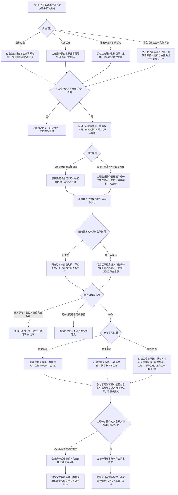

# 存在状态候选写入规格与同会话参与者代码逻辑流程图 v0.1

更新时间：2026-07-14

## 依据

```text
AGENTS.md
规范/1140_根规范_存在节点_20260720.md
规范/1160_根规范_状态节点_20260720.md
规范/4030_子规范_基础信息服务分层与领域写授权.md
规范/4040_子规范_不透明结构事务候选确认撤销与最后发布.md
规范/详细设计/仓库底层与服务数据操作分层纠偏详细设计.md
流程图/20260714_需求任务方法服务分层迁移代码逻辑流程图_v0.1.md
规范/详细设计/需求任务方法服务分层迁移详细设计.md
计划/已完成计划/20260713_SERVICE-DATA-S5_需求任务方法服务分层迁移代码实施切片_v0.1.md
实施记录/20260714_CORE-SESSION-S4_已发布关系可逆换代与普通父子重挂代码实施_Codex断点清单.md
当前 服务.存在 / 数据操作.存在场景 / 服务.状态 / 数据操作.状态动态 / 会话.结构写入 代码事实
```

## 说明

本图表达 `#278 / SERVICE-DATA-S5-PRE` 的窄前置：存在、状态业务服务继续拥有业务规格，存在场景、状态动态数据操作层在上层数据操作已经取得的一次独占会话内参与写入。它不创建需求、任务或方法业务入口，不让业务服务接触会话，也不把原子结构复制到 `数据操作.需求任务方法`。

## 流程图



## 非成功返回二分

```text
逻辑内返回：
- 零幂等键、非法来源角色、无效句柄、错误节点类型、零时间戳和不允许的来源阶段。
- 规格未形成、同许可写前版本漂移、并发同键异义冲突。
- 均发生在第一笔参与者写入前，结构不变化。

追根因解决：
- 业务规格已形成且同许可复核通过后，参与者任一写入或最小读回不符合规格。
- 本会话候选身份、节点类型、主信息或来源关系在同一版本下互相矛盾。
- 失败或无提交决定后仍可读到虚拟存在、抽象状态、实例状态或其关系 / 索引残留。
```

## 关键边界

```text
1. 业务服务只形成规格和映射业务结果，不接收、保存、返回或比较结构写入会话、原始令牌、许可或仓库。
2. 只有数据操作层可以接收 结构写入会话&；参与入口不取得新许可、不请求提交、不释放许可。
3. 本会话候选身份判断只返回 bool，不暴露候选对象、令牌、写集容器或仓库引用。
4. 虚拟存在来源仍只允许需求、任务或方法；实例状态主体仍必须是存在，场景必须是场景。
5. 已发布主体和本会话候选主体使用不同规格，禁止用 bool 参数或无类型句柄静默混用。
6. 既有立即创建入口复用规格和参与逻辑，公开业务语义、幂等结果和兼容调用点不改。
7. 本图不实施需求、任务、方法、生命周期、真实执行、线程路由、生产调用迁移或阶段 760。
```
